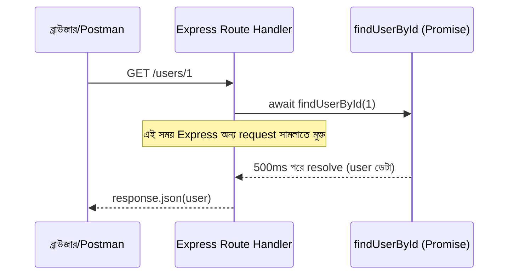

# ০৫. Use of Async Await Inside a Node JS Project

তত্ত্ব যথেষ্ট হয়েছে — এবার সময় হয়েছে async/await-কে একটা বাস্তব Express.js প্রজেক্টে ব্যবহার করে দেখার, ঠিক যেভাবে Module 4-এ আমরা প্রথমবার Express.js সেটআপ করেছিলাম, একটা GET route বানিয়েছিলাম।

ধরো আমাদের একটা রুট দরকার, যেটা একটা ইউজারের প্রোফাইল ডেটাবেজ (এই মুহূর্তে আমরা এখনো আসল ডেটাবেজ শিখিনি, তাই একটা ফাংশন দিয়ে সেটা নকল করছি, যেটা বাস্তব ডেটাবেজের মতোই সময় নেয়) থেকে এনে ফেরত পাঠাবে।

প্রথমে একটা ফাংশন বানাই, যেটা ডেটাবেজ কলের ভান করে, একটা Promise রিটার্ন করে:

```javascript
// db.js — একটা নকল ডেটাবেজ ফাংশন, বাস্তব ডেটাবেজ কলের মতো আচরণ করার জন্য
function findUserById(id) {
  const users = {
    1: { id: 1, name: "রহিম", email: "rahim@example.com" },
    2: { id: 2, name: "করিম", email: "karim@example.com" },
  };

  return new Promise((resolve, reject) => {
    setTimeout(() => {
      const user = users[id];
      if (user) {
        resolve(user);
      } else {
        reject(new Error("এই আইডির কোনো ইউজার পাওয়া যায়নি"));
      }
    }, 500); // ৫০০ মিলিসেকেন্ড দেরি, যেন আসল ডেটাবেজ কলের মতো লাগে
  });
}

module.exports = { findUserById };
```

এখন এটাকে আমাদের Express অ্যাপে ব্যবহার করি:

```javascript
// server.js
const express = require("express");
const { findUserById } = require("./db");

const app = express();

app.get("/users/:id", async (request, response) => {
  try {
    const userId = Number(request.params.id);
    const user = await findUserById(userId);
    response.json(user);
  } catch (error) {
    response.status(404).json({ message: error.message });
  }
});

app.listen(3000, () => {
  console.log("সার্ভার চালু আছে port 3000-এ");
});
```

এই কোডের প্রতিটা গুরুত্বপূর্ণ অংশ ধরে ধরে দেখি। প্রথমে খেয়াল করো, route handler ফাংশনটার আগে `async` কীওয়ার্ডটা বসানো হয়েছে:

```javascript
app.get("/users/:id", async (request, response) => {
```

এটা ছাড়া এই ফাংশনের ভেতরে `await` ব্যবহার করাই যেতো না — `await` কীওয়ার্ডটা কেবল `async` দিয়ে চিহ্নিত ফাংশনের ভেতরেই বৈধ। `request.params.id` অংশটা Module 4 লেসন ৬-এ শেখা Path Parameter থেকে আসছে — URL-এ `/users/1` লিখলে `id` হবে `"1"`।

```javascript
const user = await findUserById(userId);
```

এই লাইনে `await` বলছে — "`findUserById`-এর Promise resolve হওয়া পর্যন্ত এই ফাংশনের এক্সিকিউশন এখানে থেমে থাকো (কিন্তু পুরো Node.js সার্ভার থেমে থাকবে না, শুধু এই একটা request-এর হ্যান্ডলিং)। resolve হয়ে গেলে সেই ফলাফলটা `user` ভ্যারিয়েবলে বসাও, তারপর পরের লাইনে যাও।" এই সময়টায় Node.js-এর event loop সম্পূর্ণ মুক্ত থাকে অন্য ইউজারদের request সামলানোর জন্য — এটাই Module 5 লেসন ৩-৪-এ শেখা event loop-এর আসল সুফল, বাস্তব কোডে।

```javascript
} catch (error) {
  response.status(404).json({ message: error.message });
}
```

`try/catch` ব্লকটা এখানে অত্যন্ত গুরুত্বপূর্ণ। যদি `findUserById` ভেতরে reject করে (যেমন ভুল আইডি দেয়া হলে), সেই error স্বয়ংক্রিয়ভাবে `catch` ব্লকে চলে আসে, ঠিক যেমন সিঙ্ক্রোনাস কোডে `try/catch` কাজ করে। এটাই async/await-এর একটা বড় সুবিধা Promise চেইনের তুলনায় — error handling দেখতে হুবহু নিয়মিত JavaScript-এর মতো, আলাদা করে `.catch()` মনে রাখতে হয় না।



একটা সাধারণ ভুল যেটা নতুনরা করে, সেটা হলো `try/catch` ভুলে যাওয়া। যদি `await findUserById(userId)` reject করে আর কোনো `try/catch` না থাকে, তাহলে পুরো Node.js প্রসেস একটা "Unhandled Promise Rejection" এরর দিয়ে ক্র্যাশ করতে পারে — তাই যেকোনো `await` ব্যবহারের সময় error handling নিয়ে সচেতন থাকা একটা ভালো অভ্যাস, বিশেষ করে যখন সেই ডেটা বাইরের কোনো উৎস (ডেটাবেজ, অন্য API) থেকে আসছে।

এখন পর্যন্ত আমরা async/await-এর ভেতরের আর বাইরের দুনিয়া দুটোই দেখে ফেলেছি। এই মডিউলের বাকি অংশে আমরা একটু ভিন্ন দিকে যাবো — কোড লেখা শেষ হওয়ার পর সেটা কীভাবে নিরাপদে সংরক্ষণ আর শেয়ার করা যায়, অর্থাৎ Git-এর কার্যপ্রণালী, আর কীভাবে একটা প্রজেক্টকে একাধিক ফাইলে সুন্দরভাবে ভাগ করা যায়। চলো প্রথমে Git দিয়ে শুরু করি।
