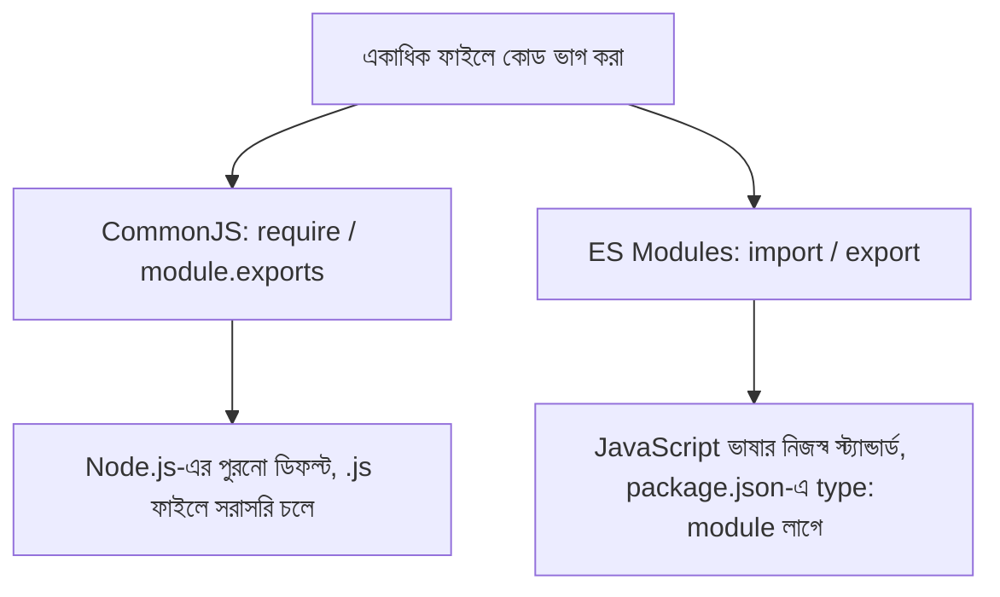

# ০৭. Working with Multiple Files in Node JS || Require vs Import

এখন পর্যন্ত আমাদের সব উদাহরণ একটামাত্র ফাইলে (`server.js`) লেখা হয়েছে, সর্বোচ্চ আগের লেসনে আমরা `db.js` নামে একটা দ্বিতীয় ফাইল তৈরি করেছিলাম। বাস্তব প্রজেক্টে এই "একাধিক ফাইলে ভাগ করা" ব্যাপারটা এতটাই গুরুত্বপূর্ণ যে এখনই এর নিয়মগুলো ভালোভাবে বুঝে নেয়া দরকার, কারণ Module 7-এ আমরা যখন Router আর Controller নিয়ে কাজ করবো, তখন এই ভিত্তিটাই কাজে লাগবে।

কেন একটামাত্র ফাইলে সব কোড লেখা যায় না? চিন্তা করো একটা বড় বাড়ি বানানোর সময় যদি সব কাজের যন্ত্রপাতি (হাতুড়ি, স্ক্রু, তার, পাইপ) একটামাত্র বড় বাক্সে জড়ো করে রাখা হয়, প্রতিবার একটা জিনিস দরকার হলে পুরো বাক্স হাতড়াতে হবে। তার বদলে যদি আলাদা আলাদা বাক্সে আলাদা জিনিস রাখা হয় (একটায় শুধু বৈদ্যুতিক জিনিস, একটায় শুধু পানির পাইপ), কাজ অনেক সহজ আর সুশৃঙ্খল হয়ে যায়। কোডেও ঠিক এই একই কারণে আমরা সম্পর্কিত কাজগুলোকে আলাদা আলাদা ফাইলে ভাগ করি — একে বলে **modular code**।

Node.js-এ ফাইলের মধ্যে কোড শেয়ার করার দুটো পদ্ধতি আছে, আর দুটোই তোমার কোডে দেখা যাবে বলে দুটোই বুঝে রাখা দরকার।

## CommonJS — Node.js-এর পুরনো, ডিফল্ট পদ্ধতি

Module 2 আর 4-এর সব উদাহরণে আমরা যা ব্যবহার করেছি, সেটাই **CommonJS** — `require` আর `module.exports`। ধরো একটা ফাইলে কিছু ইউটিলিটি ফাংশন রাখা আছে:

```javascript
// utils.js
function formatCurrency(amount) {
  return `৳${amount.toFixed(2)}`;
}

function isValidEmail(email) {
  return email.includes("@");
}

module.exports = { formatCurrency, isValidEmail };
```

`module.exports` লাইনটা বলে দেয় — "এই ফাইল থেকে বাইরে যা যা ব্যবহার করা যাবে, সেটা এই object-টা।" অন্য একটা ফাইলে এটা আনতে হলে:

```javascript
// server.js
const { formatCurrency, isValidEmail } = require("./utils");

console.log(formatCurrency(150)); // ৳150.00
console.log(isValidEmail("test@example.com")); // true
```

`require("./utils")` লাইনটা `utils.js` ফাইলটা খুঁজে বের করে, তার `module.exports`-এ যা আছে সেটা নিয়ে আসে। খেয়াল করো, `./` দিয়ে বোঝানো হচ্ছে এটা একটা লোকাল ফাইল (নিজের প্রজেক্টের ভেতরের), আর `.js` এক্সটেনশনটা লেখা লাগে না, Node.js নিজেই সেটা খুঁজে নেয়।

## ES Modules — আধুনিক, ব্রাউজার-সামঞ্জস্যপূর্ণ পদ্ধতি

জাভাস্ক্রিপ্ট ভাষার নিজস্ব, আনুষ্ঠানিক মডিউল সিস্টেমের নাম **ES Modules (ESM)**, যেটা ব্রাউজারেও একইভাবে কাজ করে। এটা ব্যবহার করে একই কোড লিখলে দেখতে হয়:

```javascript
// utils.js
export function formatCurrency(amount) {
  return `৳${amount.toFixed(2)}`;
}

export function isValidEmail(email) {
  return email.includes("@");
}
```

```javascript
// server.js
import { formatCurrency, isValidEmail } from "./utils.js";

console.log(formatCurrency(150));
```

লক্ষ্য করো, `import`-এর ক্ষেত্রে `.js` এক্সটেনশনটা লিখতে হয়, আর সিনট্যাক্সটা `require`-এর চেয়ে একটু বেশি "ভাষাগত" (built into the language) মনে হয়, কারণ এটা আসলেই তাই — এটা কোনো Node.js-এর নিজস্ব ফাংশন না, এটা JavaScript ভাষার নিজের অংশ।

Node.js-এ ES Modules চালাতে চাইলে `package.json`-এ একটা লাইন যোগ করতে হয়:

```json
{
  "type": "module"
}
```



দুটোর মধ্যে একটা বড় প্রায়োগিক পার্থক্য আছে — CommonJS-এর `require` synchronous, অর্থাৎ ফাইল লোড হওয়ার আগে বাকি কোড থেমে থাকে। ES Modules-এর `import` ভেতরে ভেতরে asynchronous ভাবে কাজ করার সক্ষমতা রাখে (যেমন `import()` ফাংশন আকারে ব্যবহার করলে একটা Promise রিটার্ন করে) — এটা এই মডিউলে শেখা asynchronous ধারণাগুলোর সাথেই সরাসরি যুক্ত।

এই কোর্সে আমরা মূলত CommonJS (`require`/`module.exports`) ব্যবহার করবো, কারণ এটাই এখনো বেশিরভাগ Node.js/Express.js প্রজেক্টে, বিশেষ করে শেখার পর্যায়ে, বেশি প্রচলিত এবং কম কনফিগারেশন লাগে। তবে বাস্তব চাকরির বাজারে দুটোই দেখতে পাবে, তাই দুটোর পার্থক্য চেনা জরুরি।

## একটা Express অ্যাপকে একাধিক ফাইলে ভাগ করা

এখন এই ধারণাটা ব্যবহার করে দেখি কীভাবে Module 5 লেসন ৫-এর সেই `server.js`-কে আরেকটু গুছিয়ে ফেলা যায়। এখন পর্যন্ত সব রুট সরাসরি `server.js`-এ লেখা ছিলো, কিন্তু প্রজেক্ট বড় হলে (দশ-বিশটা রুট হলে) এই একটামাত্র ফাইল অগোছালো হয়ে যাবে। তাই route-সংক্রান্ত কোড আলাদা করে ফেলি:

```javascript
// routes/userRoutes.js
const express = require("express");
const router = express.Router();
const { findUserById } = require("../db");

router.get("/:id", async (request, response) => {
  try {
    const user = await findUserById(Number(request.params.id));
    response.json(user);
  } catch (error) {
    response.status(404).json({ message: error.message });
  }
});

module.exports = router;
```

```javascript
// server.js
const express = require("express");
const userRoutes = require("./routes/userRoutes");

const app = express();

app.use("/users", userRoutes);

app.listen(3000, () => {
  console.log("সার্ভার চালু আছে port 3000-এ");
});
```

এখানে `express.Router()` জিনিসটা এখনই মুখস্থ করার দরকার নেই — এটা একটা প্রিভিউ মাত্র। `app.use("/users", userRoutes)` লাইনটা বলছে, "`/users` দিয়ে শুরু হওয়া যেকোনো রিকোয়েস্ট `userRoutes` ফাইলে হ্যান্ডল করা হোক।" এই প্যাটার্নটাকে বলা হয় **Router** এবং **Controller** প্যাটার্ন, যেটা নিয়ে আমরা Module 7-এ ("API Development Part Two") অনেক বিস্তারিতভাবে কাজ করবো — কীভাবে route, controller, আর middleware আলাদা আলাদা স্তরে সুন্দরভাবে সাজানো যায়।

এই লেসন দিয়ে আমরা মডিউলের মূল প্রযুক্তিগত অংশ শেষ করলাম — callback থেকে শুরু করে event loop, Promise, async/await, আর এখন কোডকে সংগঠিত করার পদ্ধতি। শেষ লেসনে আমরা একটু ভিন্নভাবে ভাবি — কোথা থেকে এই বিষয়গুলো আরও গভীরে শেখা যায়, তা নিয়ে কথা বলবো।
