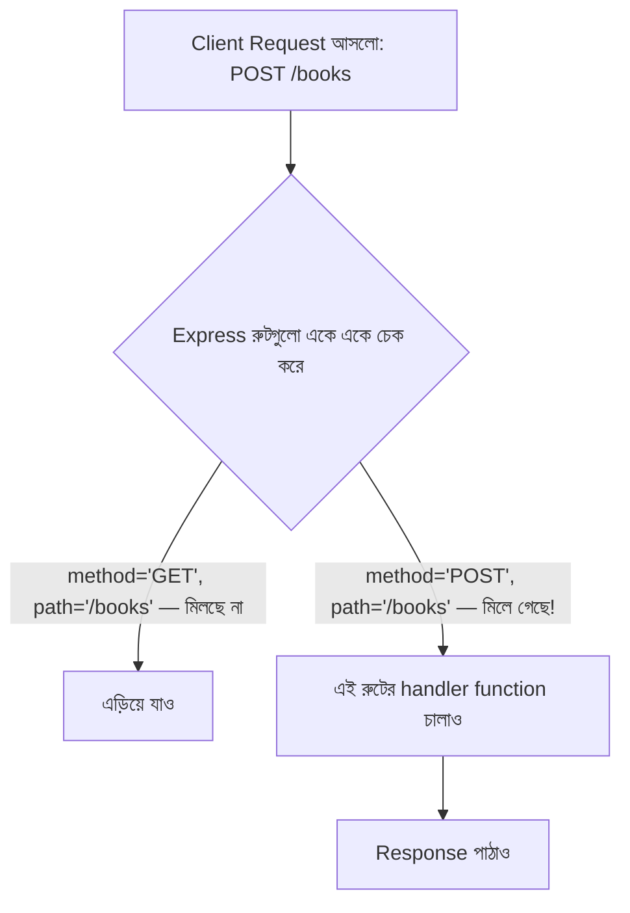

# ০২. Routing System in ExpressJS Application

একটা শহরের কথা চিন্তা করো। শহরে হাজারটা ঠিকানা আছে — বাসাবাড়ি, দোকান, হাসপাতাল, স্কুল। যদি প্রতিটা ঠিকানার কোনো নিয়ম না থাকতো, প্রতিটা রাস্তার নাম এলোমেলো হতো, তাহলে ডাকপিওনের জন্য চিঠি পৌঁছানো অসম্ভব হয়ে যেতো। তাই শহরে একটা ঠিকানা-ব্যবস্থা থাকে — এলাকা, রাস্তা, বাড়ি নম্বর — যাতে যে কেউ ঠিকানা দেখেই বুঝতে পারে জিনিসটা ঠিক কোথায় যাবে।

একটা Express অ্যাপ্লিকেশনও ঠিক এরকম একটা "শহর"। প্রতিটা URL একটা ঠিকানা, আর **routing** হলো সেই ব্যবস্থা যেটা ঠিক করে দেয় কোন ঠিকানায় রিকোয়েস্ট এলে কোন কোড চলবে। Module 4-এ আমরা ইতিমধ্যে দেখেছি কীভাবে `app.get()` দিয়ে একটা সাধারণ রুট বানানো যায়, আর query আর path parameter দিয়ে কীভাবে ঠিকানার ভেতরে অতিরিক্ত তথ্য পাঠানো যায়। এখন আমরা পুরো routing সিস্টেমটা আরও গভীরভাবে বুঝবো — শুধু GET না, বাকি HTTP মেথডগুলো নিয়েও।

আসলে একটা ঠিকানা শুধু "কোথায় যাচ্ছো" বলে না, "কী করতে যাচ্ছো" সেটাও বলা দরকার — আর সেটাই HTTP মেথডের কাজ। ধরো তুমি একটা লাইব্রেরির ঠিকানায় গেলে। "বই দেখতে যাচ্ছি" (GET), "নতুন বই জমা দিতে যাচ্ছি" (POST), "একটা বইয়ের তথ্য বদলাতে যাচ্ছি" (PUT/PATCH), আর "একটা বই লাইব্রেরি থেকে সরিয়ে ফেলতে যাচ্ছি" (DELETE) — এই চারটা কাজ একই ঠিকানার (যেমন `/books`) সাথে সম্পর্কিত হলেও সম্পূর্ণ ভিন্ন উদ্দেশ্য বহন করে। Express-এ প্রতিটা মেথডের জন্য আলাদা ফাংশন আছে:

```javascript
const express = require('express');
const app = express();

app.get('/books', (req, res) => {
  res.status(200).json({ message: 'সব বইয়ের তালিকা' });
});

app.post('/books', (req, res) => {
  res.status(201).json({ message: 'নতুন বই যোগ হলো' });
});

app.put('/books/:id', (req, res) => {
  res.status(200).json({ message: `বই ${req.params.id} আপডেট হলো` });
});

app.delete('/books/:id', (req, res) => {
  res.status(200).json({ message: `বই ${req.params.id} মুছে ফেলা হলো` });
});

app.listen(3000, () => {
  console.log('সার্ভার চালু আছে port 3000-এ');
});
```

লক্ষ্য করো, `/books` আর `/books/:id` — একই "এলাকা" নিয়ে চারটা ভিন্ন রুট তৈরি হয়েছে, প্রতিটার কাজ ভিন্ন। এই প্যাটার্নটার একটা সুন্দর নাম আছে ইন্ডাস্ট্রিতে — **RESTful routing** — যেখানে URL বলে দেয় "কোন রিসোর্স নিয়ে কাজ করছি" (যেমন `books`), আর HTTP মেথড বলে দেয় "কী কাজ করছি" (দেখা, তৈরি করা, বদলানো, মোছা)। আমরা এই প্যাটার্নটা Module 7-এ আরও গভীরে নিয়ে যাবো।

Express কীভাবে ঠিক করে কোন রুট চলবে, সেটার একটা ছবি দেখা যাক:



Express রুটগুলো উপর থেকে নিচে ক্রমানুসারে চেক করে, প্রথম যেটার সাথে method আর path দুটোই মিলে যায়, সেটাই চালায়। এই কারণে রুট লেখার ক্রমও মাঝে মাঝে গুরুত্বপূর্ণ — যেমন `/books/:id` এর আগে যদি `/books/featured` লেখা হয়, তাহলে `featured` শব্দটা ভুল করে `:id` হিসেবে ধরা পড়তে পারে যদি ক্রম উল্টো হয়।

একটা বাস্তব অ্যাপ্লিকেশনে হয়তো শতশত রুট থাকবে — সব একটা মাত্র ফাইলে লিখলে সেটা অগোছালো হয়ে যাবে, ঠিক যেমন একটা শহরের সব ঠিকানা যদি একটাই কাগজে এলোমেলোভাবে লেখা থাকতো। তাই বাস্তব প্রজেক্টে ডেভেলপাররা Express-এর `Router` ব্যবহার করে রুটগুলোকে আলাদা ফাইলে ভাগ করে ফেলে, বিষয় অনুযায়ী — যেমন `userRoutes.js`, `bookRoutes.js`:

```javascript
// bookRoutes.js
const express = require('express');
const router = express.Router();

router.get('/', (req, res) => {
  res.status(200).json({ message: 'সব বইয়ের তালিকা' });
});

router.post('/', (req, res) => {
  res.status(201).json({ message: 'নতুন বই যোগ হলো' });
});

module.exports = router;
```

```javascript
// server.js
const express = require('express');
const bookRoutes = require('./bookRoutes');

const app = express();
app.use('/books', bookRoutes);

app.listen(3000, () => {
  console.log('সার্ভার চালু আছে port 3000-এ');
});
```

এখানে `app.use('/books', bookRoutes)` লাইনটা বলে দিচ্ছে — "যেকোনো রিকোয়েস্ট যেটা `/books` দিয়ে শুরু হয়, সেটা `bookRoutes` ফাইলে পাঠিয়ে দাও, আর সেই ফাইলের ভেতরে `/` মানেই আসলে `/books`।" এভাবে একটা বড় অ্যাপ্লিকেশনও ছোট ছোট, পরিষ্কার অংশে ভাগ হয়ে যায় — ঠিক যেমন একটা শহরকে এলাকা অনুযায়ী ভাগ করলে ম্যাপ পড়া সহজ হয়।

এখন আমাদের কাছে ঠিকানা-ব্যবস্থা তৈরি হয়ে গেছে GET, POST, PUT, DELETE-এর জন্য। কিন্তু POST রিকোয়েস্টে ক্লায়েন্ট আসলে ঠিক কী পাঠায়, আর সেটা কীভাবে ব্যাকএন্ড গ্রহণ করে — সেই পুরো গল্পটা এখনো বাকি। পরের লেসনে আমরা একটা POST endpoint-এর ভেতরের অ্যানাটমি খুঁটিয়ে দেখবো।
