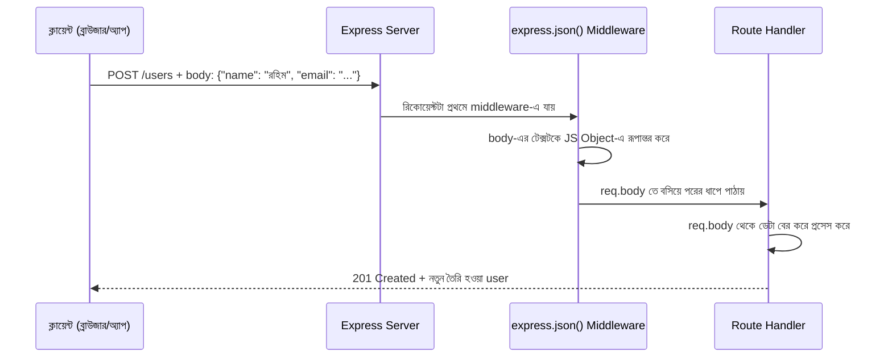

# ০৩. Anatomy of a POST Request Endpoint

Module 4-এ আমরা GET রিকোয়েস্টের দুইটা উপায়ে তথ্য পাঠানো শিখেছিলাম — query parameter (`?age=25`) আর path parameter (`/users/5`)। এই দুটোই একটা সীমাবদ্ধতা বহন করে — এগুলো URL-এর ভেতরেই বসে থাকে, আর URL সাধারণত ছোট, দৃশ্যমান, আর সীমিত পরিমাণ তথ্য বহন করতে পারে। কিন্তু ভাবো তো, যদি তোমাকে একজন নতুন ইউজারের পুরো তথ্য পাঠাতে হয় — নাম, ইমেইল, ঠিকানা, পাসওয়ার্ড — এতগুলো জিনিস URL-এ গুঁজে দেয়া অস্বাভাবিক আর অনিরাপদও, কারণ পাসওয়ার্ড URL-এ থাকলে সেটা ব্রাউজার হিস্টোরি, সার্ভার লগ সব জায়গায় দৃশ্যমান থাকবে।

এই সমস্যার সমাধান হলো POST রিকোয়েস্ট, আর এর সাথে আসা **request body** — একটা আলাদা "প্যাকেজ" যেখানে তুমি যত ইচ্ছা তথ্য, যেকোনো গঠনে, লুকিয়ে পাঠাতে পারো। এটাকে ভাবতে পারো এভাবে — URL হলো খামের উপরের ঠিকানা, আর body হলো খামের ভেতরের চিঠি। ঠিকানা দিয়ে বোঝা যায় চিঠিটা কোথায় যাচ্ছে, কিন্তু আসল বার্তাটা থাকে ভেতরে।

একটা POST রিকোয়েস্ট ঠিক কী কী ধাপ পার হয়ে ব্যাকএন্ডে পৌঁছায়, সেটা দেখা যাক:



এখানে একটা গুরুত্বপূর্ণ জিনিস আছে যেটা প্রথমবার দেখলে অনেকের কাছে জাদুর মতো লাগে — `express.json()` নামের একটা **middleware**। ক্লায়েন্ট যখন body পাঠায়, সেটা আসলে কাঁচা টেক্সট হিসেবে আসে (JSON স্ট্রিং হিসেবে), Express নিজে থেকে সেটাকে JavaScript object বানিয়ে দেয় না — এই কাজটা করার জন্যই `express.json()` middleware চালু করতে হয়। middleware মানে হলো এমন একটা ফাংশন যেটা রিকোয়েস্ট আসল route handler-এ পৌঁছানোর আগে মাঝপথে বসে কাজ করে — অনেকটা পোস্ট অফিসের সেই কর্মীর মতো, যে খাম খুলে চিঠিটা পড়ার উপযোগী করে গুছিয়ে দেয়, তারপর আসল প্রাপকের কাছে পাঠায়।

চলো এখন একটা পূর্ণাঙ্গ POST endpoint বানাই, শুরু থেকে শেষ পর্যন্ত:

```javascript
const express = require('express');
const app = express();

// middleware: body-কে JS Object-এ রূপান্তর করার জন্য
app.use(express.json());

// ধরা যাক এটা আপাতত আমাদের "ডেটাবেজ", একটা সাধারণ array
const users = [];

app.post('/users', (req, res) => {
  const { name, email } = req.body;

  const newUser = {
    id: users.length + 1,
    name,
    email
  };

  users.push(newUser);

  res.status(201).json(newUser);
});

app.listen(3000, () => {
  console.log('সার্ভার চালু আছে port 3000-এ');
});
```

লাইন ধরে বুঝি কী ঘটছে।

```javascript
app.use(express.json());
```
এই লাইনটা পুরো অ্যাপ্লিকেশনকে বলে দিচ্ছে — "যেকোনো রিকোয়েস্টের body যদি JSON আকারে আসে, সেটা স্বয়ংক্রিয়ভাবে JavaScript object-এ পরিণত করে দাও।" এই লাইনটা না থাকলে `req.body` হবে `undefined`, আর এটা নতুনদের সবচেয়ে সাধারণ একটা ভুল — POST endpoint লিখেই ফেললো, কিন্তু `express.json()` যোগ করতে ভুলে গেলো, ফলে body খালি আসে।

```javascript
const { name, email } = req.body;
```
এখানে **object destructuring** ব্যবহার করা হয়েছে — `req.body` অবজেক্ট থেকে সরাসরি `name` আর `email` ভ্যালু দুটো বের করে নেয়া হচ্ছে, আলাদা করে `req.body.name` লেখার বদলে।

```javascript
const newUser = {
  id: users.length + 1,
  name,
  email
};
```
এখানে একটা নতুন object তৈরি হচ্ছে, যেখানে `id` নিজে থেকেই বসানো হচ্ছে — বাস্তব জীবনে ক্লায়েন্টকে কখনোই `id` ঠিক করতে দেয়া হয় না, কারণ `id` ব্যাকএন্ডের নিয়ন্ত্রণে থাকা উচিত, নইলে দুইজন ইউজার একই `id` চেয়ে বসলে সিস্টেম গুলিয়ে যাবে।

```javascript
res.status(201).json(newUser);
```
আগের লেসনে শেখা `201 Created` কোডটা এখানে ব্যবহার করা হলো, কারণ সত্যিই একটা নতুন রিসোর্স তৈরি হয়েছে। আর response হিসেবে নতুন তৈরি হওয়া user-টাই ফেরত পাঠানো হচ্ছে, যাতে ক্লায়েন্ট নিশ্চিত হতে পারে ঠিক কী তৈরি হলো, বিশেষ করে সার্ভার-জেনারেটেড `id`-টা কী হলো।

এই endpoint-টা টেস্ট করার জন্য তোমাকে ব্রাউজারের ঠিকানার বার ব্যবহার করলে চলবে না, কারণ ব্রাউজার ঠিকানার বারে টাইপ করে সবসময় GET রিকোয়েস্ট পাঠায়। এর বদলে দরকার হবে Postman বা `curl`-এর মতো টুল, যেগুলো দিয়ে ইচ্ছামতো method আর body দিয়ে রিকোয়েস্ট পাঠানো যায়:

```bash
curl -X POST http://localhost:3000/users \
  -H "Content-Type: application/json" \
  -d '{"name": "রহিম", "email": "rahim@example.com"}'
```

এখানে `-H "Content-Type: application/json"` header-টা খুব গুরুত্বপূর্ণ — এটাই সার্ভারকে বলে দেয় "আমি যা পাঠাচ্ছি সেটা JSON," আর তবেই `express.json()` middleware সেটাকে ধরতে পারে।

এখন আমরা জানি কীভাবে ডেটা গ্রহণ করতে হয়, কিন্তু একটা বড় প্রশ্ন এখনো বাকি — সেই ডেটার "আকৃতি" বা গঠনটা কেমন হওয়া উচিত, কোড লেখার আগেই সেটা কীভাবে ঠিক করে নিতে হয়। এটাই পরের লেসনের বিষয় — data modeling।
