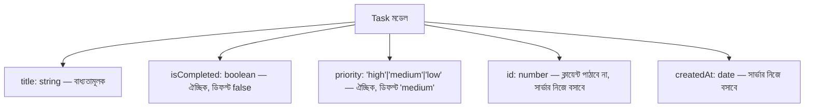
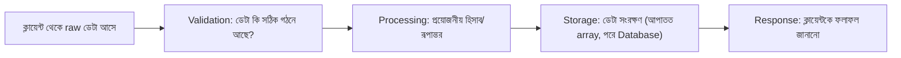

# ০৪. Data Modeling and Data Flow in a Backend Application

একজন ছুতোর মিস্ত্রি কখনো কাঠ কেটে ফেলার আগে হাতুড়ি ধরে না। সে প্রথমে বসে ভাবে — জিনিসটা দেখতে কেমন হবে, কয়টা তাক লাগবে, কোন কাঠ কোথায় বসবে, মাপ কত হবে। এই পরিকল্পনার ধাপটা বাদ দিয়ে সরাসরি কাটাকাটি শুরু করলে ফলাফল হয় এলোমেলো, মাপে না মেলা একটা আসবাব। ব্যাকএন্ড ডেভেলপমেন্টেও ঠিক এই একই শৃঙ্খলা দরকার — কোড লেখা শুরু করার আগে, ভাবতে হয় ডেটাটা দেখতে ঠিক কেমন হবে। এই চিন্তার প্রক্রিয়াটার নাম **data modeling**।

আগের লেসনে আমরা একটা `newUser` object বানিয়েছিলাম `{ id, name, email }` দিয়ে — এটা যত সাধারণ মনে হোক না কেন, এটাও আসলে একটা তথ্যচিন্তা বা মডেল। আমরা সিদ্ধান্ত নিয়েছিলাম একজন ইউজারের তিনটা বৈশিষ্ট্য থাকবে, প্রতিটার একটা নির্দিষ্ট টাইপ (Module 4-এর লেসনে আমরা string, number, boolean এসব ডেটা টাইপ নিয়ে কথা বলেছিলাম) থাকবে। বাস্তব প্রজেক্টে এই চিন্তাটা আরও গভীরে যায় — একটা "Task" অ্যাপের একটা টাস্কের কী কী বৈশিষ্ট্য থাকা উচিত? শিরোনাম (string), সম্পন্ন হয়েছে কিনা (boolean), তৈরির তারিখ (date), অগ্রাধিকার (একটা নির্দিষ্ট তালিকা থেকে, যেমন "high"/"medium"/"low")। এই সিদ্ধান্তগুলো যদি শুরুতে ভালোভাবে না নেয়া হয়, পরে কোড লেখার সময় বারবার মডেল বদলাতে হয়, যেটা একটা বড় প্রজেক্টে ব্যয়বহুল ভুল।

data modeling শুধু "কী কী ফিল্ড থাকবে" তা ঠিক করা না, সাথে এটাও ঠিক করা — কোনটা বাধ্যতামূলক (required), কোনটা ঐচ্ছিক (optional), আর কোনটা সার্ভার নিজে থেকে বসাবে (যেমন `id`, বা তৈরির তারিখ)। যেমন একটা Task মডেল এভাবে চিন্তা করা যায়:



মডেল ঠিক হয়ে গেলে, পরের প্রশ্নটা আসে — এই ডেটা ব্যাকএন্ডের ভেতর দিয়ে কীভাবে "ভ্রমণ" করে? একটা POST রিকোয়েস্ট যখন আসে, ডেটাটা একেবারে সরাসরি ডেটাবেজে গিয়ে বসে না — এটা কয়েকটা ধাপ পার হয়, প্রতিটা ধাপের নিজস্ব দায়িত্ব থাকে:



এই চারটা ধাপ প্রতিটা backend অপারেশনের মেরুদণ্ড। **Validation** ধাপে আমরা যাচাই করি ক্লায়েন্ট যা পাঠিয়েছে তা বিশ্বাসযোগ্য কিনা — এটা এত গুরুত্বপূর্ণ বিষয় যে এর জন্য পুরো পরের লেসনটাই বরাদ্দ থাকবে। **Processing** ধাপে আমরা ডেটার উপর প্রয়োজনীয় কাজ করি — যেমন `id` বসানো, `createdAt` তৈরি করা, বা কোনো হিসাব করা। **Storage** ধাপে ডেটা কোথাও সংরক্ষিত হয় — এখন পর্যন্ত আমরা একটা সাধারণ array ব্যবহার করছি (Module 15-এ আমরা প্রকৃত ডেটাবেজে যাবো)। আর **Response** ধাপে ক্লায়েন্টকে জানানো হয় কী ঘটলো, উপযুক্ত status code সহ।

চলো আগের লেসনের কোডটাকেই একটু বড় করি, Task মডেল অনুযায়ী, এই চারটা ধাপ স্পষ্টভাবে আলাদা করে দেখাই:

```javascript
const express = require('express');
const app = express();
app.use(express.json());

const tasks = [];
let nextId = 1;

app.post('/tasks', (req, res) => {
  // ধাপ ১: ক্লায়েন্টের raw ডেটা
  const { title, priority } = req.body;

  // ধাপ ২: Validation (এখানে সংক্ষিপ্ত, পরের লেসনে বিস্তারিত)
  if (!title) {
    return res.status(400).json({ message: 'title আবশ্যক' });
  }

  // ধাপ ৩: Processing — মডেল অনুযায়ী চূড়ান্ত object বানানো
  const newTask = {
    id: nextId++,
    title,
    priority: priority || 'medium',
    isCompleted: false,
    createdAt: new Date()
  };

  // ধাপ ৪: Storage
  tasks.push(newTask);

  // ধাপ ৫: Response
  res.status(201).json(newTask);
});

app.listen(3000, () => {
  console.log('সার্ভার চালু আছে port 3000-এ');
});
```

লক্ষ্য করো, `priority: priority || 'medium'` লাইনটা কী করছে — যদি ক্লায়েন্ট `priority` না পাঠায় (মানে সেটা `undefined` হয়), তাহলে ডিফল্ট মান `'medium'` বসে যাচ্ছে। এটাই হলো মডেলে করা সিদ্ধান্তের ("priority ঐচ্ছিক, ডিফল্ট medium") সরাসরি কোডে প্রতিফলন। এভাবে যখন তুমি আগে থেকে মডেলটা কাগজে বা মাথায় স্পষ্ট করে ফেলো, কোড লেখাটা হয়ে যায় শুধু সেই সিদ্ধান্তগুলোকে JavaScript-এ অনুবাদ করা — অনেকটা ছুতোর মিস্ত্রির নকশা অনুযায়ী কাঠ কাটার মতো, এলোমেলো আন্দাজে না।

আমরা উপরের কোডে `if (!title)` দিয়ে একটা সাধারণ validation দেখিয়েছি, কিন্তু বাস্তবে ভ্যালিডেশন অনেক বেশি সতর্কতা দাবি করে — কারণ ক্লায়েন্ট থেকে আসা যেকোনো ডেটাকে সন্দেহের চোখে দেখা উচিত। পরের লেসনে আমরা ঠিক এই বিষয়টা নিয়েই গভীরে যাবো।
