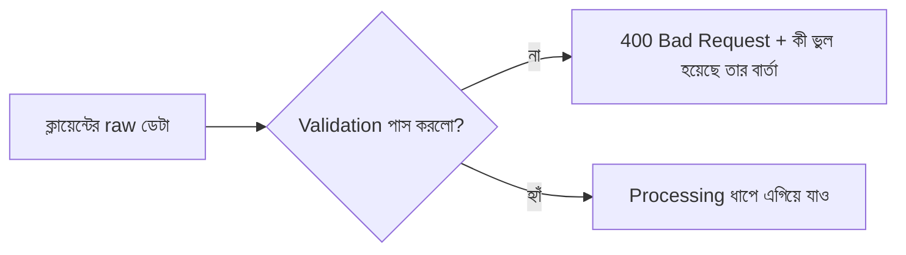

# ০৫. Data Validation in a Backend Application

সীমান্তে একজন কাস্টমস অফিসারের কথা চিন্তা করো। প্রতিটা ব্যাগ, প্রতিটা মানুষ দেশে ঢোকার আগে চেক হয় — পাসপোর্ট ঠিক আছে কিনা, ব্যাগে নিষিদ্ধ জিনিস আছে কিনা। অফিসার কখনো ধরে নেয় না যে "সবাই তো ভালো মানুষ, চেক না করলেও চলবে।" প্রতিটা প্রবেশকারীকে সমানভাবে যাচাই করা হয়, তা সে যত ভদ্রভাবেই কথা বলুক না কেন।

ব্যাকএন্ড ডেভেলপমেন্টের একটা সবচেয়ে গুরুত্বপূর্ণ নীতি হলো ঠিক এই কাস্টমস অফিসারের মতো চিন্তা করা — **client থেকে আসা কোনো ডেটাকেই বিশ্বাস করা যাবে না, যতক্ষণ না সেটা যাচাই করা হয়েছে।** এই নীতিটার একটা পরিচিত নাম আছে ইন্ডাস্ট্রিতে: "never trust user input"। কেন এত কড়াকড়ি? কারণ ক্লায়েন্ট (ব্রাউজার, মোবাইল অ্যাপ, বা Postman-এর মতো টুল) থেকে যেকোনো কিছু পাঠানো সম্ভব — একজন ব্যবহারকারী ভুল করে খালি ফর্ম সাবমিট করতে পারে, আবার একজন দুষ্টু ব্যবহারকারী ইচ্ছাকৃতভাবে ভুল বা ক্ষতিকর ডেটা পাঠানোর চেষ্টা করতে পারে। ফ্রন্টএন্ডে যতই ভ্যালিডেশন থাকুক (যেমন ফর্মে "এই ফিল্ড খালি রাখা যাবে না" লেখা), সেই ফ্রন্টএন্ড এড়িয়ে সরাসরি API-তে রিকোয়েস্ট পাঠানো টেকনিক্যালি সহজ — তাই আসল, নির্ভরযোগ্য প্রতিরক্ষা-ব্যুহ সবসময় ব্যাকএন্ডেই বসাতে হয়।

আগের লেসনে আমরা data flow-এর মধ্যে "Validation" ধাপটা দেখেছিলাম, request-এর একদম শুরুতেই বসানো:



লক্ষ্য করার বিষয়, validation ব্যর্থ হলে সাথে সাথে থেমে যাওয়া উচিত — processing বা storage ধাপে না গিয়ে। এটা অনেকটা কাস্টমস অফিসারের মতোই, পাসপোর্ট ঠিক না থাকলে আর ভেতরে ঢুকতে দেয়া হয় না, বাকি প্রক্রিয়া চলেই না।

চলো আগের লেসনের Task মডেল দিয়েই একটা আরও সম্পূর্ণ ম্যানুয়াল ভ্যালিডেশন লিখি, যাতে বোঝা যায় ঠিক কী কী জিনিস যাচাই করা উচিত:

```javascript
app.post('/tasks', (req, res) => {
  const { title, priority } = req.body;

  // ১. আবশ্যক ফিল্ড আছে কিনা
  if (!title) {
    return res.status(400).json({ message: 'title আবশ্যক' });
  }

  // ২. টাইপ ঠিক আছে কিনা
  if (typeof title !== 'string') {
    return res.status(400).json({ message: 'title অবশ্যই লেখা (string) হতে হবে' });
  }

  // ৩. অতিরিক্ত সীমাবদ্ধতা — খালি স্ট্রিং বা অতিরিক্ত লম্বা লেখা ঠেকানো
  if (title.trim().length === 0 || title.length > 100) {
    return res.status(400).json({ message: 'title ১-১০০ অক্ষরের মধ্যে হতে হবে' });
  }

  // ৪. যদি priority পাঠানো হয়, সেটা নির্দিষ্ট তালিকার মধ্যে আছে কিনা
  const allowedPriorities = ['high', 'medium', 'low'];
  if (priority && !allowedPriorities.includes(priority)) {
    return res.status(400).json({
      message: `priority অবশ্যই এই একটা হতে হবে: ${allowedPriorities.join(', ')}`
    });
  }

  const newTask = {
    id: nextId++,
    title: title.trim(),
    priority: priority || 'medium',
    isCompleted: false,
    createdAt: new Date()
  };

  tasks.push(newTask);
  res.status(201).json(newTask);
});
```

এখানে প্রতিটা `if` ব্লক একটা করে নির্দিষ্ট প্রশ্ন করছে — ফিল্ডটা আছে কিনা, টাইপ ঠিক আছে কিনা, মানটা যুক্তিসঙ্গত সীমার মধ্যে কিনা, আর যদি একটা নির্দিষ্ট তালিকা থেকে বেছে নেয়ার কথা থাকে (যেমন priority), তাহলে ক্লায়েন্ট সেই তালিকার বাইরের কিছু পাঠায়নি তো। প্রতিটা ব্যর্থতার সাথে `400 Bad Request` আর একটা স্পষ্ট বার্তা পাঠানো হচ্ছে, যাতে ফ্রন্টএন্ড ডেভেলপার বা ব্যবহারকারী ঠিক বুঝতে পারে কোথায় ভুল হয়েছে — শুধু "এরর হয়েছে" বললে সেটা কাজে লাগে না, ঠিক কোন ফিল্ডে কী সমস্যা সেটা বলাই দায়িত্বশীল API-এর লক্ষণ।

এখন খেয়াল করার বিষয়, উপরের কোডটা একটা মাত্র endpoint-এর জন্য লেখা। বাস্তব প্রজেক্টে যেখানে দশটা, বিশটা endpoint থাকে, প্রতিটাতে এভাবে হাতে-হাতে `if` লিখতে থাকলে কোড অনেক বড় আর পুনরাবৃত্তিমূলক হয়ে যায়। এই সমস্যার সমাধানে ইন্ডাস্ট্রিতে **validation library** ব্যবহার করা হয় — যেমন `Joi`, `Zod`, বা `express-validator`। এই লাইব্রেরিগুলো তোমাকে একটা "স্কিমা" (schema) — অর্থাৎ ডেটার প্রত্যাশিত গঠন — একবার লিখে দিতে দেয়, আর তারপর সেই স্কিমা দিয়ে যেকোনো ডেটা এক লাইনে যাচাই করা যায়। ধারণাটা অনেকটা এরকম দেখতে হবে (এখনই এটা ব্যবহার না করলেও, ধারণাটা মাথায় রাখা ভালো):

```javascript
// ধারণাগত উদাহরণ — একটা validation library ব্যবহার করলে কেমন দেখাতো
const taskSchema = {
  title: { type: 'string', required: true, maxLength: 100 },
  priority: { type: 'string', enum: ['high', 'medium', 'low'] }
};
```

আমরা এই কোর্সে যখন বড় প্রজেক্টে যাবো, তখন এরকম একটা লাইব্রেরি পরিচয় করিয়ে দেয়া হবে, যাতে ভ্যালিডেশন কোড ছোট, পরিষ্কার আর পুনর্ব্যবহারযোগ্য হয়। কিন্তু এখন যেভাবে ম্যানুয়ালি `if` দিয়ে ভ্যালিডেশন লিখতে শিখলে, সেটার একটা বড় সুবিধা আছে — ভেতরে আসলে কী ঘটছে সেটা তুমি পুরোপুরি বুঝতে পারবে, লাইব্রেরিটা শুধু এই একই লজিককে সংক্ষিপ্ত আর সংগঠিত করে দেয়, জাদু কিছু করে না।

এই মডিউলে আমরা status code, routing, POST endpoint-এর গঠন, data modeling আর validation — এই পাঁচটা বিষয় একটার পর একটা শিখেছি, আর প্রতিটাই একে অপরের সাথে জড়িত। এখন সময় হয়েছে এই সবগুলো জ্ঞান একসাথে করে নিজের হাতে একটা সম্পূর্ণ API বানানোর — সেটাই পরের ও এই মডিউলের শেষ লেসন, একটা হাতে-কলমে অ্যাসাইনমেন্ট।
