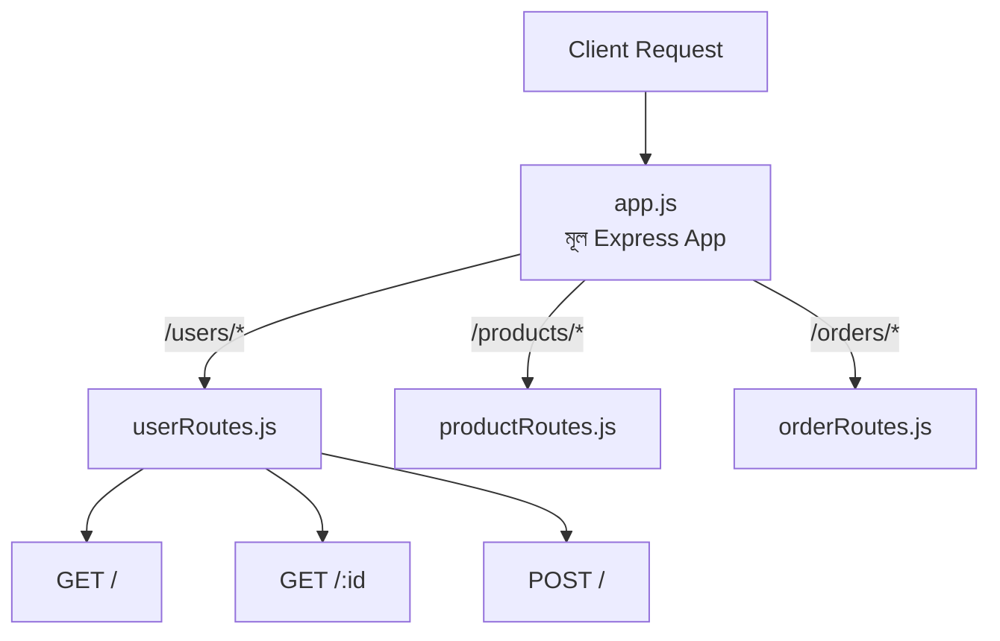

# ০২. Why Do We Need Router? Implementing Routers

Module 6-এর দ্বিতীয় লেসনে আমরা `app.get('/users', ...)`, `app.post('/users', ...)` এভাবে সরাসরি `app` অবজেক্টের উপরে রুট বসাতে শিখেছিলাম। এই পদ্ধতিটা ছোট প্রজেক্টের জন্য একদম ঠিকঠাক। কিন্তু এখন কল্পনা করো একটা বাস্তব অ্যাপ্লিকেশন, যেখানে ইউজার ম্যানেজমেন্টের জন্য ১০টা রুট, প্রোডাক্টের জন্য ১৫টা রুট, অর্ডারের জন্য ১২টা রুট — সব মিলিয়ে ৪০-৫০টা রুট। যদি এই সবগুলো একই `app.js` ফাইলে একের পর এক লেখা হয়, তাহলে ফাইলটা হয়ে যায় একটা অগোছালো গুদামঘর, যেখানে দরকারি জিনিস খুঁজে পাওয়াই কঠিন হয়ে যায়।

এই সমস্যার সমাধান হলো **Router**। Express.js-এর `express.Router()` তোমাকে দেয় একটা "মিনি অ্যাপ্লিকেশন" তৈরি করার ক্ষমতা, যেটার নিজস্ব রুটের সেট থাকে, যেটা তুমি আলাদা একটা ফাইলে লিখে রাখতে পারো, আর পরে মূল অ্যাপ্লিকেশনের সাথে জুড়ে দিতে পারো। এটাকে ভাবতে পারো একটা বড় শপিং মলের মতো — পুরো মলটা হলো তোমার `app`, আর প্রতিটা দোকান (ইলেকট্রনিক্সের দোকান, কাপড়ের দোকান, খাবারের দোকান) হলো আলাদা আলাদা Router। প্রতিটা দোকানের নিজস্ব সেকশন আছে, নিজস্ব কর্মী আছে, কিন্তু সবগুলো মিলেই একটা মল তৈরি করে, আর মলের গেটে একটা সাইনবোর্ড বলে দেয় কোন দিকে গেলে কোন দোকান পাওয়া যাবে।

চলো একটা বাস্তব উদাহরণ দিয়ে দেখি। ধরো আমাদের একটা `users` রিসোর্স আছে। আমরা একটা আলাদা ফাইল বানাবো, `routes/userRoutes.js`:

```javascript
// routes/userRoutes.js
const express = require('express');
const router = express.Router();

router.get('/', (req, res) => {
  res.json({ message: 'সব ইউজারের তালিকা' });
});

router.get('/:id', (req, res) => {
  res.json({ message: `ইউজার আইডি: ${req.params.id}` });
});

router.post('/', (req, res) => {
  res.json({ message: 'নতুন ইউজার তৈরি হলো', data: req.body });
});

module.exports = router;
```

লক্ষ করো, এখানে `express()` না, বরং `express.Router()` ব্যবহার করা হয়েছে — এটাই আমাদের "মিনি অ্যাপ্লিকেশন"। আর প্রতিটা রুটের পাথ কিন্তু `/users` দিয়ে শুরু হচ্ছে না, শুধু `/` আর `/:id` — কারণ "এই রুটগুলো ইউজার-সম্পর্কিত" এই তথ্যটা আমরা পরে বলবো, যখন এই router-কে মূল অ্যাপে জোড়া দেবো।

এবার মূল `app.js` ফাইলে:

```javascript
// app.js
const express = require('express');
const userRoutes = require('./routes/userRoutes');

const app = express();
app.use(express.json());

app.use('/users', userRoutes);

app.listen(3000, () => {
  console.log('সার্ভার চালু আছে port 3000-এ');
});
```

এই `app.use('/users', userRoutes)` লাইনটাই আসল জাদু। এটা বলছে — "যেকোনো request যেটা `/users` দিয়ে শুরু হয়, সেটা `userRoutes` router-এর হাতে ছেড়ে দাও।" তাই `router.get('/:id', ...)` আসলে কার্যকর হয় `/users/:id` হিসেবে, আর `router.post('/', ...)` কার্যকর হয় `/users` হিসেবে। এভাবে router নিজে জানে না তার "পূর্ণ ঠিকানা" কী, শুধু জানে সে `/users`-এর ভেতরে কী কী সাব-রুট সামলাবে — আর এই আলাদা করে রাখাটাই একে reusable আর maintainable করে তোলে।



এভাবে একই প্যাটার্নে তুমি `productRoutes.js`, `orderRoutes.js` তৈরি করতে পারো, আর `app.js` ফাইলটা থেকে যাবে ছোট, পরিষ্কার, শুধু কোন রিসোর্সের রুট কোথায় মাউন্ট হচ্ছে তার একটা তালিকার মতো — অনেকটা মলের প্রবেশপথে থাকা ডিরেক্টরি বোর্ডের মতো।

router দিয়ে আমরা "কোন request কোথায় যাবে" এই সমস্যাটা সমাধান করলাম। কিন্তু "সেখানে গিয়ে ঠিক কী কাজ হবে" — সেই লজিকটা এখনো রুট ফাইলের ভেতরেই লেখা আছে। পরের লেসনে আমরা সেই লজিককেও আলাদা করে ফেলবো, একটা নতুন স্তরে — যার নাম **Controller**।
