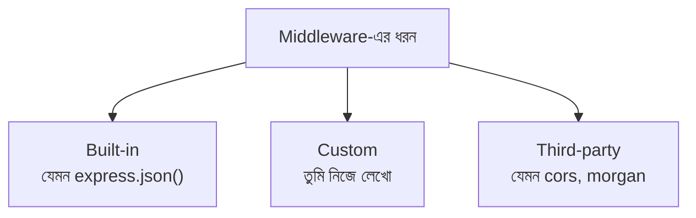
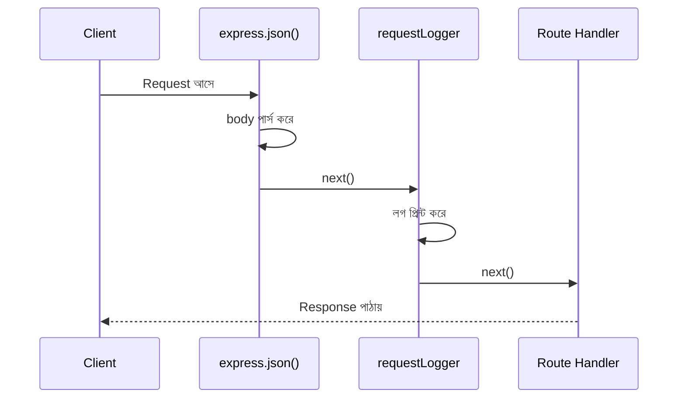

# ০৪. Introduction to Middleware

আগের লেসনের শেষে একটা প্রশ্ন রেখে এসেছিলাম — এমন কাজ যা প্রায় সব রুটের জন্যই দরকার (যেমন ইউজার লগইন করা আছে কিনা যাচাই করা, বা প্রতিটা request-এর একটা লগ রাখা), সেটা কি প্রতিটা controller ফাংশনে বারবার কপি-পেস্ট করে লিখতে হবে? উত্তরটা অবশ্যই "না", আর এই "না"-এর পেছনের সমাধানটাই হলো **Middleware**।

একটা এয়ারপোর্টের কথা চিন্তা করো। একজন যাত্রী প্লেনে ওঠার আগে একে একে কয়েকটা চেকপয়েন্ট পার হয় — টিকিট চেক, ব্যাগেজ স্ক্যান, ইমিগ্রেশন, বোর্ডিং গেট। প্রতিটা চেকপয়েন্ট তার নিজের কাজটা করে, তারপর যাত্রীকে পরের চেকপয়েন্টে যেতে দেয়। কোনো একটা চেকপয়েন্টে যদি সমস্যা হয় (যেমন টিকিট না থাকে), যাত্রীকে সেখানেই আটকে দেয়া হয়, সে আর সামনে এগোতে পারে না। Express-এর **middleware** ঠিক এভাবেই কাজ করে — প্রতিটা incoming request একটা রুট হ্যান্ডলারে পৌঁছানোর আগে একের পর এক middleware ফাংশনের ভেতর দিয়ে যায়, আর প্রতিটা middleware চাইলে request-টাকে সামনে যেতে দিতে পারে, অথবা সেখানেই থামিয়ে একটা রেসপন্স পাঠিয়ে দিতে পারে।

একটা middleware ফাংশনের গঠন একটু বিশেষ — এতে সাধারণ রুট হ্যান্ডলারের মতো `req, res` থাকে, কিন্তু সাথে একটা তৃতীয় প্যারামিটার থাকে, `next`:

```javascript
const myMiddleware = (req, res, next) => {
  // এখানে কিছু একটা কাজ
  console.log('একটা request এসেছে');
  next(); // পরের চেকপয়েন্টে/হ্যান্ডলারে যাও
};
```

এই `next()` ফাংশনটাই মূল চাবিকাঠি। যদি middleware-এর ভেতরে `next()` কল না করা হয়, request সেখানেই আটকে থাকবে — client কখনো কোনো জবাব পাবে না (যদি না নিজে থেকে `res.send()` বা `res.json()` দিয়ে রেসপন্স পাঠানো হয়)। তাই প্রতিটা middleware-কে সিদ্ধান্ত নিতে হয়: হয় `next()` কল করে সামনে যেতে দাও, অথবা `res`-এর মাধ্যমে নিজেই একটা জবাব দিয়ে যাত্রা শেষ করে দাও (যেমন authentication ব্যর্থ হলে `401 Unauthorized` পাঠিয়ে দেয়া)।

Express-এ middleware মূলত তিন ধরনের:



**Built-in middleware** Express নিজেই সরবরাহ করে — সবচেয়ে পরিচিত উদাহরণ `express.json()`, যেটা আমরা আগেই ব্যবহার করেছি request body-কে JSON হিসেবে পড়ার জন্য। **Third-party middleware** হলো npm থেকে ইনস্টল করা প্যাকেজ, যেমন `cors` (ভিন্ন ডোমেইন থেকে request গ্রহণের অনুমতি দেয়া) বা `morgan` (প্রতিটা request স্বয়ংক্রিয়ভাবে লগ করা)। আর **Custom middleware** হলো আমাদের নিজেদের লেখা — যেটা এই মডিউলে আমরা বানাবো।

একটা সহজ custom middleware দিয়ে শুরু করি, যেটা প্রতিটা request-এর সময় আর পাথ প্রিন্ট করে:

```javascript
// middlewares/logger.js
const requestLogger = (req, res, next) => {
  const time = new Date().toISOString();
  console.log(`[${time}] ${req.method} ${req.url}`);
  next();
};

module.exports = requestLogger;
```

এবার এটাকে `app.js`-এ ব্যবহার করি:

```javascript
const express = require('express');
const requestLogger = require('./middlewares/logger');

const app = express();
app.use(express.json());
app.use(requestLogger); // প্রতিটা request-এর জন্য চলবে

app.use('/users', userRoutes);
```

`app.use(requestLogger)` লাইনটা বলছে — "প্রতিটা request, যেকোনো রুটে যাওয়ার আগে, প্রথমে এই middleware দিয়ে যাক।" মনে রাখা জরুরি, middleware-এর ক্রম গুরুত্বপূর্ণ — `app.use()` যে ক্রমে লেখা হয়, request ঠিক সেই ক্রমেই তাদের ভেতর দিয়ে যায়, এয়ারপোর্টের চেকপয়েন্টের মতোই।



middleware শুধু গোটা অ্যাপ্লিকেশনের জন্য না, নির্দিষ্ট একটা রুটের জন্যও বসানো যায় — যেমন `router.get('/profile', authCheck, getProfile)` লিখলে শুধু `/profile` রুটেই `authCheck` middleware চলবে। এই নমনীয়তাটাই middleware-কে এত শক্তিশালী করে তোলে — চাইলে পুরো অ্যাপে প্রয়োগ করা যায়, চাইলে শুধু নির্দিষ্ট কিছু রুটে।

এখন আমরা middleware-এর তত্ত্ব জানি — `next()`, ক্রম, তিন ধরনের middleware। পরের লেসনে আমরা এই জ্ঞানটা কাজে লাগিয়ে হাতেকলমে একটা বাস্তব middleware প্রজেক্ট বানাবো।
