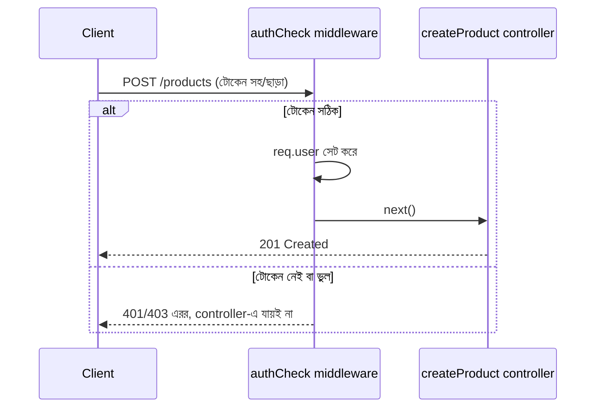

# ০৫. Middleware Project One

তত্ত্ব যথেষ্ট হয়েছে — এবার হাতেকলমে একটা বাস্তব middleware বানানোর পালা। আমরা এমন একটা পরিস্থিতি নেবো যেটা প্রায় প্রতিটা API-তেই থাকে — কিছু রুট আছে যেগুলো সবার জন্য উন্মুক্ত (যেমন ইউজার তালিকা দেখা), আবার কিছু রুট আছে যেগুলোর জন্য একজন ইউজারকে "লগইন করা" প্রমাণ করতে হয় (যেমন নতুন প্রোডাক্ট তৈরি করা)। এই যাচাইয়ের কাজটাই আমরা একটা middleware দিয়ে সমাধান করবো, যার নাম দেবো `authCheck`।

বাস্তব জীবনে এই এয়ারপোর্ট চেকপয়েন্টের সাথে তুলনাটা এখানে আরও স্পষ্ট হয় — টিকিট চেক না হলে কাউকে বোর্ডিং গেটের ভেতরেই ঢুকতে দেয়া হয় না। আমাদের ক্ষেত্রে, "টিকিট" হবে একটা টোকেন, যেটা request-এর header-এ পাঠানো হবে। আমরা এখনো প্রকৃত authentication সিস্টেম (যেমন JWT) নিয়ে বিস্তারিত পড়িনি — সেটা পরের মডিউলগুলোতে আসবে। এখন আমরা সহজ একটা সংস্করণ বানাবো, যাতে middleware-এর প্যাটার্নটা স্পষ্ট বোঝা যায়।

প্রথমে middleware ফাংশনটা লিখি:

```javascript
// middlewares/authCheck.js

const authCheck = (req, res, next) => {
  const token = req.headers['authorization'];

  if (!token) {
    return res.status(401).json({
      success: false,
      message: 'অনুমতি নেই — টোকেন পাওয়া যায়নি'
    });
  }

  if (token !== 'Bearer my-secret-token') {
    return res.status(403).json({
      success: false,
      message: 'ভুল টোকেন — প্রবেশাধিকার নিষিদ্ধ'
    });
  }

  // টোকেন ঠিক থাকলে, request-এর সাথে ইউজারের তথ্য জুড়ে দিলাম
  req.user = { id: 1, name: 'রহিম' };
  next();
};

module.exports = authCheck;
```

এখানে দুটো গুরুত্বপূর্ণ জিনিস লক্ষ করার মতো। প্রথমত, প্রতিটা ব্যর্থ যাচাইয়ের ক্ষেত্রে আমরা `return` ব্যবহার করেছি `res.status(...).json(...)`-এর আগে। এই `return` না দিলে কোডটা থেমে যেতো না, নিচের লাইনগুলোও চলতে থাকতো, আর ভুলবশত `next()`-ও কল হয়ে যেতে পারতো — যেটা একটা সাধারণ কিন্তু বিপজ্জনক bug। দ্বিতীয়ত, টোকেন সঠিক হলে আমরা `req.user` নামে একটা নতুন প্রপার্টি বসিয়ে দিচ্ছি request অবজেক্টের ভেতরে। এটাই middleware-এর একটা শক্তিশালী ক্ষমতা — এটা `req` অবজেক্টে তথ্য যোগ করতে পারে, যেটা পরের middleware বা controller ফাংশন পরে ব্যবহার করতে পারবে, ঠিক যেমন এয়ারপোর্টের একটা চেকপয়েন্ট যাত্রীর হাতে একটা স্ট্যাম্প মেরে দেয়, যেটা পরের চেকপয়েন্ট দেখে বুঝে নেয় আগের ধাপ পার হয়েছে কিনা।

এবার এটাকে নির্দিষ্ট রুটে বসাই, পুরো অ্যাপে না:

```javascript
// routes/productRoutes.js
const express = require('express');
const router = express.Router();
const authCheck = require('../middlewares/authCheck');
const { getAllProducts, createProduct } = require('../controllers/productController');

router.get('/', getAllProducts);           // সবার জন্য উন্মুক্ত
router.post('/', authCheck, createProduct); // শুধু লগইন করা ইউজারের জন্য

module.exports = router;
```

`router.post('/', authCheck, createProduct)` — এই লাইনটাই মূল ধাঁধার সমাধান। Express-এ একটা রুটে একাধিক ফাংশন একসাথে দেয়া যায়, আর সেগুলো বাম থেকে ডানে ক্রমানুসারে চলে। তাই `authCheck` প্রথমে চলবে; যদি সে `next()` কল করে, তবেই `createProduct` চলবে; নাহলে `createProduct`-এর কোড কখনো এক্সিকিউটই হবে না।



controller-এর ভেতরে এখন `req.user` ব্যবহার করা যাবে, কারণ middleware সেটা আগেই বসিয়ে দিয়েছে:

```javascript
const createProduct = (req, res) => {
  const { name, price } = req.body;
  const createdBy = req.user.name; // authCheck থেকে পাওয়া তথ্য
  res.status(201).json({
    success: true,
    data: { name, price, createdBy }
  });
};
```

এই ছোট প্রজেক্টটা দেখিয়ে দিলো middleware কীভাবে বাস্তবে ব্যবহার করা হয় — নিরাপত্তার একটা স্তর যোগ করা, যেটা controller-এর লজিক থেকে সম্পূর্ণ আলাদা, আর যেকোনো রুটে চাইলেই জুড়ে দেয়া যায় শুধু রুট ডেফিনিশনে এক লাইন যোগ করে। Module 6 লেসন ৫-এ শেখা validation-এর ধারণার সাথে এটার একটা সুন্দর মিল আছে — দুটোই "খারাপ ডেটা বা অননুমোদিত ব্যবহার সিস্টেমের গভীরে ঢোকার আগেই আটকানো"-র নীতিতে কাজ করে, শুধু validation যাচাই করে ডেটার আকৃতি, আর middleware যাচাই করতে পারে তার চেয়েও বিস্তৃত অনেক কিছু।

এখন আমাদের হাতে middleware লেখা আর নির্দিষ্ট রুটে বসানোর অভিজ্ঞতা আছে। পরের লেসনে আমরা এই একই ধারণা ব্যবহার করে সমাধান করবো আরেকটা বাস্তব সমস্যা — কীভাবে একজন ইউজারকে সার্ভারে অতিরিক্ত request পাঠিয়ে সিস্টেম বিপর্যস্ত করে ফেলা থেকে ঠেকানো যায়, যার নাম **Rate Limiting**।
