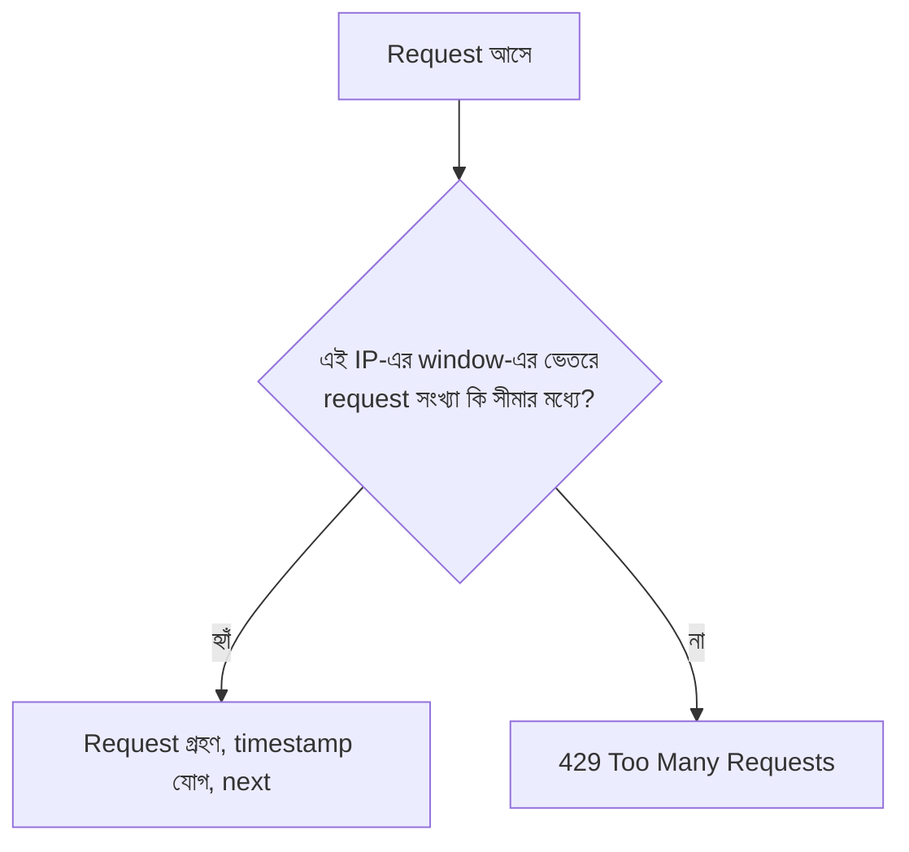

# ০৬. Module Recap with Rate Limiting Middleware

এই পর্যন্ত আমরা যে পথটা পাড়ি দিয়েছি সেটা একবার ঝালিয়ে নেই। আমরা রুটকে ফাইলে ফাইলে ভাগ করেছি (Router), তারপর ব্যবসায়িক লজিককে আলাদা করেছি (Controller), তারপর দেখেছি কীভাবে সাধারণ কাজগুলো (যেমন authentication) middleware আকারে সব রুটে বা নির্দিষ্ট রুটে বসানো যায়। এখন এই একই middleware-এর ধারণা দিয়ে আমরা সমাধান করবো ব্যাকএন্ড ডেভেলপমেন্টের আরেকটা পরিচিত সমস্যা — **Rate Limiting**।

কল্পনা করো একটা ব্যাংকের শাখা, যেখানে একজন গ্রাহক প্রতি সেকেন্ডে ১০০ বার লাইনে দাঁড়িয়ে একই প্রশ্ন জিজ্ঞেস করছে। এতে অন্য গ্রাহকরা সেবা পাচ্ছে না, কর্মীরা ক্লান্ত হয়ে পড়ছে, পুরো শাখার কার্যক্ষমতা কমে যাচ্ছে। ঠিক এই একই জিনিস ঘটতে পারে একটা API-তে — একজন ইউজার (ইচ্ছাকৃতভাবে, বা কোনো bug-এর কারণে) সেকেন্ডে শত শত request পাঠাতে পারে, যেটা সার্ভারের রিসোর্স (CPU, মেমোরি, ডেটাবেজ কানেকশন) শেষ করে দিতে পারে, এমনকি পুরো সার্ভারকে অন্য সবার জন্য অকার্যকর করে দিতে পারে। এই আক্রমণকে অনেক সময় বলা হয় **DoS (Denial of Service)**, আর এমনকি সরল, দুর্ঘটনাবশত বাগ থেকেও একই ক্ষতি হতে পারে।

**Rate Limiting** হলো এই সমস্যার সমাধান — একটা নিয়ম যা বলে দেয়, "একজন নির্দিষ্ট ইউজার (বা IP address) একটা নির্দিষ্ট সময়ের মধ্যে সর্বোচ্চ এতগুলো request পাঠাতে পারবে, তার বেশি হলে তাকে সাময়িকভাবে আটকে দেয়া হবে।" এটা যে middleware দিয়ে বাস্তবায়ন করা সবচেয়ে স্বাভাবিক জায়গা, সেটা এতক্ষণে স্পষ্ট হওয়ার কথা — কারণ এটাও ঠিক আগের এয়ারপোর্ট চেকপয়েন্টের মতোই একটা কাজ, যেটা রুটে পৌঁছানোর আগেই যাচাই করে নিতে হয়।

চলো একটা সহজ, নিজে হাতে বানানো (hand-rolled) rate limiter middleware লিখি, যাতে ভেতরের যুক্তিটা স্পষ্ট বোঝা যায়:

```javascript
// middlewares/simpleRateLimiter.js

const requestLog = {}; // { ip: [timestamp1, timestamp2, ...] }

const WINDOW_MS = 60 * 1000; // ১ মিনিট সময়সীমা
const MAX_REQUESTS = 5;      // এই সময়ে সর্বোচ্চ ৫টা request

const simpleRateLimiter = (req, res, next) => {
  const ip = req.ip;
  const now = Date.now();

  if (!requestLog[ip]) {
    requestLog[ip] = [];
  }

  // পুরনো (window-এর বাইরের) টাইমস্ট্যাম্পগুলো বাদ দিলাম
  requestLog[ip] = requestLog[ip].filter((timestamp) => now - timestamp < WINDOW_MS);

  if (requestLog[ip].length >= MAX_REQUESTS) {
    return res.status(429).json({
      success: false,
      message: 'অনেক বেশি request পাঠানো হয়েছে, একটু পরে আবার চেষ্টা করো'
    });
  }

  requestLog[ip].push(now);
  next();
};

module.exports = simpleRateLimiter;
```

এখানে `429` স্ট্যাটাস কোডটা লক্ষণীয় — এটা HTTP-এর নির্দিষ্ট একটা কোড, যার নাম **"Too Many Requests"**, ঠিক এই পরিস্থিতির জন্যই তৈরি। আমরা এখানে প্রতিটা IP address-এর জন্য একটা তালিকা রাখছি তার সাম্প্রতিক request-এর সময়ের, আর প্রতিবার নতুন request এলে পুরনো (window-এর বাইরে চলে যাওয়া) টাইমস্ট্যাম্পগুলো ফেলে দিচ্ছি, তারপর দেখছি এখনো কতগুলো বৈধ request আছে।

এটাকে আমরা পুরো অ্যাপে বসাতে পারি:

```javascript
const simpleRateLimiter = require('./middlewares/simpleRateLimiter');
app.use(simpleRateLimiter);
```

বাস্তব প্রোডাকশন প্রজেক্টে অবশ্য নিজে থেকে এই লজিক লেখার বদলে সাধারণত `express-rate-limit` নামের একটা জনপ্রিয় প্যাকেজ ব্যবহার করা হয়, কারণ সেটা আরও দক্ষভাবে (মেমোরি ব্যবহারে, একাধিক সার্ভার ইনস্ট্যান্স মিলিয়ে) এই একই কাজ করে:

```javascript
const rateLimit = require('express-rate-limit');

const limiter = rateLimit({
  windowMs: 60 * 1000, // ১ মিনিট
  max: 5,              // প্রতি IP-তে সর্বোচ্চ ৫টা request
  message: { success: false, message: 'অনেক বেশি request পাঠানো হয়েছে' }
});

app.use(limiter);
```

লক্ষ করো, `express-rate-limit`-এর কনফিগারেশনটা আমাদের নিজে লেখা middleware-এর মূল ধারণার সাথে হুবহু মিলে যায় — একটা সময়ের জানালা (`windowMs`), একটা সীমা (`max`)। আমরা নিজে হাতে লিখে দেখালাম যাতে বুঝতে পারো একটা রেডিমেড প্যাকেজের ভেতরে আসলে কী ঘটছে — একটা প্যাকেজ ব্যবহার করা তখনই বুদ্ধিমানের কাজ, যখন তুমি জানো সেটা ভেতরে ভেতরে কী করছে।



Rate limiting আমাদের সার্ভারকে অতিরিক্ত ব্যবহার থেকে রক্ষা করে। কিন্তু নিরাপত্তার আরেকটা গুরুত্বপূর্ণ দিক আছে, যেটা rate limiting সমাধান করে না — যদি কিছু একটা ভুল হয়, বা সন্দেহজনক কিছু ঘটে, তাহলে আমরা কীভাবে জানবো কে, কখন, কী করেছিলো? এই প্রশ্নের উত্তরেই পরের লেসনে আমরা বানাবো একটা **Audit Logger**।
