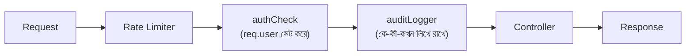

# ০৭. Audit Logger Project

ধরো একদিন সকালে দেখা গেলো, একটা প্রোডাক্টের দাম হঠাৎ ভুলভাবে বদলে গেছে, অথবা একজন ইউজারের অ্যাকাউন্ট ডিলিট হয়ে গেছে যেটা হওয়ার কথা ছিলো না। প্রশ্ন উঠবে — এটা কে করলো, কখন করলো, ঠিক কী request পাঠিয়েছিলো? যদি তোমার সিস্টেমে এই প্রশ্নের কোনো উত্তর না থাকে, তাহলে তুমি একটা অন্ধকারে হাতড়ানোর মতো পরিস্থিতিতে পড়ে যাবে। এই সমস্যার সমাধান হলো **Audit Logging** — সিস্টেমের গুরুত্বপূর্ণ প্রতিটা কাজের একটা স্থায়ী রেকর্ড রাখা, ঠিক যেমন একটা ব্যাংকের প্রতিটা লেনদেনের একটা রশিদ থাকে, যাতে পরে দরকার হলে পুরো ইতিহাসটা ফিরে দেখা যায়।

Audit logging আর সাধারণ ডিবাগ লগিং (যেমন আমরা লেসন ৪-এ বানানো `requestLogger`) এক জিনিস না, যদিও দুটোই middleware দিয়ে বানানো যায়। ডিবাগ লগ মূলত ডেভেলপারের জন্য, সাময়িক, আর প্রায়ই কনসোলেই থেকে যায়। কিন্তু **audit log** হলো একটা দায়বদ্ধতার (accountability) রেকর্ড — কে করলো, কী করলো, কখন করলো — যেটা সাধারণত স্থায়ীভাবে সংরক্ষণ করা হয় (ফাইলে, বা ডেটাবেজে), কারণ এটা প্রায়ই আইনি বা নিরাপত্তাজনিত কারণে পরে যাচাই করার দরকার পড়ে।

চলো একটা সহজ audit logger middleware বানাই, যেটা প্রতিটা "পরিবর্তনমূলক" request (POST, PUT, DELETE) একটা ফাইলে রেকর্ড করে রাখবে:

```javascript
// middlewares/auditLogger.js
const fs = require('fs');
const path = require('path');

const LOG_FILE = path.join(__dirname, '..', 'audit.log');

const auditLogger = (req, res, next) => {
  const shouldLog = ['POST', 'PUT', 'DELETE'].includes(req.method);

  if (shouldLog) {
    const entry = {
      time: new Date().toISOString(),
      method: req.method,
      path: req.originalUrl,
      user: req.user ? req.user.name : 'অজানা (auth ছাড়া)',
      ip: req.ip
    };

    const line = JSON.stringify(entry) + '\n';
    fs.appendFile(LOG_FILE, line, (error) => {
      if (error) {
        console.error('অডিট লগ লিখতে সমস্যা হয়েছে:', error.message);
      }
    });
  }

  next();
};

module.exports = auditLogger;
```

এই কোডে কয়েকটা বিষয় লক্ষ করার মতো। প্রথমত, আমরা `req.user` ব্যবহার করছি — এই একই প্যাটার্ন যা আমরা লেসন ৫-এর `authCheck` middleware-এ বসিয়েছিলাম। এটাই middleware চেইনের একটা সুন্দর দিক — একটা middleware অন্য middleware-এর বসানো তথ্যের উপর নির্ভর করতে পারে, যদি সেটা তার আগে বসানো থাকে। দ্বিতীয়ত, আমরা `fs.appendFile` ব্যবহার করেছি, `fs.writeFile` না — কারণ `writeFile` পুরনো কনটেন্ট মুছে নতুন করে লেখে, কিন্তু আমরা চাই প্রতিটা নতুন এন্ট্রি আগেরগুলোর সাথে যোগ হোক, ফাইলের শেষে। তৃতীয়ত, এই ফাইল-লেখার কাজটা asynchronous (মনে আছে Module 2 লেসন ৯-এ `fs.readFile` নিয়ে যা শিখেছিলাম, `fs.appendFile`-ও ঠিক একই স্বভাবের), তাই আমরা `next()`-কে callback-এর ভেতরে না রেখে সরাসরি চালাচ্ছি — লগ লেখা শেষ হওয়া পর্যন্ত ইউজারকে অপেক্ষা করানোর দরকার নেই, এটাই ভালো অভ্যাস।

এবার এটাকে অ্যাপে বসাই, তবে খেয়াল রাখতে হবে ক্রম নিয়ে — `auditLogger`-কে `authCheck`-এর পরে বসাতে হবে, কারণ তার আগে `req.user` থাকবে না:

```javascript
app.use(express.json());
app.use(simpleRateLimiter);
app.use('/users', authCheck, auditLogger, userRoutes);
```



চালানোর পর `audit.log` ফাইলে এরকম এন্ট্রি জমা হতে থাকবে:

```
{"time":"2026-08-08T10:15:32.120Z","method":"POST","path":"/users","user":"রহিম","ip":"::1"}
{"time":"2026-08-08T10:16:05.400Z","method":"DELETE","path":"/users/3","user":"রহিম","ip":"::1"}
```

এই ধরনের একটা লগ ফাইল থেকে পরে যেকোনো সময় প্রশ্নের উত্তর বের করা যায় — কে, কবে, কী পরিবর্তন করেছিলো। বাস্তব প্রোডাকশন সিস্টেমে এই লগ সাধারণত ফাইলের বদলে একটা ডেটাবেজে বা বিশেষায়িত লগিং সার্ভিসে (যেমন CloudWatch, Datadog) পাঠানো হয়, কিন্তু মূল নীতিটা একই থাকে — একটা middleware যা প্রতিটা গুরুত্বপূর্ণ কাজের ছাপ রেখে যায়।

এই প্রজেক্টটা দিয়ে আমরা middleware-এর ধারণাটাকে একটা বাস্তব, উৎপাদন-মানের ফিচারে রূপান্তরিত করলাম। এখন router, controller, authentication middleware, rate limiting, আর audit logging — সবগুলো টুকরা আমাদের হাতে আছে। পরের লেসনে আমরা একটু ভিন্নভাবে এগোবো — rate limiting-এর পেছনের অ্যালগরিদমগুলো নিয়ে আরও গভীরে চিন্তা করবো।
