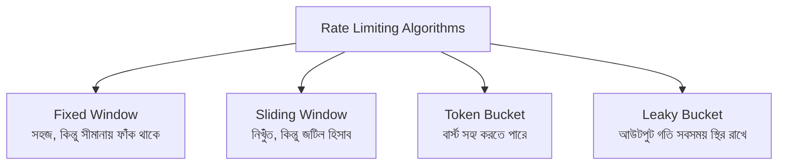

# ০৮. Type of Rate Limiting Algorithm You Can Explore

লেসন ৬-এ আমরা যে rate limiter বানিয়েছিলাম, সেটার ভেতরের যুক্তিটা ছিলো বেশ সহজ — একটা নির্দিষ্ট সময়ের জানালার (window) ভেতরে কতগুলো request এসেছে সেটা গুনে রাখা, আর সীমা পার হলে আটকে দেয়া। এই পদ্ধতিটা কাজ করে, কিন্তু এটা rate limiting-এর একমাত্র উপায় না। বাস্তব জগতে, বিশেষ করে বড় বড় সিস্টেমে (যেমন Google, Cloudflare, বা কোনো পেমেন্ট গেটওয়ে), rate limiting বাস্তবায়নের জন্য বেশ কয়েকটা প্রতিষ্ঠিত অ্যালগরিদম আছে, আর প্রতিটার নিজস্ব সুবিধা-অসুবিধা আছে।

এই লেসনের উদ্দেশ্য এই অ্যালগরিদমগুলোর প্রতিটার ভেতরের কোড লিখে দেখানো না, বরং এগুলোর পেছনের ধারণাটা পরিচয় করিয়ে দেয়া, যাতে তুমি জানো এই জগতে আর কী কী আছে, আর প্রয়োজনে নিজে থেকে আরও গভীরে খুঁজে দেখতে পারো — বিশেষ করে ইউটিউবে এই বিষয়ে চমৎকার ভিজ্যুয়াল ব্যাখ্যা পাওয়া যায়, যেখানে এই অ্যালগরিদমগুলোকে অ্যানিমেশনের মাধ্যমে দেখানো হয়, আর সেটা লেখা পড়ার চেয়ে বোঝা অনেক সহজ করে দেয়।

চারটা সবচেয়ে পরিচিত অ্যালগরিদম নিয়ে সংক্ষেপে বলি।

**Fixed Window Counter** হলো ঠিক সেই পদ্ধতি যেটা আমরা নিজে হাতে বানিয়েছিলাম — সময়টাকে নির্দিষ্ট, স্থির খণ্ডে (যেমন প্রতি মিনিটের শুরু থেকে শেষ) ভাগ করা হয়, আর প্রতিটা খণ্ডে কতগুলো request এসেছে গোনা হয়। এটা বুঝতে সহজ, কিন্তু একটা সমস্যা আছে — যদি কেউ একটা window-এর একদম শেষ সেকেন্ডে আর পরের window-এর একদম প্রথম সেকেন্ডে হঠাৎ করে অনেক request পাঠায়, তাহলে দুই window মিলিয়ে সীমার চেয়ে অনেক বেশি request পার হয়ে যেতে পারে, যদিও প্রতিটা window আলাদাভাবে ঠিক আছে।

**Sliding Window** এই সমস্যাটার সমাধান করে — এখানে সময়ের একটা স্থির খণ্ডের বদলে, "এখন থেকে ঠিক এক মিনিট আগে পর্যন্ত" এই চলমান জানালাটা হিসাব করা হয়, প্রতিটা নতুন request-এর সাথে সাথে। এটা বেশি নিখুঁত, কিন্তু হিসাব করাটা একটু বেশি জটিল আর রিসোর্স-সাপেক্ষ।

**Token Bucket** ভিন্ন একটা চিন্তা থেকে আসে — কল্পনা করো একটা বালতি, যেটাতে নির্দিষ্ট হারে (যেমন প্রতি সেকেন্ডে একটা) টোকেন যোগ হতে থাকে, আর বালতির একটা সর্বোচ্চ ধারণক্ষমতা আছে। প্রতিটা request পাঠাতে হলে বালতি থেকে একটা টোকেন খরচ করতে হয়; বালতি খালি থাকলে request প্রত্যাখ্যাত হয়। এই পদ্ধতির সুন্দর দিক হলো, এটা হঠাৎ কিছুটা "বার্স্ট" (একসাথে অনেকগুলো request) সহ্য করতে পারে, যতক্ষণ বালতিতে টোকেন জমা আছে — যেটা fixed window-এর তুলনায় বাস্তব ব্যবহারের ধরনের সাথে বেশি মানানসই।

**Leaky Bucket** টোকেন বাকেটের উল্টো দিক থেকে চিন্তা করে — এখানে বালতিতে request জমা হতে থাকে, আর একটা নির্দিষ্ট, স্থির হারে সেগুলো বের করে প্রসেস করা হয়, ঠিক যেমন একটা ফুটো বালতি থেকে পানি স্থির গতিতে চুইয়ে পড়ে। যদি request আসার গতি এই প্রসেসিং-এর গতির চেয়ে অনেক বেশি হয়ে যায়, বালতি উপচে যায়, আর অতিরিক্ত request বাতিল হয়ে যায়। এই পদ্ধতি আউটপুটের গতিকে সবসময় স্থির রাখে, যেটা কিছু সিস্টেমে (যেমন নেটওয়ার্ক ট্রাফিক শেপিং-এ) খুব গুরুত্বপূর্ণ।

এই চারটা অ্যালগরিদমের প্রতিটাই একটা নির্দিষ্ট পরিস্থিতির জন্য বেশি মানানসই — যেমন একটা পাবলিক API যেখানে মাঝেমধ্যে বৈধ বার্স্ট ট্রাফিক আসতে পারে, সেখানে Token Bucket ভালো ফিট করে; আর যেখানে ডাউনস্ট্রিম সিস্টেমকে একদম স্থির গতিতে ডেটা দেয়া জরুরি, সেখানে Leaky Bucket বেশি মানানসই। কোনটা "সবচেয়ে ভালো" এমন কোনো একক উত্তর নেই — প্রতিটা প্রকৃত সিস্টেম ডিজাইনের সিদ্ধান্তের মতোই, এটা নির্ভর করে তোমার ব্যবহারের ধরনের উপর।

এই অ্যালগরিদমগুলোর ভেতরের হিসাব-নিকাশ চোখে দেখে বোঝাটা লেখার চেয়ে অনেক বেশি স্বজ্ঞাত (intuitive) — তাই এই বিষয়ে ইউটিউবে "Rate Limiting Algorithms" লিখে খুঁজলে যে ভিজ্যুয়াল অ্যানিমেশনভিত্তিক ব্যাখ্যাগুলো পাওয়া যায়, সেগুলো দেখে নেয়াটা এই ধারণাগুলো মাথায় স্থায়ীভাবে বসিয়ে দেয়ার জন্য চমৎকার একটা বাড়তি অনুশীলন। কোনো নির্দিষ্ট ভিডিও এখানে সুপারিশ করছি না, কারণ এই ধরনের কনটেন্ট সময়ের সাথে বদলায় এবং নতুন ভালো ব্যাখ্যা আসতেই থাকে — নিজে খুঁজে সবচেয়ে স্বচ্ছ ব্যাখ্যাটা বেছে নেয়ার অভ্যাসটাও একজন ভালো ডেভেলপার হওয়ার অংশ।

এই তাত্ত্বিক পটভূমি নিয়ে এখন আমরা ফিরে যাবো ব্যবহারিক দিকে — এই পুরো মডিউলে যা যা কোড লিখেছি, সেটার একটা সংগঠিত, রেফারেন্সযোগ্য সংস্করণ কোথায় পাওয়া যাবে, সেই প্রসঙ্গে।
