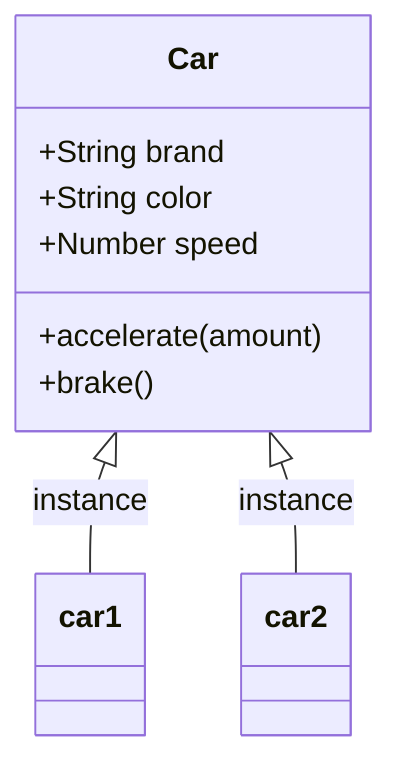

# ০১. Introduction to Object Oriented Programming

Module 4-এ আমরা object নিয়ে পরিচিত হয়েছিলাম — মনে আছে `const user = { name: "রহিম", age: 25 }` লিখে আমরা একজন ইউজারের তথ্য একসাথে রেখেছিলাম? তখন এটাকে শুধু "ডেটা রাখার একটা কাঠামো" হিসেবে দেখেছিলাম। কিন্তু বাস্তব সফটওয়্যার ডেভেলপমেন্টে object-এর ধারণাটা এর চেয়ে অনেক গভীর, আর সেই গভীরতাটাই এই লেসনের বিষয় — **Object Oriented Programming (OOP)**।

চিন্তা করো তোমার হাতে একটা গাড়ি আছে। গাড়িটার কিছু বৈশিষ্ট্য আছে — রং, মডেল, জ্বালানির পরিমাণ, বর্তমান গতি। আবার গাড়িটা কিছু কাজও করতে পারে — স্টার্ট দেওয়া, গতি বাড়ানো, ব্রেক করা, থামা। লক্ষ্য করো, এই দুই ধরনের জিনিস কিন্তু একে অপরের সাথে জড়িত — গতি বাড়ানোর কাজটা গাড়ির "বর্তমান গতি" নামের বৈশিষ্ট্যটাকেই পরিবর্তন করে। OOP-এর মূল ধারণাটা ঠিক এখান থেকেই আসে — বাস্তব জগতের যেকোনো জিনিসকে আমরা তার **বৈশিষ্ট্য (properties)** আর **আচরণ (behaviors/methods)**-এর সমন্বয়ে একটা "প্যাকেজ" হিসেবে কোডে প্রকাশ করতে পারি। এই প্যাকেজটাকেই বলা হয় **object**।

তাহলে প্রশ্ন আসে — Module 4-এর সেই সাধারণ object আর এখানকার OOP-এর object কি এক জিনিস? অনেকটা এক, কিন্তু একটা গুরুত্বপূর্ণ পার্থক্য আছে। Module 4-এ আমরা object বানিয়েছিলাম শুধু ডেটা রাখার জন্য, কোনো behavior ছাড়া। কিন্তু OOP-এ আমরা object-এর ভেতরে behavior-ও (function) রাখি, আর সবচেয়ে গুরুত্বপূর্ণ কথা — একই ধরনের অনেকগুলো object বানানোর জন্য আমরা একটা "নকশা" বা "ছাঁচ" তৈরি করি, যাকে বলা হয় **class**।

একটা class-কে ভাবতে পারো কেক বানানোর ছাঁচ (mold) হিসেবে। ছাঁচটা নিজে কেক না, কিন্তু ছাঁচ দিয়ে তুমি একই আকৃতির অনেকগুলো কেক বানাতে পারো। ঠিক তেমনি, একটা `Car` class লিখলে সেটা নিজে কোনো নির্দিষ্ট গাড়ি না, কিন্তু সেই class ব্যবহার করে তুমি অনেকগুলো আলাদা আলাদা গাড়ির object বানাতে পারো — প্রতিটার রং, মডেল আলাদা হতে পারে, কিন্তু গঠন একই। এই প্রক্রিয়াটাকে বলা হয় **instantiation**, আর class থেকে তৈরি প্রতিটা object-কে বলা হয় সেই class-এর একটা **instance**।

আধুনিক JavaScript-এ class লেখার সিনট্যাক্সটা দেখা যাক:

```javascript
class Car {
  constructor(brand, color) {
    // constructor হলো একটা বিশেষ ফাংশন, যেটা object তৈরির সময় স্বয়ংক্রিয়ভাবে চলে
    this.brand = brand;
    this.color = color;
    this.speed = 0; // শুরুতে গতি শূন্য
  }

  accelerate(amount) {
    // এটা একটা method — object-এর নিজস্ব আচরণ
    this.speed += amount;
    console.log(`${this.brand} এখন ${this.speed} কিমি/ঘণ্টা গতিতে চলছে।`);
  }

  brake() {
    this.speed = 0;
    console.log(`${this.brand} থেমে গেছে।`);
  }
}

// class থেকে দুইটা আলাদা object (instance) তৈরি করা হলো
const car1 = new Car("Toyota", "সাদা");
const car2 = new Car("Honda", "কালো");

car1.accelerate(40); // Toyota এখন ৪০ কিমি/ঘণ্টা গতিতে চলছে।
car2.accelerate(60); // Honda এখন ৬০ কিমি/ঘণ্টা গতিতে চলছে।
```

এখানে `this` শব্দটা লক্ষ্য করো — এটা বোঝায় "এই নির্দিষ্ট instance-টার নিজের ডেটা"। যখন `car1.accelerate(40)` কল করা হয়, তখন `this` মানে `car1`, আর যখন `car2.accelerate(60)` কল করা হয়, তখন `this` মানে `car2`। এই জন্যই দুইটা গাড়ি একে অপরের গতি নষ্ট না করে স্বাধীনভাবে চলতে পারে — প্রতিটা instance তার নিজের ডেটা আলাদাভাবে সংরক্ষণ করে।

class আর তার instance-দের সম্পর্কটা একটা চিত্রে দেখা যাক:



এখন প্রশ্ন হতে পারে — ব্যাকএন্ড ডেভেলপমেন্টে এই ধারণাটা কোথায় লাগবে? আসলে প্রতিটা ওয়েব অ্যাপ্লিকেশনেই আমরা বাস্তব জগতের জিনিস নিয়ে কাজ করি — User, Product, Order, Payment। এই প্রতিটাকেই আমরা properties আর behavior দিয়ে গঠন করতে পারি, ঠিক যেমন গাড়ির উদাহরণে করলাম। পরের লেসনে আমরা ঠিক এই কাজটাই করবো — বাস্তব জগতের এন্টিটিগুলোকে OOP-এর ভাষায় অনুবাদ করা শিখবো।
