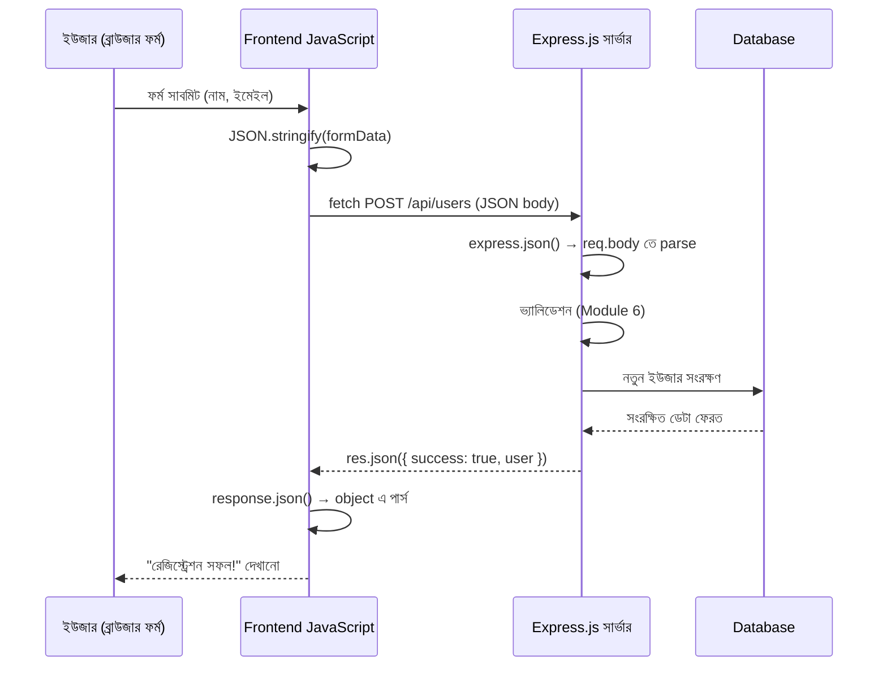

# ০৪. Data Flow: JSON Data from Frontend to Backend — Understanding the Flow

আগের লেসনে আমরা বুঝেছি JSON কী আর কেন এটা ডেটা আদান-প্রদানের সার্বজনীন ফরম্যাট। কিন্তু এই ধারণাটা কাগজে-কলমে বোঝা আর সত্যিকারের একটা রিকোয়েস্ট-রেসপন্স চক্রে দেখা — এই দুটো ভিন্ন জিনিস। এই লেসনে আমরা পুরো যাত্রাটাকে একটা ভিডিওর মতো ধীরে ধীরে চালিয়ে দেখবো — একজন ইউজার যখন একটা ফর্ম সাবমিট করে, তখন ঠিক কী কী ঘটনা ঘটে, ডেটা কোন কোন রূপ ধারণ করে, যতক্ষণ না সেটা আবার ইউজারের স্ক্রিনে ফিরে আসে।

চিন্তা করো একজন ইউজার একটা রেজিস্ট্রেশন ফর্ম পূরণ করছে — নাম আর ইমেইল দিচ্ছে, তারপর "সাবমিট" বাটনে ক্লিক করছে। এই মুহূর্ত থেকে শুরু করে সার্ভারের উত্তর ফিরে আসা পর্যন্ত পুরো প্রক্রিয়াটা কয়েকটা ধাপে ভাগ করা যায়:

১. ব্রাউজারে ফর্মের ইনপুট ফিল্ডগুলোর ডেটা প্রথমে একটা সাধারণ JavaScript object-এ জড়ো করা হয়।
২. এই object-কে `JSON.stringify()` দিয়ে JSON স্ট্রিং-এ রূপান্তর করা হয়, কারণ নেটওয়ার্কের মধ্য দিয়ে শুধু টেক্সট পাঠানো যায়, লাইভ object না।
৩. `fetch()` ফাংশন ব্যবহার করে এই JSON স্ট্রিংটা একটা HTTP request-এর "body"-তে ভরে backend সার্ভারের একটা নির্দিষ্ট endpoint-এ পাঠানো হয়। Module 5-এ আমরা শিখেছিলাম এই পুরো প্রক্রিয়াটা asynchronous — মানে ব্রাউজার এই রিকোয়েস্ট পাঠিয়ে বসে থাকে না, বরং উত্তরের জন্য অপেক্ষা করে অন্য কাজ চালিয়ে যেতে পারে।
৪. Express.js সার্ভার এই রিকোয়েস্টটা পায়, আর `express.json()` নামের একটা middleware (Module 6-এ আমরা middleware নিয়ে বিস্তারিত দেখেছিলাম) স্বয়ংক্রিয়ভাবে সেই JSON স্ট্রিংটাকে আবার একটা JavaScript object-এ পার্স করে, আর সেটা বসিয়ে দেয় `req.body`-তে।
৫. আমাদের route handler ফাংশন — Module 6-এর লেসন ৩-এ আমরা POST endpoint-এর গঠন বিস্তারিতভাবে দেখেছিলাম — সেই `req.body` থেকে ডেটা পড়ে, প্রয়োজনে ভ্যালিডেট করে, ডেটাবেজে সংরক্ষণ করে বা প্রসেস করে।
৬. প্রসেসিং শেষে সার্ভার একটা রেসপন্স পাঠায় — সেটাও আবার JSON আকারেই, `res.json()` মেথড ব্যবহার করে।
৭. ব্রাউজারের `fetch()` কল সেই রেসপন্স পায়, আর `.json()` মেথড দিয়ে সেটাকে আবার একটা ব্যবহারযোগ্য JavaScript object-এ রূপান্তর করে, যা দিয়ে ইউজারকে একটা সফলতার বার্তা দেখানো যায়।

পুরো এই যাত্রাটা একটা sequenceDiagram-এ দেখলে সম্পর্কগুলো আরও স্পষ্ট হয়:



এখন কোড দিয়ে দুই পাশ থেকেই দেখা যাক। প্রথমে frontend-এর অংশ:

```javascript
const formData = {
  name: document.getElementById("name").value,
  email: document.getElementById("email").value
};

// fetch একটা Promise ফেরত দেয় (Module 5), তাই async/await ব্যবহার করছি
async function submitForm() {
  const response = await fetch("http://localhost:3000/api/users", {
    method: "POST",
    headers: { "Content-Type": "application/json" }, // সার্ভারকে জানানো হচ্ছে, body-টা JSON
    body: JSON.stringify(formData) // object কে JSON স্ট্রিং-এ রূপান্তর
  });

  const result = await response.json(); // সার্ভারের JSON রেসপন্সকে object-এ রূপান্তর
  console.log(result.message);
}
```

আর backend-এর অংশ:

```javascript
const express = require("express");
const app = express();

app.use(express.json()); // এই middleware ছাড়া req.body undefined থাকবে

app.post("/api/users", (req, res) => {
  const { name, email } = req.body; // Module 6-এ শেখা destructuring দিয়ে ডেটা বের করা

  if (!name || !email) {
    return res.status(400).json({ success: false, message: "নাম বা ইমেইল অনুপস্থিত" });
  }

  // এখানে সাধারণত ডেটাবেজে সংরক্ষণের কাজ হয়
  const newUser = { id: Date.now(), name, email };

  res.status(201).json({ success: true, user: newUser });
});

app.listen(3000, () => console.log("সার্ভার চালু আছে port 3000-এ"));
```

লক্ষ্য করার মতো বিষয় হলো — `Content-Type: application/json` হেডারটা না দিলে Express বুঝতেই পারবে না যে আসা ডেটাটা JSON হিসেবে পার্স করতে হবে, আর তখন `req.body` খালি বা undefined থেকে যাবে। এই ছোট্ট হেডারটাই ব্রাউজার আর সার্ভারের মধ্যে একটা "চুক্তি" — বলে দেয় প্যাকেজের ভেতরে কী ধরনের মালামাল আছে।

এখন আমরা জানি ডেটা কীভাবে যাতায়াত করে। কিন্তু একটা বাস্তব প্রজেক্ট শুরু করার আগে আরেকটা গুরুত্বপূর্ণ প্রশ্নের উত্তর দরকার — এই ডেটার গঠনটা ঠিক কেমন হওয়া উচিত, আর কোন কোন endpoint বানানো দরকার? এটাই পরের লেসনের বিষয়।
