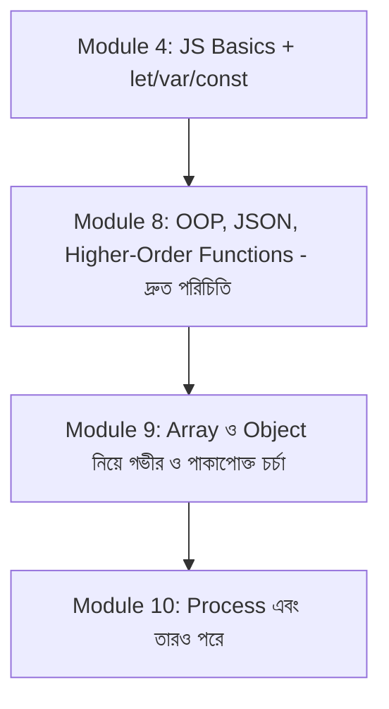

# ০১. Module Introduction

গত কয়েকটা মডিউলে আমরা অনেকটা পথ পেরিয়ে এসেছি। Module 4-এ আমরা Express.js দিয়ে সার্ভার বানানো শিখেছি, Module 5-এ শিখেছি asynchronous কোড কীভাবে কাজ করে, আর Module 6, 7, 8-এ আমরা সত্যিকারের API বানিয়েছি — routing, controller, middleware, JSON data modeling, এমনকি একটা ই-কমার্স প্রোডাক্টের ডেটা স্ট্রাকচার পর্যন্ত ডিজাইন করেছি।

এতটা পথ পেরিয়ে আসার পর একটা স্বাভাবিক প্রশ্ন উঠতে পারে — "আমরা তো এখন সত্যিকারের API বানাতে পারি, তাহলে আবার নতুন করে Array আর Object নিয়ে একটা মডিউল কেন?"

উত্তরটা একটা বাস্তব অভিজ্ঞতা থেকে আসে। ধরো তুমি একটা বাড়ি বানিয়ে ফেলেছো — দেয়াল উঠেছে, ছাদ হয়েছে, রঙও করা হয়ে গেছে। কিন্তু ভিতের (foundation) কংক্রিট যদি পুরোপুরি শক্ত না হয়, তাহলে বাড়িটা কিছুদিন পর ফাটল ধরতে শুরু করে। Module 8-এ আমরা OOP, JSON, আর higher-order function-এর সাথে পরিচিত হয়েছি খুব দ্রুত গতিতে, কারণ সেই মডিউলের মূল লক্ষ্য ছিলো ডেটা মডেলিং আর API ডিজাইনের বড় ছবিটা দেখানো। এই মডিউলে আমরা সেই ভিতটাকেই আরেকবার শক্ত করে ঢালাই করবো — ধীরে, গভীরভাবে, প্রতিটা খুঁটিনাটি নিয়ে।

কেন এটা গুরুত্বপূর্ণ ব্যাকএন্ড ডেভেলপমেন্টের জন্য? কারণ ব্যাকএন্ডে যা কিছু ঘটে — একটা ইউজারের তথ্য, একটা অর্ডারের লিস্ট, একটা প্রোডাক্টের ক্যাটালগ — সবকিছুই শেষ পর্যন্ত জাভাস্ক্রিপ্টের array আর object দিয়েই প্রকাশ পায়। Module 4-এ আমরা `let`, `var`, `const` শিখেছিলাম, আর Module 4-এর শুরুতে জাভাস্ক্রিপ্ট বেসিকস দেখেছিলাম — সেগুলো ছিলো ভাষার ব্যাকরণ শেখা। এই মডিউলে আমরা সেই ব্যাকরণ দিয়ে বাক্য গঠনে দক্ষ হবো — মানে ডেটা নিয়ে দক্ষভাবে কাজ করা শিখবো।

এই মডিউলে আমরা যা করবো তার একটা রোডম্যাপ দিয়ে রাখি। প্রথমে ডেটা টাইপ আর অবজেক্টের গঠন নিয়ে কথা বলবো, তারপর বাস্তব জীবনের উদাহরণ দিয়ে অবজেক্ট বুঝবো। এরপর array আর array of objects — যেটা প্রায় প্রতিটা API রেসপন্সের আসল রূপ। তারপর destructuring শিখবো, যেটা কোড লেখাকে অনেক পরিষ্কার করে দেয়। শেষে আমরা backend-এ সবচেয়ে বেশি ব্যবহৃত প্যাটার্নগুলো — filter, search, pagination-এর মতো জিনিস — একসাথে জোড়া দেবো।

তাহলে চলো শুরু করি একদম গোড়া থেকে — জাভাস্ক্রিপ্টের ডেটা টাইপ আর অবজেক্ট দিয়ে।
