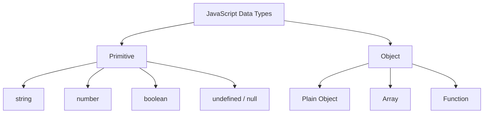

# ০২. JS Data Types and Objects

একটা ফাইলিং ক্যাবিনেটের কথা কল্পনা করো। কিছু ড্রয়ারে থাকে একটা করে কাগজ — একটা নাম, একটা সংখ্যা, একটা তারিখ। আর কিছু ড্রয়ারে থাকে পুরো একটা ফোল্ডার, যার ভেতরে আবার অনেকগুলো কাগজ গোছানো থাকে, একটার সাথে আরেকটা সম্পর্কিত। জাভাস্ক্রিপ্টের ডেটা টাইপগুলোকেও ঠিক এভাবে ভাগ করা যায় — **primitive** (একলা কাগজ) আর **object** (গোছানো ফোল্ডার)।

Primitive টাইপগুলো হলো সবচেয়ে সাধারণ, একক মান বহনকারী টাইপ — `string` (টেক্সট), `number` (সংখ্যা), `boolean` (true/false), `undefined` (মান নির্ধারণ করা হয়নি), আর `null` (ইচ্ছাকৃতভাবে খালি রাখা)। Module 4-এ যখন আমরা `let`, `var`, `const` শিখেছিলাম, তখন এই টাইপগুলোর সাথেই আসলে আমরা প্রথম পরিচিত হয়েছিলাম।

```javascript
const name = "Arman";       // string
const age = 25;             // number
const isActive = true;      // boolean
let city;                   // undefined - এখনো মান দেওয়া হয়নি
const middleName = null;    // null - ইচ্ছাকৃতভাবে "কিছু নেই" বোঝানো হচ্ছে

console.log(typeof name);      // "string"
console.log(typeof age);       // "number"
console.log(typeof isActive);  // "boolean"
```

`typeof` অপারেটরটা একটা ডিটেক্টিভের মতো কাজ করে — যেকোনো ভ্যারিয়েবলের ভেতরে কী ধরনের মান লুকিয়ে আছে, সেটা বলে দেয়। ব্যাকএন্ড ডেভেলপমেন্টে এটা প্রায়ই দরকার হয় — যেমন ধরো ইউজার একটা ফর্মে বয়স লিখলো, কিন্তু সেটা টেক্সট হিসেবে এসেছে নাকি নাম্বার হিসেবে, সেটা যাচাই করার জন্য।

কিন্তু আসল গল্পটা শুরু হয় object দিয়ে। একটা object হলো related তথ্যের একটা গুচ্ছ, key-value জোড়া আকারে সাজানো।

```javascript
const student = {
  name: "Arman",
  age: 25,
  isActive: true,
  address: {
    city: "Dhaka",
    country: "Bangladesh"
  }
};
```

এখানে `student` একটা ফোল্ডারের মতো, যার ভেতরে আলাদা আলাদা কাগজ (`name`, `age`, `isActive`) আছে, আবার একটা সাব-ফোল্ডারও (`address`) আছে যার ভেতরে আরও কাগজ। এই নেস্টেড গঠনটাই বাস্তব জগতের ডেটাকে প্রকাশ করার সবচেয়ে স্বাভাবিক উপায় — Module 8-এ আমরা যখন JSON নিয়ে কথা বলেছিলাম, তখনও ঠিক এই একই গঠনের কথাই বলেছিলাম, কারণ JSON আসলে জাভাস্ক্রিপ্ট object-এরই একটা টেক্সট-রূপ।



লক্ষ্য করার মতো একটা মজার তথ্য — জাভাস্ক্রিপ্টে array এবং এমনকি function-ও আসলে object-এরই বিশেষ রূপ। এই কথাটা মনে রাখলে পরের লেসনগুলো বুঝতে সুবিধা হবে, কারণ আমরা এখন object-কে বাস্তব জীবনের সাথে মিলিয়ে আরেকটু গভীরে যাবো।
