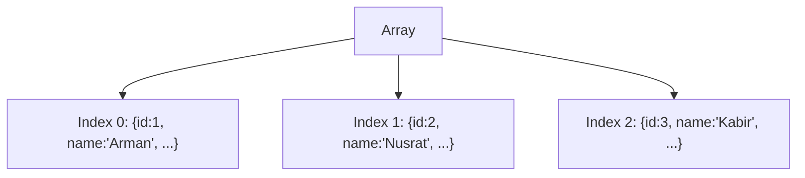

# ০৪. Array and Array Of Objects

একটা ট্রেনের কথা কল্পনা করো। প্রতিটা বগির (compartment) একটা নাম্বার আছে — ১, ২, ৩... এভাবে। জাভাস্ক্রিপ্টের **array** ঠিক এরকম — একগুচ্ছ মান, প্রতিটার একটা নির্দিষ্ট অবস্থান (index), যেটা শুরু হয় শূন্য (０) থেকে।

```javascript
const cities = ["Dhaka", "Chittagong", "Sylhet"];

console.log(cities[0]); // "Dhaka"
console.log(cities[1]); // "Chittagong"
console.log(cities.length); // 3
```

এই সাধারণ array-তে আমরা শুধু টেক্সট রেখেছি। কিন্তু বাস্তব ব্যাকএন্ড অ্যাপ্লিকেশনে ডেটা সাধারণত এতটা সরল হয় না। মনে করো তোমাকে সব ইউজারের লিস্ট রাখতে হবে — শুধু নাম না, প্রতিটা ইউজারের নাম, ইমেইল, বয়স সবকিছু। তখন দরকার হয় **array of objects** — যেখানে প্রতিটা বগিতে (index) বসানো থাকে একটা পুরো ফোল্ডার (object), শুধু একটা কাগজ না।

```javascript
const users = [
  { id: 1, name: "Arman", email: "arman@example.com", age: 25 },
  { id: 2, name: "Nusrat", email: "nusrat@example.com", age: 22 },
  { id: 3, name: "Kabir", email: "kabir@example.com", age: 30 }
];

console.log(users[0].name);   // "Arman"
console.log(users[1].email);  // "nusrat@example.com"
```

এই গঠনটাকে চিনে রাখা খুব গুরুত্বপূর্ণ, কারণ প্রায় প্রতিটা API-ই যখন একাধিক জিনিসের লিস্ট রিটার্ন করে (যেমন সব প্রোডাক্টের লিস্ট, সব অর্ডারের লিস্ট), তখন সেটা এভাবেই আসে — একটা array, যার ভেতরে অনেকগুলো object।



Express.js-এ একটা GET endpoint বানালে সেটা দেখতে এমন হয়:

```javascript
app.get("/users", (req, res) => {
  res.status(200).json(users); // পুরো array of objects রেসপন্স হিসেবে যাবে
});
```

আর ক্লায়েন্টের দিক থেকে, এটাই ঠিক সেই JSON array, যেটা Module 6-এ আমরা status code সহ রেসপন্স পাঠানো শিখেছিলাম। ফোন থেকে বা ব্রাউজার থেকে এই endpoint কল করলে ঠিক এই একই গঠনের ডেটা ফিরে আসবে, শুধু টেক্সট আকারে (JSON string) — সার্ভার আর ক্লায়েন্ট দুই পাশেই একই কাঠামো বোঝা যায়, কারণ Module 8-এ আমরা শিখেছিলাম JSON আসলে জাভাস্ক্রিপ্ট object/array-এরই টেক্সট রূপ।

এখন কল্পনা করো, একটা ফাংশনে যদি তোমাকে `users[0].name` আর `users[0].email` — দুটোই আলাদা করে বের করতে হয়, প্রতিবার `users[0].` লিখে লিখে ক্লান্ত হয়ে যাবে। এই সমস্যার সুন্দর সমাধান হলো destructuring, যেটা আমরা ঠিক পরের লেসনেই শিখবো।
