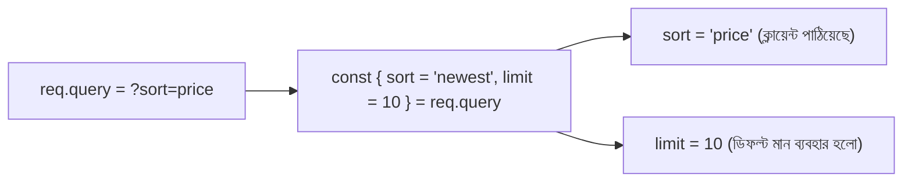

# ০৫. De-Structuring in Array and In Objects

একটা কুরিয়ার বক্সের কথা ভাবো, যার ভেতরে তিনটা জিনিস আছে — একটা বই, একটা কলম, একটা নোটবুক। বক্সটা খুলে একটা একটা করে জিনিস বের করে সরাসরি নির্দিষ্ট শেলফে রেখে দেওয়াকেই বলা যায় **destructuring** — বক্সের (object বা array) ভেতর থেকে সরাসরি প্রতিটা জিনিস তার নিজের ভ্যারিয়েবলে বসিয়ে দেওয়া, `box.item1`, `box.item2` লিখে লিখে বের না করে।

গত লেসনে আমরা দেখেছিলাম object-এর মান বের করতে হলে `users[0].name` এভাবে লিখতে হয়। Destructuring দিয়ে এই একই কাজ অনেক পরিষ্কারভাবে করা যায়:

```javascript
const user = { id: 1, name: "Arman", email: "arman@example.com", age: 25 };

// পুরোনো পদ্ধতি
const nameOld = user.name;
const emailOld = user.email;

// Destructuring পদ্ধতি
const { name, email } = user;
console.log(name);  // "Arman"
console.log(email); // "arman@example.com"
```

Array-এর ক্ষেত্রেও একই ধারণা কাজ করে, শুধু কোঁকড়া বন্ধনী `{}` এর বদলে তৃতীয় বন্ধনী `[]` ব্যবহার হয়, কারণ array-তে জিনিসগুলো নামে না, ক্রম অনুযায়ী (position) সাজানো থাকে:

```javascript
const cities = ["Dhaka", "Chittagong", "Sylhet"];
const [capital, second] = cities;
console.log(capital); // "Dhaka"
console.log(second);  // "Chittagong"
```

Destructuring-এর সবচেয়ে বড় কাজে লাগার জায়গাটা হলো Express.js-এর route handler। Module 4 লেসন ৬-এ আমরা query param আর path param নিয়ে কথা বলেছিলাম — এখন সেগুলো destructuring দিয়ে আরও পরিষ্কারভাবে বের করা যায়:

```javascript
app.get("/products/:id", (req, res) => {
  const { id } = req.params;        // path parameter destructure করা হলো
  const { sort, limit } = req.query; // query parameter destructure করা হলো

  res.status(200).json({ id, sort, limit });
});
```

এখানে `sort` আর `limit` যদি ক্লায়েন্ট না পাঠায়, তাহলে `undefined` হয়ে যাবে। সেটা এড়াতে destructuring-এ ডিফল্ট মান দেওয়া যায়:

```javascript
const { sort = "newest", limit = 10 } = req.query;
```

মানে ক্লায়েন্ট কিছু না পাঠালেও `sort` এর মান স্বয়ংক্রিয়ভাবে `"newest"` হয়ে যাবে। এটা অনেকটা রেস্টুরেন্টে অর্ডার না দিলে "আজকের স্পেশাল" পাঠিয়ে দেওয়ার মতো — একটা নিরাপদ ডিফল্ট আচরণ।



Destructuring শুধু কোড সংক্ষিপ্ত করে না, কোড পড়াও সহজ করে দেয় — একনজরে বোঝা যায় একটা object থেকে ঠিক কোন কোন তথ্য দরকার। এখন চলো দেখি, বাস্তব প্রজেক্টে array কীভাবে ঘুরেফিরে ব্যবহার হয়, তার কিছু জীবন্ত উদাহরণ দিয়ে।
