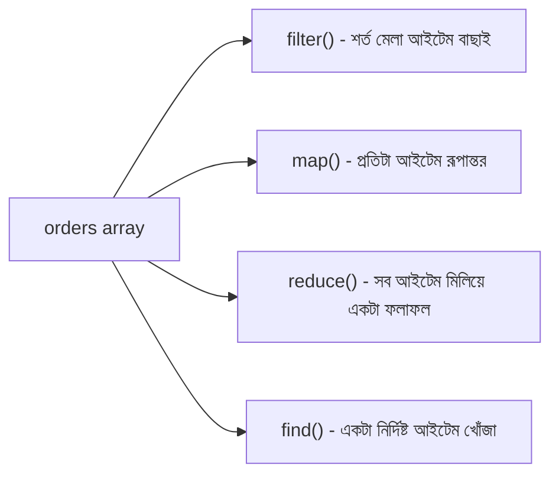

# ০৬. Array In Real Life

এতক্ষণ আমরা array-কে থিওরির চোখে দেখেছি। এবার কল্পনা করো তুমি একটা ই-কমার্স সাইটের ব্যাকএন্ডে কাজ করছো, আর তোমার কাছে একটা অর্ডার লিস্ট আছে।

```javascript
const orders = [
  { id: 101, customer: "Arman", amount: 1500, status: "delivered" },
  { id: 102, customer: "Nusrat", amount: 800, status: "pending" },
  { id: 103, customer: "Kabir", amount: 3200, status: "delivered" },
  { id: 104, customer: "Rafi", amount: 450, status: "cancelled" }
];
```

বাস্তব জীবনে এই লিস্ট নিয়ে তোমাকে নানা প্রশ্নের উত্তর দিতে হবে — "কতগুলো অর্ডার ডেলিভার হয়েছে?", "মোট বিক্রি কত টাকা?", "শুধু pending অর্ডারগুলোর নাম কী কী?" এই প্রতিটা প্রশ্নের জন্য জাভাস্ক্রিপ্টে রেডিমেড টুল আছে, যেগুলোকে বলা হয় higher-order function — Module 8-এ আমরা যেগুলোর সাথে সংক্ষিপ্ত পরিচয় করেছিলাম।

`filter` ব্যবহার করে শুধু ডেলিভার হওয়া অর্ডার বের করা যায়, অনেকটা ছাঁকনি দিয়ে চাল থেকে কাঁকর আলাদা করার মতো:

```javascript
const delivered = orders.filter(order => order.status === "delivered");
console.log(delivered.length); // 2
```

`map` ব্যবহার করে প্রতিটা অর্ডার থেকে শুধু customer-এর নাম বের করা যায় — অনেকটা একটা লিস্টের প্রতিটা লাইন একই নিয়মে রূপান্তর করার মতো:

```javascript
const customerNames = orders.map(order => order.customer);
console.log(customerNames); // ["Arman", "Nusrat", "Kabir", "Rafi"]
```

`reduce` ব্যবহার করে মোট বিক্রির অংক বের করা যায় — একটা ক্যালকুলেটরের মতো, যেটা লিস্টের প্রতিটা মান একে একে যোগ করে একটা চূড়ান্ত ফলাফলে নিয়ে আসে:

```javascript
const totalAmount = orders.reduce((sum, order) => sum + order.amount, 0);
console.log(totalAmount); // 5950
```

আর `find` দিয়ে একটা নির্দিষ্ট শর্ত পূরণ করা প্রথম আইটেমটা খুঁজে বের করা যায় — যেমন একটা নির্দিষ্ট আইডির অর্ডার:

```javascript
const order103 = orders.find(order => order.id === 103);
console.log(order103.customer); // "Kabir"
```



এই চারটা function — `filter`, `map`, `reduce`, `find` — ব্যাকএন্ড ডেভেলপারের হাতিয়ারবাক্সের সবচেয়ে বেশি ব্যবহৃত টুল বলা চলে। Module 6-এ যখন আমরা API-তে ডেটা প্রসেস করার কথা বলেছিলাম, তখন পর্দার আড়ালে ঠিক এই ধরনের function-ই কাজ করে। এখন যেহেতু আমরা array আর object দুটোই ভালোভাবে বুঝে গেছি, একটু থেমে বাইরের কিছু শেখার সহায়ক উৎস নিয়ে কথা বলা যাক, তারপর আমরা এই দুটো ধারণাকে এক জায়গায় জড়ো করবো।
