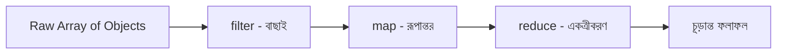

# ০৮. Javascript Array and Object Text Lesson Part One

এই মডিউলে আমরা বেশ কিছু পথ পেরিয়ে এসেছি — ডেটা টাইপ, object, array, array of objects, destructuring, আর higher-order function। এবার একটু থেমে, একটা লিখিত রেফারেন্স আকারে সবকিছু একসাথে সাজিয়ে ফেলা যাক, যাতে ভবিষ্যতে কোনো একটা জিনিস ভুলে গেলে এই লেসনে ফিরে এসে দ্রুত মনে করে নেওয়া যায়।

শুরু করি object দিয়ে। একটা object হলো key-value জোড়ার সংগ্রহ, বাস্তব জীবনের কোনো একটা জিনিসের বৈশিষ্ট্য প্রকাশ করার জন্য।

```javascript
const book = {
  title: "Clean Code",
  pages: 464,
  isAvailable: true,
  getSummary() {
    return `${this.title} - ${this.pages} pages`;
  }
};

console.log(book.getSummary()); // "Clean Code - 464 pages"
```

এরপর array — একই ধরনের একাধিক মান রাখার জন্য, ক্রমানুসারে সাজানো।

```javascript
const numbers = [10, 20, 30, 40];
console.log(numbers[2]); // 30
```

এই দুটো একসাথে হলে তৈরি হয় array of objects — বাস্তব ব্যাকএন্ড অ্যাপ্লিকেশনের সবচেয়ে কমন ডেটা গঠন।

```javascript
const books = [
  { title: "Clean Code", pages: 464 },
  { title: "The Pragmatic Programmer", pages: 352 }
];
```

Destructuring আমাদের সাহায্য করে এই গঠন থেকে দ্রুত মান বের করতে।

```javascript
const { title, pages } = books[0];
const [firstBook, secondBook] = books;
```

আর higher-order function — `filter`, `map`, `reduce`, `find` — এই array of objects নিয়ে কাজ করার আসল শক্তি।

```javascript
const longBooks = books.filter(b => b.pages > 400);
const titles = books.map(b => b.title);
const totalPages = books.reduce((sum, b) => sum + b.pages, 0);
const found = books.find(b => b.title === "Clean Code");
```

এই সবগুলো টুল একসাথে কল্পনা করলে একটা প্রসেসিং পাইপলাইনের মতো দেখতে লাগে — কাঁচামাল (raw array) একদিক দিয়ে ঢোকে, বিভিন্ন ধাপ পেরিয়ে দরকারি ফলাফল বের হয়ে আসে অন্যদিক দিয়ে।



একটা জিনিস মনে রাখা জরুরি — `filter`, `map` নতুন array রিটার্ন করে, মূল array-কে বদলায় না। এই আচরণকে বলে **immutability** — মূল ডেটা অক্ষত থাকে, শুধু তার একটা নতুন সংস্করণ তৈরি হয়। এটা ব্যাকএন্ড ডেভেলপমেন্টে বিশেষভাবে গুরুত্বপূর্ণ, কারণ একই ডেটার উপর যদি একাধিক জায়গা থেকে কাজ চলে, তাহলে অনিচ্ছাকৃতভাবে মূল ডেটা পাল্টে যাওয়াটা বাগের একটা বড় উৎস হতে পারে।

এই রেফারেন্সটা মাথায় গেঁথে নিয়ে, এখন চলো দেখি বাস্তব ব্যাকএন্ড অ্যাপ্লিকেশনে এই টুলগুলো দিয়ে ঠিক কী কী কমন প্যাটার্ন তৈরি হয় — যেমন সার্চ, ফিল্টার, আর পেজিনেশন।
