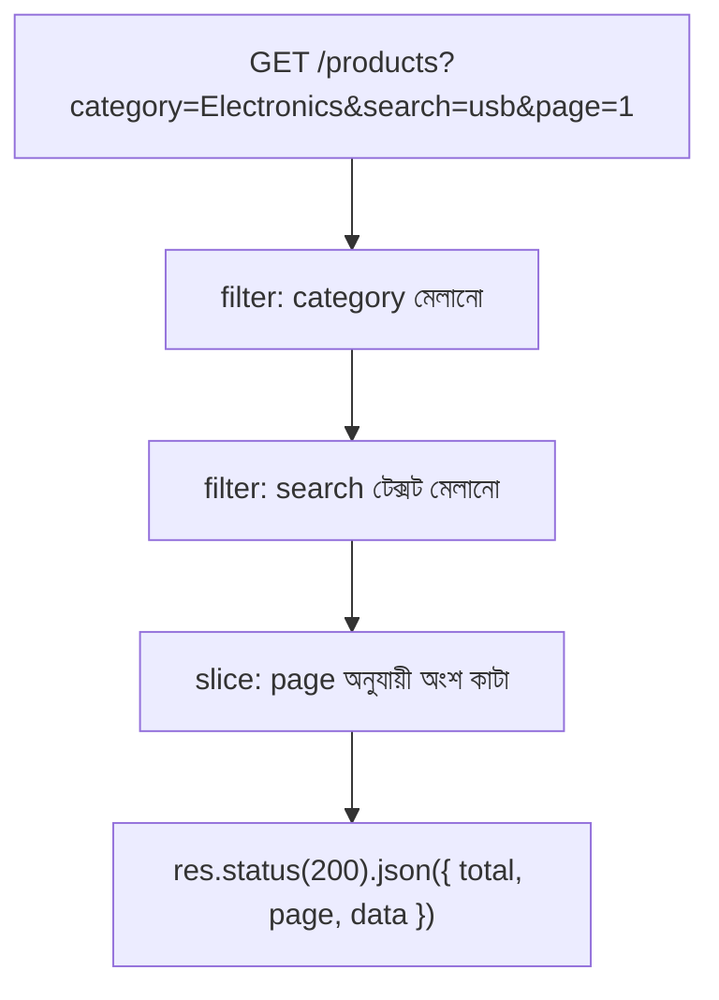

# ০৯. Common Backend Pattern with Array Filters and JSON

এই মডিউলের শেষ লেসনে চলো সব কিছুকে একসাথে জড়ো করে সত্যিকারের ব্যাকএন্ড প্যাটার্নে রূপ দিই। Module 6-এ আমরা GET endpoint বানিয়েছিলাম, Module 4 লেসন ৬-এ query parameter শিখেছিলাম। এখন আমরা array-এর higher-order function দিয়ে সেই query parameter-গুলোকে সত্যিকারের ফিল্টারিং, সার্চিং আর হালকা পেজিনেশনে রূপান্তর করবো।

ধরো আমাদের কাছে একটা প্রোডাক্ট লিস্ট আছে:

```javascript
const products = [
  { id: 1, name: "Wireless Mouse", price: 950, category: "Electronics" },
  { id: 2, name: "Office Chair", price: 5200, category: "Furniture" },
  { id: 3, name: "Bluetooth Speaker", price: 1800, category: "Electronics" },
  { id: 4, name: "Study Table", price: 4300, category: "Furniture" },
  { id: 5, name: "USB Cable", price: 150, category: "Electronics" }
];
```

প্রথম প্যাটার্ন — **ক্যাটাগরি অনুযায়ী ফিল্টার করা**। ক্লায়েন্ট যদি `/products?category=Electronics` কল করে, তাহলে শুধু Electronics ক্যাটাগরির প্রোডাক্ট ফেরত পাঠাতে হবে।

```javascript
app.get("/products", (req, res) => {
  const { category, search, page = 1, limit = 2 } = req.query;
  let result = products;

  if (category) {
    result = result.filter(p => p.category === category);
  }

  // পরের ধাপ এখানে যোগ হবে...
  res.status(200).json(result);
});
```

দ্বিতীয় প্যাটার্ন — **নাম দিয়ে সার্চ করা**। ধরো ক্লায়েন্ট `/products?search=speaker` পাঠালো — তখন প্রোডাক্টের নামের মধ্যে সেই টেক্সট আছে কিনা যাচাই করতে হবে, ছোট-বড় হাতের অক্ষর উপেক্ষা করে।

```javascript
  if (search) {
    result = result.filter(p =>
      p.name.toLowerCase().includes(search.toLowerCase())
    );
  }
```

তৃতীয় প্যাটার্ন — **হালকা পেজিনেশন**। সব ফলাফল একসাথে না পাঠিয়ে, ছোট ছোট পাতায় ভাগ করে পাঠানো — অনেকটা একটা বইয়ের সবগুলো পাতা একসাথে না দিয়ে, একটা একটা পাতা উল্টে দেখানোর মতো। এখানে `slice` কাজে লাগে, যেটা array-র একটা নির্দিষ্ট অংশ কেটে বের করে আনে।

```javascript
  const startIndex = (page - 1) * limit;
  const endIndex = startIndex + Number(limit);
  const paginated = result.slice(startIndex, endIndex);

  res.status(200).json({
    total: result.length,
    page: Number(page),
    data: paginated
  });
```

পুরো ফ্লো-টা একসাথে দেখলে বোঝা যায়, একটা রিকোয়েস্ট কীভাবে ধাপে ধাপে filter, search, আর pagination পেরিয়ে চূড়ান্ত রেসপন্সে পৌঁছায়।



এই প্যাটার্নটা এত কমন যে প্রায় প্রতিটা রিয়েল-ওয়ার্ল্ড API-তে এর কোনো না কোনো রূপ দেখা যায় — প্রোডাক্ট লিস্টিং, ইউজার সার্চ, অর্ডার হিস্টোরি, সবখানেই। আর লক্ষ্য করো, এখানে যা কিছু ব্যবহার করা হয়েছে — object, array, destructuring, filter, slice — এই পুরো মডিউলে যা যা শিখেছি তার প্রায় সবকিছুই একসাথে কাজে লেগেছে।

এতদিন আমরা কোডের ভেতরের লজিক নিয়ে কথা বলেছি — কীভাবে ডেটা প্রসেস হয়, কীভাবে রিকোয়েস্ট হ্যান্ডেল হয়। কিন্তু একটা `node server.js` কমান্ড চালানোর পর কম্পিউটারের ভেতরে আসলে কী ঘটে, সেটা এখনো আমরা খতিয়ে দেখিনি। পরের মডিউলে আমরা ঠিক সেই প্রশ্নের উত্তর খুঁজবো — Process আর Thread নিয়ে।
