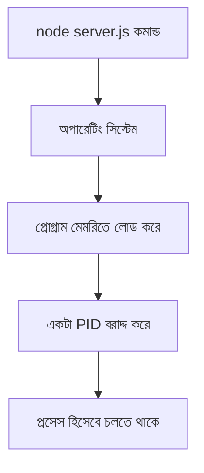

# ০১. What is Process? How do find a node JS Process in windows PC?

Module 2-এ আমরা প্রথম যখন `node server.js` কমান্ড চালিয়ে একটা ওয়েবসার্ভার তুলেছিলাম, তখন আমরা মূলত এর "ফলাফল" দেখেছি — ব্রাউজারে গিয়ে `localhost:৩০০০`-এ কিছু একটা দেখা যাচ্ছে। কিন্তু কমান্ডটা চালানোর সাথে সাথেই অপারেটিং সিস্টেমের ভেতরে আসলে কী ঘটে, সেটা আমরা এখনো খতিয়ে দেখিনি। এই মডিউলে আমরা ঠিক সেই পর্দার আড়ালের গল্পটা জানবো।

একটা রেস্টুরেন্ট চেইনের কথা কল্পনা করো, যার অনেকগুলো শাখা (branch) আছে — একটা ধানমন্ডিতে, একটা গুলশানে। প্রতিটা শাখা আলাদাভাবে চলে, তাদের নিজস্ব কর্মী আছে, নিজস্ব রান্নাঘর আছে, একটার সমস্যা আরেকটাকে সরাসরি প্রভাবিত করে না। অপারেটিং সিস্টেমে একটা **process** ঠিক এরকম — একটা প্রোগ্রামের চলমান একটা "শাখা" বা instance, যার নিজস্ব মেমরি, নিজস্ব রিসোর্স, আর একটা নিজস্ব পরিচয় নম্বর থাকে, যাকে বলে **PID (Process ID)**।

তুমি যখন টার্মিনালে `node server.js` লেখো, তখন অপারেটিং সিস্টেম Node.js প্রোগ্রামটাকে মেমরিতে লোড করে, তাকে একটা PID দেয়, আর সেটাকে চালাতে শুরু করে। এই মুহূর্ত থেকে সেটা একটা independent প্রসেস — তুমি চাইলে একই সার্ভার কোড দুইবার চালিয়ে দুইটা আলাদা প্রসেস তৈরি করতে পারো (যদিও দুটো একসাথে একই পোর্টে চলতে পারবে না, Module 2-তে যেটা আমরা শিখেছিলাম পোর্ট সংঘর্ষের প্রসঙ্গে)।

```javascript
// server.js
console.log("এই প্রসেসের PID হলো:", process.pid);

const http = require("http");
const server = http.createServer((req, res) => {
  res.end("Hello from a running process!");
});

server.listen(3000, () => {
  console.log("Server running, PID:", process.pid);
});
```

এখানে `process` হলো Node.js-এর একটা built-in global object, যেটা দিয়ে চলমান প্রসেস সম্পর্কে তথ্য পাওয়া যায় — Module 3-এ আমরা যখন Core Module নিয়ে কথা বলেছিলাম, `process` অনেকটা সেরকমই, তবে এটা require না করেই সবসময় ব্যবহারযোগ্য।

Windows-এ চলমান কোনো Node.js প্রসেস খুঁজে বের করতে দুইভাবে করা যায়। প্রথমত, **Task Manager** খুলে (Ctrl+Shift+Esc চাপলেই আসে) "Details" ট্যাবে গিয়ে `node.exe` নামের এন্ট্রি খুঁজলে সেখানে PID কলামেও দেখা যাবে।

দ্বিতীয়ত, কমান্ড লাইন থেকে:

```bash
tasklist | findstr node
```

এই কমান্ডটা চলমান সব প্রসেসের লিস্ট থেকে শুধু "node" শব্দটা যেখানে আছে সেগুলো ফিল্টার করে দেখাবে — অনেকটা আমরা Module 9-এ যেভাবে array `filter` করেছিলাম, ঠিক সেই একই ধারণা, শুধু এবার অপারেটিং সিস্টেমের লেভেলে।



এখন প্রশ্ন আসতে পারে — একটা প্রসেস চলছে জানলাম, কিন্তু সেটাকে বন্ধ করতে হলে কী করবো? বিশেষ করে যখন "port already in use" এর মতো এরর আসে? সেই উত্তর খুঁজবো পরের লেসনে।
