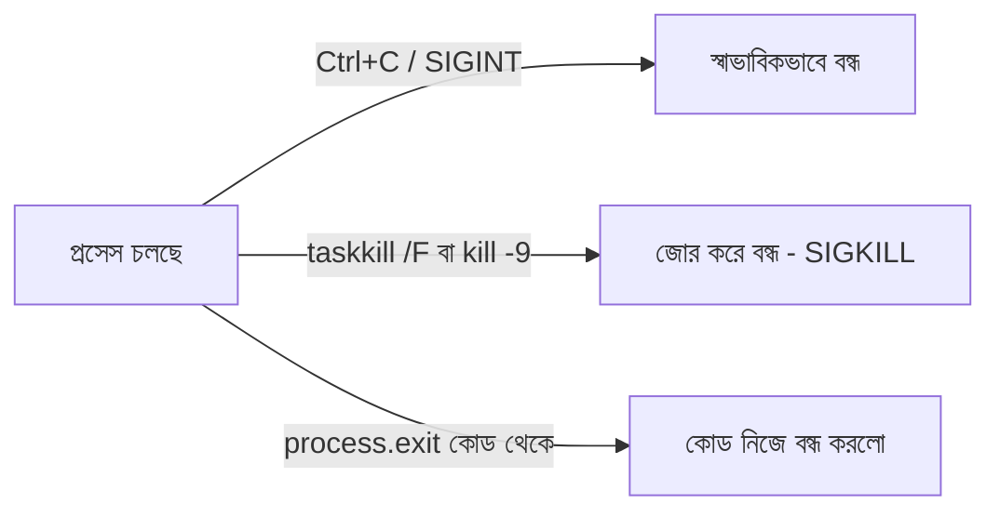

# ০২. How to kill a node JS process?

গত লেসনে আমরা রেস্টুরেন্ট চেইনের একটা শাখাকে process-এর সাথে তুলনা করেছিলাম। এবার কল্পনা করো, দিনের শেষে সেই শাখাটা বন্ধ করতে হবে — কর্মীদের ছুটি দিতে হবে, বাতি নিভাতে হবে, দরজায় তালা দিতে হবে। একটা চলমান প্রসেস বন্ধ করাও ঠিক এরকম একটা কাজ, যাকে বলে **kill করা**।

কেন একটা প্রসেস বন্ধ করার দরকার পড়ে? সবচেয়ে সাধারণ কারণ হলো — তুমি হয়তো `node server.js` চালিয়েছিলে, টার্মিনাল বন্ধ না করেই অন্য কোথাও চলে গিয়েছিলে, আর এখন আবার সেই একই পোর্টে (Module 2-তে যেটা শিখেছিলাম) নতুন করে সার্ভার চালাতে গেলে একটা এরর আসে — "Error: listen EADDRINUSE: address already in use :::3000"। এর মানে হলো, আগের শাখাটা (প্রসেস) এখনো বন্ধ হয়নি, আর নতুন শাখা একই ঠিকানায় (পোর্টে) খুলতে পারছে না।

সবচেয়ে সহজ উপায় হলো টার্মিনালে গিয়ে যেখানে প্রসেসটা চলছে, সেখানে **Ctrl+C** চাপা — এটা প্রসেসকে একটা "থামো" সংকেত পাঠায়, যাকে অপারেটিং সিস্টেমের ভাষায় বলে **SIGINT** সিগন্যাল।

কিন্তু অনেক সময় টার্মিনাল উইন্ডোটাই আর খুঁজে পাওয়া যায় না, অথবা প্রসেসটা ব্যাকগ্রাউন্ডে চলছে। তখন আগের লেসনে শেখা PID কাজে লাগে। Windows-এ:

```bash
tasklist | findstr node
taskkill /PID 12345 /F
```

এখানে `/PID 12345` বলছে ঠিক কোন প্রসেসটা বন্ধ করতে হবে (PID নাম্বারটা `tasklist` থেকে পাওয়া), আর `/F` মানে "force" — জোর করে বন্ধ করা, যদি প্রসেসটা স্বাভাবিকভাবে সাড়া না দেয়।

macOS বা Linux-এ একই কাজ হয় এভাবে:

```bash
ps aux | grep node
kill -9 12345
```

`ps aux` দিয়ে চলমান সব প্রসেস দেখা যায়, `grep node` দিয়ে শুধু node-সম্পর্কিত এন্ট্রি ফিল্টার করা হয় (ঠিক যেমন Windows-এ `findstr` করেছিলাম), আর `kill -9` দিয়ে সেই PID-কে জোর করে বন্ধ করা হয়। `-9` আসলে SIGKILL সিগন্যাল পাঠায় — একটা কড়া নির্দেশ, "এখনই বন্ধ হও, কোনো প্রশ্ন ছাড়া।"

কোডের ভেতর থেকেও একটা প্রসেস নিজেকে বন্ধ করতে পারে:

```javascript
console.log("কিছু জরুরি শর্ত পূরণ না হলে প্রসেস বন্ধ করে দেবো");

if (!process.env.DATABASE_URL) {
  console.error("DATABASE_URL সেট করা নেই, প্রসেস বন্ধ করা হচ্ছে।");
  process.exit(1); // 1 মানে ভুল/এরর হয়ে বন্ধ হয়েছে, 0 মানে স্বাভাবিকভাবে বন্ধ হয়েছে
}
```

`process.exit()` একটা exit code নেয় — `0` মানে সব ঠিকঠাক শেষ হয়েছে, আর `0` ছাড়া অন্য যেকোনো সংখ্যা মানে কোনো না কোনো সমস্যার কারণে বন্ধ হয়েছে। এই কনভেনশনটা লিনাক্স/ইউনিক্স জগত থেকে এসেছে আর প্রায় সব প্রোগ্রামিং ভাষাতেই মানা হয়।



প্রসেস চেনা আর বন্ধ করা শিখলাম। কিন্তু একটা প্রসেসের ভেতরেও যে ছোট ছোট কাজের একক থাকতে পারে, যাদের বলে **thread** — সেটা এখনো আমরা ছুঁইনি। পরের লেসনে আমরা ঠিক সেই প্রশ্নে যাবো।
