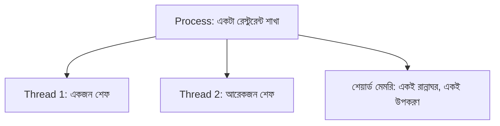

# ০৩. what is a thread?

রেস্টুরেন্ট শাখার (process) উদাহরণটা আরেকটু এগিয়ে নিই। একটা শাখার ভেতরে একজন বা একাধিক শেফ কাজ করতে পারে, তাই না? একজন শেফ একসাথে একটা কাজই করতে পারে — একটা তরকারি রান্না করা শেষ না করে সে আরেকটা শুরু করতে পারবে না, যদি না তার সহকারী থাকে। অপারেটিং সিস্টেমের ভাষায় এই একেকজন শেফকে বলা যায় একেকটা **thread** — একটা প্রসেসের ভেতরে কাজ সম্পাদনের সবচেয়ে ছোট একক।

তাহলে process আর thread-এর সম্পর্কটা কী? একটা প্রসেস হলো পুরো রেস্টুরেন্ট শাখা — তার নিজস্ব রান্নাঘর (মেমরি), নিজস্ব ঠিকানা (PID)। আর thread হলো সেই শাখার ভেতরে কাজ করা কর্মী। একটা প্রসেসে একটা থ্রেড থাকতে পারে (একজন শেফ), আবার অনেকগুলো থ্রেডও থাকতে পারে (অনেকজন শেফ, একই রান্নাঘর শেয়ার করে)।



এখন এখানে Node.js নিয়ে একটা গুরুত্বপূর্ণ এবং প্রায়ই ভুল বোঝা তথ্য আসে। Module 5-এ আমরা event loop নিয়ে বিস্তারিত কথা বলেছিলাম, আর সেখানে বলেছিলাম, জাভাস্ক্রিপ্ট কোড একটা মাত্র "main thread"-এ চলে — একজন মাত্র শেফ, যে সব অর্ডার নিজে হাতে ধরে ধরে সামলায়, কিন্তু চতুরতার সাথে অপেক্ষার সময়টা অন্য কাজে লাগায়। মূল জাভাস্ক্রিপ্ট কোড এক্সিকিউশনের জন্য Node.js আসলেই single-threaded।

কিন্তু পুরো Node.js প্রসেসটা কিন্তু পুরোপুরি single-threaded না। এর ভেতরে একটা লুকানো "সহকারী দল" আছে, যাকে বলে **libuv thread pool** — ফাইল পড়া, কিছু cryptographic হিসাব, DNS lookup-এর মতো ভারী কাজগুলো এই সহকারী দলের হাতে দিয়ে দেওয়া হয়, যাতে মূল শেফ (main thread) ব্যস্ত না থেকে অন্য রিকোয়েস্ট সামলাতে পারে।

```javascript
const crypto = require("crypto");

console.log("প্রথম লাইন");

// এই ভারী হ্যাশিং কাজটা পর্দার আড়ালে thread pool ব্যবহার করে
crypto.pbkdf2("password", "salt", 100000, 64, "sha512", (err, derivedKey) => {
  console.log("হ্যাশিং শেষ হয়েছে thread pool-এ");
});

console.log("দ্বিতীয় লাইন - এটা হ্যাশিং শেষ হওয়ার আগেই প্রিন্ট হবে");
```

এখানে `crypto.pbkdf2` ভারী গণনার কাজটা মূল থ্রেডে না করে libuv-এর thread pool-এ পাঠিয়ে দেয়, তাই মূল থ্রেড আটকে না থেকে পরের লাইনে চলে যেতে পারে। এটাই ব্যাখ্যা করে কেন Node.js-কে "single-threaded" বলা হলেও, সে আসলে পুরোপুরি একলা কাজ করে না — বরং প্রয়োজনে সহকারী থ্রেড ব্যবহার করে, শুধু সেই জটিলতাটা ডেভেলপারের চোখের আড়ালে রাখা হয়।

```mermaid
sequenceDiagram
    participant Main as Main Thread (JS Code)
    participant Pool as libuv Thread Pool
    Main->>Main: console.log("প্রথম লাইন")
    Main->>Pool: crypto.pbkdf2() কাজ পাঠায়
    Main->>Main: console.log("দ্বিতীয় লাইন")
    Pool-->>Main: হ্যাশিং শেষ, callback চালু হয়
