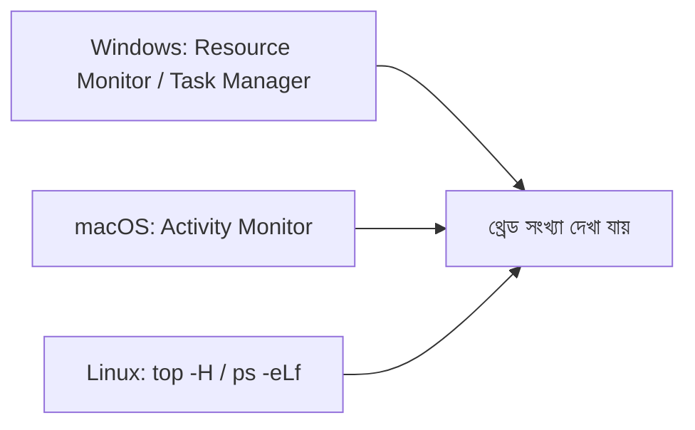

# ০৪. how to find a thread in windows, mac, linux PC?

গত লেসনে আমরা জানলাম, একটা প্রসেসের ভেতরে একাধিক থ্রেড থাকতে পারে — একটা রেস্টুরেন্ট শাখায় একাধিক শেফের মতো। এখন কৌতূহল জাগতেই পারে — একটা চলমান প্রসেসের ভেতরে ঠিক কয়টা থ্রেড কাজ করছে, সেটা বাস্তবে কীভাবে দেখা যায়?

Windows-এ এই তথ্য দেখার সবচেয়ে সহজ উপায় হলো **Task Manager**-এর "Details" ট্যাব। কোনো প্রসেসের উপর রাইট-ক্লিক করে "Properties" খুললে থ্রেড সংক্রান্ত কিছু তথ্য পাওয়া যায়, তবে আরও বিস্তারিতভাবে দেখার জন্য **Resource Monitor** ব্যবহার করা ভালো — এটা খুলতে Task Manager-এর Performance ট্যাব থেকে "Open Resource Monitor" এ ক্লিক করলেই হয়। সেখানে CPU ট্যাবে গেলে প্রতিটা প্রসেসের পাশে "Threads" নামে একটা কলাম দেখা যায়, যেখানে ঠিক সংখ্যাটা লেখা থাকে।

macOS-এ একই কাজের জন্য আছে **Activity Monitor** (Spotlight দিয়ে খুঁজে বের করা যায়, বা Applications > Utilities-এ পাওয়া যায়)। সেখানে CPU ট্যাবে কোনো একটা প্রসেসে ডাবল-ক্লিক করলে একটা ছোট উইন্ডো খোলে, যেখানে "Threads" নামে একটা সংখ্যা দেখানো হয় — ঠিক কতগুলো থ্রেড সেই মুহূর্তে সেই প্রসেসের ভেতরে কাজ করছে।

Linux-এ এই কাজটা টার্মিনাল থেকে আরও সরাসরি করা যায়:

```bash
top -H
```

`-H` ফ্ল্যাগটা `top` কমান্ডকে বলে, প্রতিটা প্রসেসকে না দেখিয়ে, প্রতিটা থ্রেডকে আলাদা আলাদা লাইনে দেখাও। আরেকটা জনপ্রিয় টুল হলো `htop`, যেটা `top`-এরই একটা রঙিন, আরও পড়তে সহজ সংস্করণ। নির্দিষ্ট একটা প্রসেসের থ্রেড গণনা করতে চাইলে:

```bash
ps -eLf | grep node
```

এখানে `-eLf` ফ্ল্যাগ প্রতিটা থ্রেডকে (Lightweight Process, তাই `L`) আলাদা লাইন হিসেবে দেখায়, আর `grep node` দিয়ে আমরা শুধু node-সম্পর্কিত এন্ট্রি বাছাই করছি — Module 9-এ শেখা `filter`-এর ধারণা এখানে অপারেটিং সিস্টেমের কমান্ডেও প্রতিফলিত হচ্ছে।



একটা মজার পর্যবেক্ষণ করতে পারো নিজেই — একটা সাধারণ `node server.js` চালিয়ে যদি থ্রেড সংখ্যা দেখো, তাহলে একটার বেশি থ্রেড দেখতে পাবে, যদিও তোমার লেখা জাভাস্ক্রিপ্ট কোড একটা মাত্র মূল থ্রেডেই চলছে। বাকি থ্রেডগুলো হলো Node.js-এর ভেতরের libuv thread pool আর অন্যান্য অভ্যন্তরীণ ব্যবস্থাপনার জন্য বরাদ্দ — ঠিক যেমন আগের লেসনে আমরা `crypto.pbkdf2`-এর উদাহরণে দেখেছিলাম।

Process আর thread দুটোই এখন আমাদের কাছে পরিষ্কার। এখন শেষ প্রশ্নে যাওয়া যাক — বাস্তব প্রজেক্টে প্রায়ই একটার বেশি ভাষায় লেখা সার্ভিস একসাথে চালাতে হয়, যেমন একটা Node.js ব্যাকএন্ডের পাশাপাশি একটা Python সার্ভিস। সেটা কীভাবে সম্ভব, সেই প্রশ্নের উত্তর নিয়েই এই মডিউলের শেষ লেসন।
