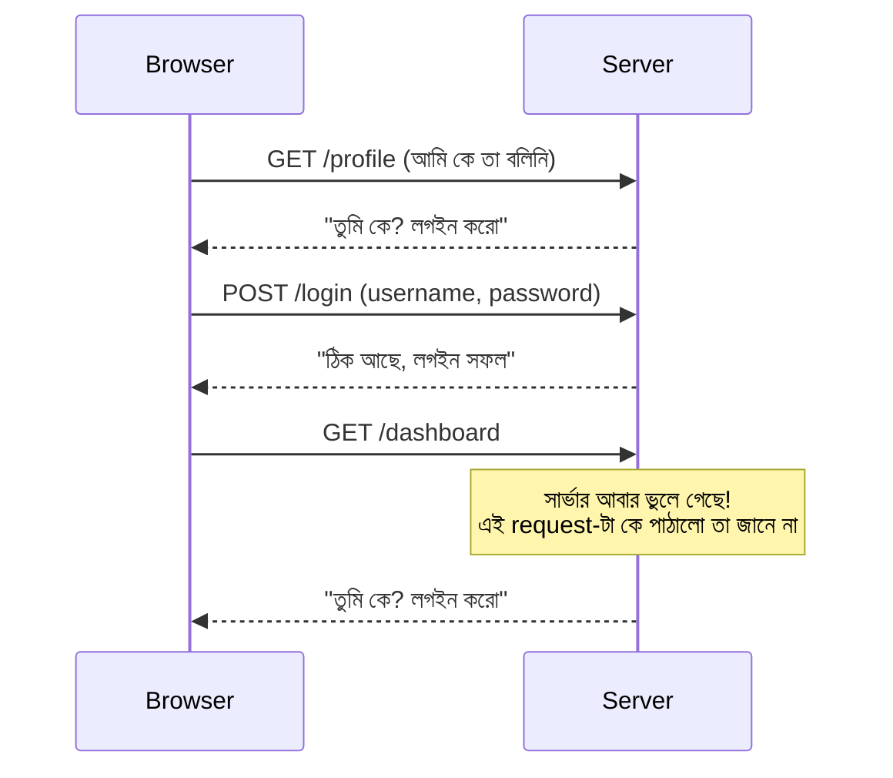
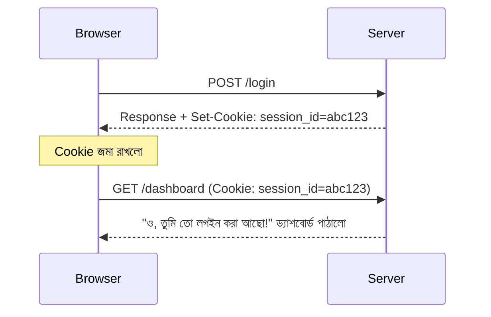

# ০১. Stateless HTTP এবং Cookie-র পরিচয়

মনে করো তুমি একটা দোকানে ঢুকলে, দোকানদারকে বললে "ভাই, আমাকে একটা লাল শার্ট দেখান।" সে দেখালো। তুমি আবার বললে "এটা মাঝারি সাইজে আছে?" — আর দোকানদার তোমার দিকে এমনভাবে তাকালো যেন তোমাকে সে জীবনে প্রথমবার দেখছে, আগের প্রশ্নটা মনেই নেই তার। প্রতিবার তোমাকে নতুন করে বলতে হচ্ছে তুমি কে, কী চাও, আগে কী জিজ্ঞেস করেছিলে। এটাই HTTP-র আসল স্বভাব — **stateless**।

Module 6-এ আমরা দেখেছিলাম প্রতিটা HTTP request-response একটা সম্পূর্ণ স্বাধীন লেনদেন — request যায়, response আসে, ব্যস, সম্পর্ক শেষ। সার্ভার পরের request-টা পেলে তার আগের কোনো request-এর কথা মনে রাখে না, যদি না তুমি নিজে থেকে কিছু ব্যবস্থা করো। প্রতিটা request সার্ভারের কাছে সম্পূর্ণ নতুন একজন আগন্তুক।

এই সমস্যাটা বাস্তব — চিন্তা করো, তুমি Facebook-এ একবার লগইন করলে, আর প্রতিটা নতুন পোস্ট দেখতে গেলেই যদি আবার username-password দিতে হতো, তাহলে ইন্টারনেট ব্যবহার করাই দুঃস্বপ্ন হয়ে যেতো। তাহলে ওয়েবসাইটগুলো কীভাবে তোমাকে "মনে রাখে"?

উত্তরটা হলো একটা ছোট কৌশল — সার্ভার নিজে কিছু মনে না রেখে, ব্রাউজারকেই দায়িত্ব দেয় একটা ছোট "পরিচয়পত্র" বহন করার, আর প্রতিবার request পাঠানোর সময় সেই পরিচয়পত্রটা সাথে নিয়ে যাওয়ার। এই ছোট পরিচয়পত্রটাই **Cookie**।

Cookie আসলে একটা ছোট্ট টেক্সট তথ্য (key-value জোড়া), যেটা সার্ভার ব্রাউজারকে পাঠায়, আর ব্রাউজার সেটা নিজের কম্পিউটারে জমা রাখে। এরপর থেকে যতবার তুমি সেই একই ওয়েবসাইটে request পাঠাও, ব্রাউজার নিজে থেকেই সেই Cookie-টা request-এর সাথে জুড়ে পাঠিয়ে দেয় — অনেকটা যেন তুমি প্রতিবার দোকানে ঢোকার সময় একটা মেম্বারশিপ কার্ড দেখাচ্ছো, আর দোকানদার কার্ড দেখেই বলছে "ও, আপনি তো গতবার লাল শার্ট দেখেছিলেন।"

লক্ষ্য করো এখানে দুইটা নতুন HTTP header এসেছে। সার্ভার response-এ পাঠায় `Set-Cookie` header, যেটা দিয়ে ব্রাউজারকে বলে "এই তথ্যটা জমা রাখো"। এরপর ব্রাউজার প্রতিটা request-এর সাথে পাঠায় `Cookie` header, যেটা দিয়ে বলে "এই যে, আমার কাছে যা জমা আছে তা তোমাকে ফেরত দিচ্ছি।" Module 8-এ আমরা যেমন JSON দিয়ে ডেটা পাঠাতাম request body-তে, ঠিক তেমনই Cookie পাঠানো হয় header-এর মধ্য দিয়ে — কিন্তু এর কাজ সম্পূর্ণ আলাদা, এটা ডেটা পাঠানোর জন্য নয়, বরং পরিচয় "মনে রাখার" জন্য।

এখানে একটা গুরুত্বপূর্ণ জিনিস বোঝা দরকার — সার্ভার নিজে কিছু মনে রাখছে না, ব্রাউজারই বহন করছে সেই তথ্য, আর প্রতি request-এ ফেরত পাঠাচ্ছে। এই কৌশলটাই HTTP-র stateless স্বভাবকে "স্টেটফুল মনে হওয়ার" একটা অনুভূতি দেয়, যদিও প্রোটোকল নিজে বদলায়নি।

পরের লেসনে আমরা সত্যিকারের Express কোড লিখে দেখবো, কীভাবে সার্ভার থেকে একটা Cookie বানানো যায় আর ব্রাউজারে সেভ করা যায়।
