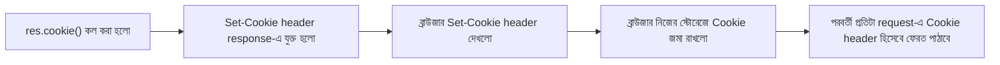

# ০২. Cookie বোঝা: কীভাবে বানাতে ও সেভ করতে হয়

আগের লেসনে আমরা বুঝেছি Cookie কেন দরকার। এবার হাতে-কলমে দেখি — Express দিয়ে কীভাবে একটা Cookie বানানো যায়, ব্রাউজারে সেটা কীভাবে জমা হয়, আর কীভাবে সেটা পড়া যায়।

Express-এ Cookie বসানোর জন্য `res` অবজেক্টের একটা মেথড আছে — `res.cookie(name, value, options)`। Module 7-এ আমরা middleware আর route handler-এর মধ্যে `req`, `res` কীভাবে কাজ করে দেখেছিলাম; এখানে `res`-এর নতুন একটা ক্ষমতা দেখবো।

```js
const express = require("express");
const app = express();

app.get("/set-cookie", (req, res) => {
  res.cookie("username", "arman", { maxAge: 60000 }); // 60 সেকেন্ড পর্যন্ত বৈধ
  res.send("Cookie সেট করা হয়েছে!");
});

app.listen(3000, () => console.log("Server চলছে পোর্ট 3000-এ"));
```

এই route-এ হিট করলে, response-এর সাথে একটা `Set-Cookie: username=arman; Max-Age=60` header যাবে। ব্রাউজার (বা Postman) এটা দেখে নিজের স্টোরেজে জমা রাখবে। Chrome-এ DevTools খুলে Application ট্যাবে গেলে তুমি নিজের চোখেই দেখতে পাবে এই Cookie জমা আছে।

এখন প্রশ্ন হলো — Cookie পড়বো কীভাবে? এখানে একটু সাবধান হতে হবে, কারণ raw Express দিয়ে `req.cookies` সরাসরি পাওয়া যায় না — এই কাজে সাহায্য করে `cookie-parser` নামের একটা middleware (এটা নিয়ে বিস্তারিত লেসন ৫-এ)। কিন্তু এখন বোঝার জন্য raw header থেকেও দেখা যায়:

```js
app.get("/read-cookie", (req, res) => {
  console.log(req.headers.cookie); // "username=arman"
  res.send("দেখো টার্মিনালে কী প্রিন্ট হলো");
});
```

Cookie বানানোর সময় কিছু গুরুত্বপূর্ণ option থাকে, যেগুলো Cookie-র আচরণ নিয়ন্ত্রণ করে:

| Option | কাজ |
|---|---|
| `maxAge` | কত মিলিসেকেন্ড পর্যন্ত Cookie বৈধ থাকবে |
| `expires` | কোন নির্দিষ্ট তারিখ-সময়ে Cookie মেয়াদ শেষ হবে |
| `httpOnly` | `true` হলে JavaScript দিয়ে (`document.cookie`) Cookie পড়া যাবে না — শুধু HTTP request-এ যাবে |
| `secure` | `true` হলে শুধু HTTPS কানেকশনে Cookie পাঠানো হবে |
| `path` | কোন route/path-এ Cookie প্রযোজ্য হবে |

`httpOnly` আর `secure` — এই দুইটা option বিশেষভাবে মনে রাখা দরকার, কারণ Module 11-এর শেষের দিকে আমরা যখন Cookie-ভিত্তিক Auth-এর নিরাপত্তা সমস্যা নিয়ে কথা বলবো, তখন এই দুইটাই বারবার ফিরে আসবে। আপাতত এইটুকু মনে রাখো — `httpOnly: true` মানে হ্যাকার যদি তোমার সাইটে কোনোভাবে ক্ষতিকর JavaScript ঢুকিয়েও দেয়, সে তোমার Cookie চুরি করতে পারবে না, কারণ সেই স্ক্রিপ্ট Cookie-টা দেখতেই পাবে না।

Cookie মুছে ফেলতে চাইলে `res.clearCookie("username")` ব্যবহার করা হয় — এটা মূলত ব্রাউজারকে বলে "এই Cookie-র মেয়াদ এক্ষুনি শেষ করে দাও।"



এখন আমরা জানি কীভাবে Cookie বানাতে ও পড়তে হয়। পরের লেসনে আমরা এটা ব্যবহার করে সত্যিকারের একটা কাজের জিনিস বানাবো — Cookie দিয়ে লগইন সিস্টেম আর একটা প্রোটেক্টেড রুট।
