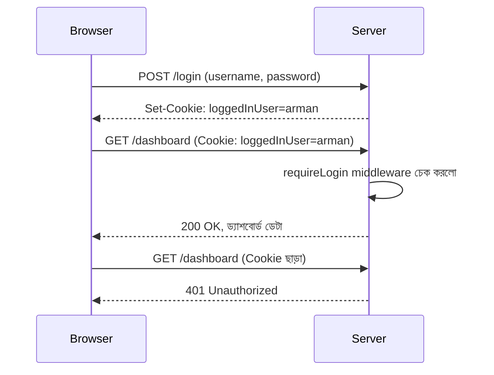

# ০৩. Cookie দিয়ে সিম্পল লগইন ও Protected Route

এখন পর্যন্ত আমরা Cookie বানাতে আর পড়তে শিখেছি। কিন্তু বাস্তব দুনিয়ায় Cookie-র সবচেয়ে পরিচিত ব্যবহার হলো — একজন ব্যবহারকারী লগইন করার পর তাকে "মনে রাখা", আর কিছু নির্দিষ্ট পাতা শুধু লগইন করা মানুষদেরই দেখানো। একে বলে **protected route**। এই লেসনে আমরা এটাই বানাবো, যদিও এখনো খুব সাধারণ (naive) পদ্ধতিতে — আসল, নিরাপদ পদ্ধতি আমরা ধাপে ধাপে শিখবো।

প্রথমে `cookie-parser` ইনস্টল করে নেই, কারণ এটা ছাড়া `req.cookies` ব্যবহার করা যাবে না:

```bash
npm install express cookie-parser
```

```js
const express = require("express");
const cookieParser = require("cookie-parser");
const app = express();

app.use(express.json());
app.use(cookieParser());

// ভুয়া ইউজার ডেটাবেস, শুধু শেখার জন্য
const users = [{ username: "arman", password: "1234" }];

app.post("/login", (req, res) => {
  const { username, password } = req.body;
  const user = users.find(
    (u) => u.username === username && u.password === password
  );

  if (!user) {
    return res.status(401).json({ message: "ভুল username অথবা password" });
  }

  // লগইন সফল হলে একটা Cookie সেট করে দিচ্ছি
  res.cookie("loggedInUser", username, { httpOnly: true, maxAge: 3600000 });
  res.json({ message: "লগইন সফল!" });
});
```

লক্ষ্য করো, লগইন সফল হলেই আমরা `loggedInUser` নামে একটা Cookie সেট করে দিচ্ছি, যার মধ্যে username জমা আছে। এখন এই তথ্য ব্যবহার করে আমরা একটা middleware বানাবো, যেটা যাচাই করবে অনুরোধকারীর কাছে বৈধ Cookie আছে কিনা — Module 7-এ শেখা middleware চেইনের ধারণাটাই এখানে কাজে লাগছে।

```js
function requireLogin(req, res, next) {
  const user = req.cookies.loggedInUser;

  if (!user) {
    return res.status(401).json({ message: "আগে লগইন করুন" });
  }

  req.user = user; // পরের handler-এর জন্য রেখে দিলাম
  next();
}

app.get("/dashboard", requireLogin, (req, res) => {
  res.json({ message: `স্বাগতম, ${req.user}! এটা তোমার ড্যাশবোর্ড।` });
});
```

এই `requireLogin` middleware-টাই আসল "গেটকিপার" — কেউ `/dashboard`-এ ঢুকতে চাইলে, প্রথমে এই middleware তাকে থামায়, Cookie চেক করে, তারপর `next()` কল করে ভেতরে যেতে দেয়। Cookie না থাকলে সে ৪০১ Status Code (Module 6-এ শেখা Unauthorized) ফেরত দিয়ে দেয়।



এই সিস্টেমটা কাজ করছে, কিন্তু এখানে একটা বড় দুর্বলতা লুকিয়ে আছে যেটা আমরা এখনই চিহ্নিত করে রাখি — আমরা সরাসরি Cookie-তে username রেখে দিচ্ছি, কোনো এনক্রিপশন বা যাচাই ছাড়া। কেউ যদি বুঝে ফেলে Cookie-র নাম আর ফরম্যাট, সে নিজে থেকে Cookie বানিয়ে যেকোনো username বসিয়ে দিতে পারবে, আর সার্ভার বিশ্বাস করে নেবে! এই সমস্যাটা সমাধানের জন্যই দরকার হয় **Session** — যেখানে Cookie-তে শুধু একটা এলোমেলো ID থাকে, আসল তথ্য থাকে সার্ভারের নিজের কাছে।

পরের লেসনে আমরা ঠিক এই সমস্যা সমাধান করতে নিজের হাতে (custom) একটা Session সিস্টেম বানাবো।
