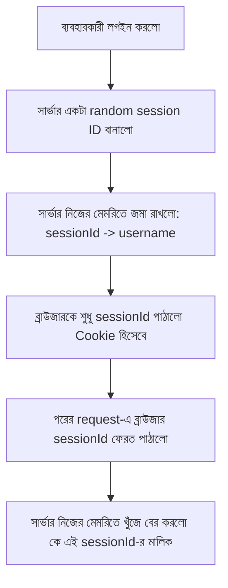

# ০৪. Cookie দিয়ে Session বানানো: Custom Session Storage

আগের লেসনের শেষে আমরা একটা ফাঁকফোকর খুঁজে পেয়েছিলাম — Cookie-তে সরাসরি username রেখে দিলে যে কেউ সেটা নকল করে জালিয়াতি করতে পারে। এই সমস্যার সমাধান হলো একটা সহজ কিন্তু শক্তিশালী ধারণা: Cookie-তে আসল তথ্য না রেখে, শুধু একটা এলোমেলো, অনুমান-অযোগ্য ID রাখো, আর আসল তথ্য জমা রাখো সার্ভারের নিজের মেমরিতে। একেই বলে **Session**।

চিন্তা করো এটা অনেকটা ক্লোকরুম টিকিটের মতো — তুমি কনসার্টে ঢোকার সময় ব্যাগ জমা দিলে, বদলে পেলে একটা টিকিট নম্বর, যেমন "৪৭"। তোমার ব্যাগে কী আছে সেটা টিকিটে লেখা নেই, শুধু নম্বরটা আছে। ফেরত নেয়ার সময় টিকিট দেখালেই কর্মচারী তার নিজের রেকর্ড বই থেকে দেখে বলে দেয় তোমার ব্যাগ কোনটা। Cookie হলো সেই টিকিট, আর সার্ভারের মেমরি হলো রেকর্ড বই।



চলো নিজের হাতে এটা বানাই। এলোমেলো ID বানানোর জন্য Node-এর built-in `crypto` মডিউল ব্যবহার করবো — Module 3-এ যেটার নাম আমরা শুধু চিনে রেখেছিলাম, এখন প্রথমবার ব্যবহার করছি।

```js
const express = require("express");
const cookieParser = require("cookie-parser");
const crypto = require("crypto");
const app = express();

app.use(express.json());
app.use(cookieParser());

const users = [{ username: "arman", password: "1234" }];

// এটাই আমাদের "রেকর্ড বই" — আসল Session Storage, সার্ভারের মেমরিতে
const sessionStore = {};

app.post("/login", (req, res) => {
  const { username, password } = req.body;
  const user = users.find(
    (u) => u.username === username && u.password === password
  );

  if (!user) {
    return res.status(401).json({ message: "ভুল username অথবা password" });
  }

  const sessionId = crypto.randomBytes(16).toString("hex"); // এলোমেলো ID
  sessionStore[sessionId] = { username, loggedInAt: new Date() };

  res.cookie("sessionId", sessionId, { httpOnly: true, maxAge: 3600000 });
  res.json({ message: "লগইন সফল!" });
});

function requireLogin(req, res, next) {
  const sessionId = req.cookies.sessionId;
  const session = sessionStore[sessionId];

  if (!session) {
    return res.status(401).json({ message: "আগে লগইন করুন" });
  }

  req.user = session.username;
  next();
}

app.get("/dashboard", requireLogin, (req, res) => {
  res.json({ message: `স্বাগতম, ${req.user}!` });
});

app.post("/logout", (req, res) => {
  delete sessionStore[req.cookies.sessionId]; // রেকর্ড বই থেকে মুছে ফেললাম
  res.clearCookie("sessionId");
  res.json({ message: "লগআউট সফল" });
});
```

এখন লক্ষ্য করো, Cookie-তে থাকা `sessionId` দেখে কেউ বুঝতেই পারবে না এটা কার — এটা শুধু একটা অর্থহীন এলোমেলো স্ট্রিং। আসল তথ্য (কে লগইন করেছে, কখন করেছে) সব সার্ভারের `sessionStore` অবজেক্টে, যেটা বাইরের কেউ কখনো সরাসরি দেখতে পায় না। এটাই Session-ভিত্তিক পদ্ধতির মূল শক্তি — ব্রাউজারের হাতে শুধু একটা "চাবি" থাকে, "তালা" আর "ঘর" দুটোই থাকে সার্ভারের কাছে।

তবে এই `sessionStore` অবজেক্টের নিজেরও একটা সীমাবদ্ধতা আছে — এটা শুধু সাধারণ একটা JavaScript অবজেক্ট, যেটা RAM-এ থাকে। সার্ভার রিস্টার্ট হলেই সব Session হারিয়ে যাবে, আর একাধিক সার্ভার ইন্সট্যান্স চললে (যেমন লোড ব্যালান্সিং-এ) প্রতিটার নিজস্ব আলাদা মেমরি থাকবে, ফলে একটাতে লগইন করলে অন্যটা চিনবে না। বাস্তব প্রজেক্টে তাই মানুষ নিজে হাতে এই Storage না বানিয়ে, পরীক্ষিত একটা লাইব্রেরি ব্যবহার করে।

পরের লেসনে আমরা দেখবো কীভাবে `express-session` নামের জনপ্রিয় লাইব্রেরি এই একই কাজ আরও পরিণত, নিরাপদ, আর কনফিগারযোগ্য উপায়ে করে দেয়।
