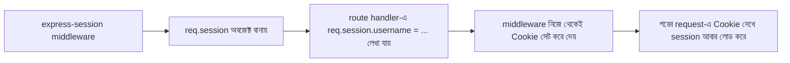

# ০৫. Third Party Library দিয়ে Session ও Cookie (express-session, cookie-parser)

আগের লেসনে আমরা নিজের হাতে একটা `sessionStore` অবজেক্ট বানিয়ে Session ম্যানেজ করেছিলাম। এটা কাজ করে, কিন্তু বাস্তব প্রজেক্টে এই চাকা আবার নতুন করে বানানোর দরকার নেই — কারণ session ID বানানো, মেয়াদ নিয়ন্ত্রণ করা, নিরাপদভাবে Cookie সাইন করা, এইসব খুঁটিনাটি ইতিমধ্যে হাজারো ডেভেলপার মিলে টেস্ট করে, ভুল ঠিক করে একটা পরিণত লাইব্রেরিতে রূপ দিয়েছে — `express-session`।

`cookie-parser` আমরা আগেই ব্যবহার করেছি — এটা শুধু ব্রাউজার থেকে আসা `Cookie` header-টা পার্স করে `req.cookies`-তে সাজিয়ে দেয়। `express-session` আরেক ধাপ এগিয়ে — এটা পুরো Session ব্যবস্থাটাই সামলায়: session ID বানানো, Cookie সেট করা, session data জমা রাখা, সব একসাথে।

```bash
npm install express-session
```

```js
const express = require("express");
const session = require("express-session");
const app = express();

app.use(express.json());

app.use(
  session({
    secret: "amar-goopon-chabi", // Cookie সাইন করার জন্য গোপন চাবি
    resave: false, // পরিবর্তন না হলে বারবার সেভ করার দরকার নেই
    saveUninitialized: false, // খালি session সেভ করার দরকার নেই
    cookie: { httpOnly: true, maxAge: 3600000 },
  })
);

const users = [{ username: "arman", password: "1234" }];

app.post("/login", (req, res) => {
  const { username, password } = req.body;
  const user = users.find(
    (u) => u.username === username && u.password === password
  );

  if (!user) {
    return res.status(401).json({ message: "ভুল username অথবা password" });
  }

  req.session.username = username; // ব্যস, এতটুকুই!
  res.json({ message: "লগইন সফল!" });
});

function requireLogin(req, res, next) {
  if (!req.session.username) {
    return res.status(401).json({ message: "আগে লগইন করুন" });
  }
  next();
}

app.get("/dashboard", requireLogin, (req, res) => {
  res.json({ message: `স্বাগতম, ${req.session.username}!` });
});

app.post("/logout", (req, res) => {
  req.session.destroy(() => {
    res.clearCookie("connect.sid"); // express-session-এর ডিফল্ট Cookie নাম
    res.json({ message: "লগআউট সফল" });
  });
});
```

লক্ষ্য করো, আমরা `sessionStore`, `crypto.randomBytes`, ম্যানুয়াল Cookie সেট করা — এসব কিছুই আর নিজে লিখিনি। `express-session` middleware ভেতরে ভেতরে ঠিক আগের লেসনের মতোই কাজ করে — একটা এলোমেলো ID বানায়, সেটাকে Cookie-তে (ডিফল্ট নাম `connect.sid`) পাঠায়, আর `req.session` নামের একটা অবজেক্টে তথ্য জমা রাখে যেটা আমরা যেকোনো route-এ সরাসরি ব্যবহার করতে পারি।



একটা গুরুত্বপূর্ণ জিনিস মনে রাখা দরকার — ডিফল্টভাবে `express-session` সার্ভারের মেমরিতেই (`MemoryStore`) session জমা রাখে, যেটা প্রোডাকশনে ব্যবহারের জন্য উপযুক্ত নয় (কনসোলে warning-ও দেখাবে)। বাস্তব প্রজেক্টে এই session data সাধারণত Redis বা ডেটাবেসে জমা রাখা হয়, `connect-redis`-এর মতো আলাদা "store" প্যাকেজ দিয়ে — যাতে সার্ভার রিস্টার্ট হলেও session হারিয়ে না যায়, আর একাধিক সার্ভার একই session শেয়ার করতে পারে। এখন আমরা শুধু ধারণাটা ঠিকভাবে বুঝে রাখছি; স্টোরেজ পরিবর্তন করা মূলত একটা কনফিগারেশনের বিষয়, কোড লজিক একই থাকে।

এখন পর্যন্ত আমরা Cookie আর Session দুটোই হাতে-কলমে বানিয়ে দেখেছি, নিজে হাতে আর লাইব্রেরি দিয়ে। পরের লেসনে আমরা একটু থেমে পুরো যাত্রাটা মাথায় গুছিয়ে নেবো।
