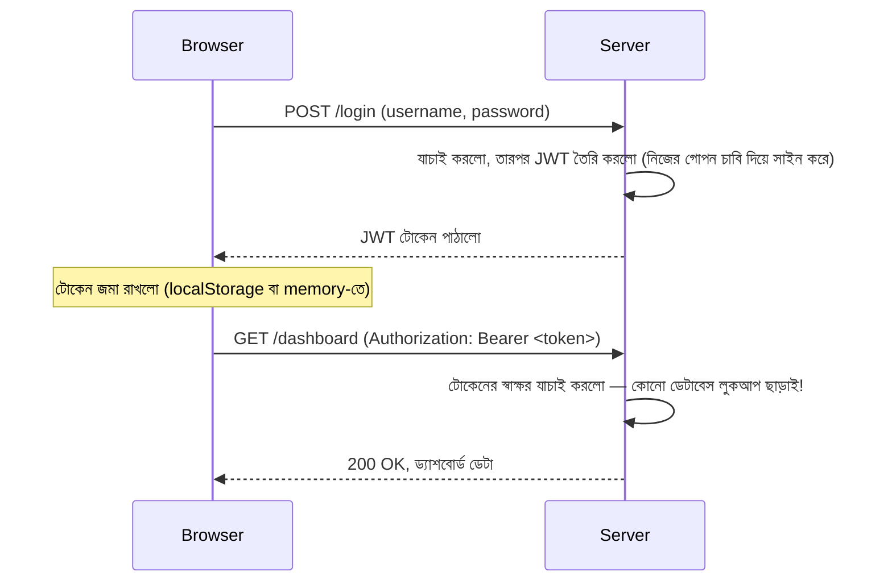
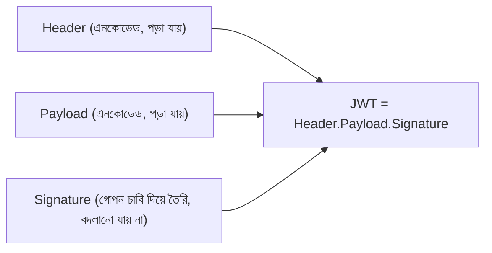

# ০১. JWT-র পরিচয়

Module 11-এর শেষে আমরা একটা তালিকা বানিয়েছিলাম — Cookie-ভিত্তিক Session সিস্টেমের সমস্যাগুলো: একাধিক সার্ভারে Session শেয়ার করার ঝামেলা, ক্রস-ডোমেইন জটিলতা, মোবাইল অ্যাপে Cookie ব্যবহারের অসুবিধা, আর CSRF-এর ঝুঁকি। এই সব সমস্যার মূলে একটা জিনিস লুকিয়ে ছিলো — সার্ভারকে *মনে রাখতে হচ্ছিলো* কে লগইন করেছে, একটা কেন্দ্রীয় জায়গায় (`sessionStore`, বা Redis)। JWT এই পুরো ধারণাটাকেই উল্টে দেয়।

JWT মানে **JSON Web Token**। এর মূল দর্শনটা এরকম — সার্ভার আর কিছু "মনে" রাখবে না। বরং ব্যবহারকারী লগইন করার সময় সার্ভার তাকে একটা স্বয়ংসম্পূর্ণ (self-contained), স্বাক্ষরিত (signed) টোকেন দিয়ে দেবে, যেটার ভেতরেই তার পরিচয়ের তথ্য লেখা থাকবে। এরপর ব্যবহারকারী প্রতিটা request-এর সাথে সেই টোকেনটা পাঠাবে, আর সার্ভার শুধু টোকেনটা যাচাই করবে — কোথাও লুকআপ করতে হবে না, কোনো `sessionStore` মনে রাখতে হবে না।

এটাকে তুলনা করা যায় একটা পাসপোর্টের সাথে। যখন তুমি বিদেশ যাও, ইমিগ্রেশন অফিসার তোমার দেশের ডেটাবেসে ফোন করে যাচাই করে না তুমি সত্যিই কে — সে শুধু তোমার পাসপোর্টটা দেখে, তাতে থাকা সরকারি সিলমোহর (স্বাক্ষর) যাচাই করে বোঝে এটা জাল না আসল, আর পাসপোর্টের ভেতরের তথ্য (নাম, জন্মতারিখ, ছবি) পড়েই সিদ্ধান্ত নেয়। পাসপোর্টটা নিজেই তথ্য বহন করছে, স্বয়ংসম্পূর্ণ। JWT ঠিক এই ধারণাতেই কাজ করে।



একটা JWT দেখতে আসলে একটা লম্বা, অদ্ভুত স্ট্রিং, যেটা তিনটা অংশ নিয়ে গঠিত, ডট (`.`) দিয়ে আলাদা করা:

```
eyJhbGciOiJIUzI1NiJ9.eyJ1c2VybmFtZSI6ImFybWFuIn0.4f8h2K9s...
   Header                Payload                  Signature
```

**Header** অংশে থাকে টোকেনের মেটাডেটা — কোন অ্যালগরিদম দিয়ে সাইন করা হয়েছে, টোকেনের ধরন কী। **Payload** অংশে থাকে আসল তথ্য (যাকে বলে "claims") — যেমন username, user ID, বা কোনো পারমিশন তথ্য। এটা Module 8-এ শেখা JSON ফরম্যাটেই লেখা থাকে, শুধু Base64 দিয়ে এনকোড করা। আর **Signature** অংশটাই আসল নিরাপত্তার চাবিকাঠি — এটা সার্ভারের একটা গোপন চাবি (secret key) দিয়ে বাকি দুই অংশ থেকে গণিতগতভাবে তৈরি করা একটা স্বাক্ষর, যা প্রমাণ করে টোকেনটা সার্ভার নিজেই বানিয়েছে, কেউ মাঝপথে বদলে দেয়নি।

একটা গুরুত্বপূর্ণ জিনিস এখনই পরিষ্কার করে নেয়া ভালো — Header আর Payload শুধু **এনকোড** করা, **এনক্রিপ্ট** করা নয়। মানে যে কেউ চাইলে এই অংশ দুটো ডিকোড করে পড়ে ফেলতে পারবে (jwt.io ওয়েবসাইটে পেস্ট করলেই দেখা যায়)। তাই কখনো পাসওয়ার্ডের মতো অতি-সংবেদনশীল তথ্য JWT-র payload-এ রাখা উচিত না। যেটা গোপন থাকে, সেটা হলো Signature বানানোর "গোপন চাবি" — সেটা শুধু সার্ভারের কাছে থাকে, আর সেটা দিয়েই সার্ভার বোঝে টোকেনটা আসল কিনা।



এই লেসনে আমরা শুধু ধারণাটা চিনলাম — কীভাবে এই Signature আসলে গণনা করা হয়, সেটা বোঝার আগে আমাদের একটা আরও মৌলিক ধারণা শক্তভাবে বুঝে নিতে হবে, যেটা JWT-র পুরো নিরাপত্তা মডেলের ভিত্তি — **Hashing**। পরের লেসনে আমরা ঠিক সেটাই শিখবো।
