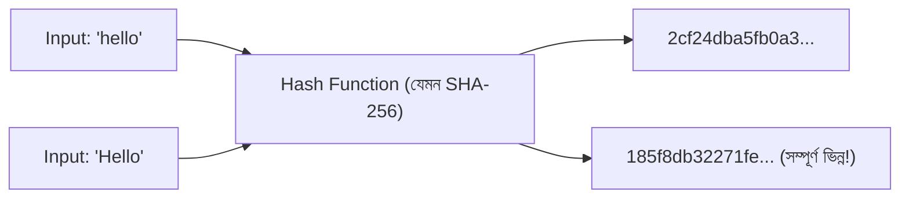

# ০২. Hashing-এর ধারণা

আগের লেসনে আমরা বলেছিলাম JWT-র Signature "গণিতগতভাবে" তৈরি হয় গোপন চাবি দিয়ে। এই গণিতটার নাম **Hashing**, আর এই লেসনে আমরা এই ধারণাটা মাটি থেকে বুঝবো — কারণ শুধু JWT না, পাসওয়ার্ড সংরক্ষণ, ডেটার অখণ্ডতা যাচাই, ব্লকচেইন — আধুনিক সিকিউরিটির প্রায় সবকিছুর গোড়ায় Hashing বসে আছে।

চিন্তা করো একটা ফলের জুসার — তুমি একটা আপেল, একটা কলা, একটা আম দিলে, বের হলো একটা নির্দিষ্ট রঙের, নির্দিষ্ট স্বাদের জুস। এখন যদি তুমি সেই জুসটা আবার দেখাও, কেউ কি বলতে পারবে ঠিক কোন কোন ফল, কী পরিমাণে দেয়া হয়েছিলো? না — জুস বানানো এক দিকে সহজ, কিন্তু জুস থেকে আবার আসল ফলে ফিরে যাওয়া অসম্ভব। **Hash function** ঠিক এভাবেই কাজ করে — এটা যেকোনো ইনপুট (ছোট হোক বা বিশাল একটা ফাইল) নিয়ে একটা নির্দিষ্ট দৈর্ঘ্যের আউটপুট (hash) তৈরি করে, কিন্তু সেই আউটপুট থেকে আসল ইনপুটে ফিরে যাওয়ার কোনো উপায় নেই। একে বলে **one-way function**।

Hashing-এর কিছু গুরুত্বপূর্ণ বৈশিষ্ট্য মনে রাখা দরকার:

- **এক দিকের যাত্রা (one-way)** — hash থেকে আসল ডেটা বের করা প্রায় অসম্ভব।
- **একই ইনপুট সবসময় একই আউটপুট দেয় (deterministic)** — "hello" শব্দটা যতবারই hash করো, একই ফলাফল আসবে।
- **সামান্য পরিবর্তনেও সম্পূর্ণ ভিন্ন আউটপুট (avalanche effect)** — "hello" আর "Hello" (শুধু বড় হাতের H) হ্যাশ করলে সম্পূর্ণ আলাদা, সম্পর্কহীন দুইটা ফলাফল আসবে।
- **নির্দিষ্ট দৈর্ঘ্য (fixed length)** — একটা ছোট শব্দ হ্যাশ করলে যত লম্বা আউটপুট আসবে, একটা পুরো বই হ্যাশ করলেও ঠিক একই দৈর্ঘ্যের আউটপুট আসবে।

এখানে একটা খুব গুরুত্বপূর্ণ পার্থক্য বুঝে নেয়া দরকার — **Hashing এনক্রিপশনের মতো নয়**। Module 3-এ আমরা `crypto` মডিউলের নাম দেখেছিলাম, যেটা "এনক্রিপশন, হ্যাশিং" দুটো কাজেই ব্যবহৃত হয়, কিন্তু এই দুইটা সম্পূর্ণ ভিন্ন উদ্দেশ্যে কাজ করে।

| দিক | Encryption | Hashing |
|---|---|---|
| দিক | দুই দিকের (এনক্রিপ্ট করো, পরে ডিক্রিপ্ট করে ফেরত পাও) | এক দিকের (ফেরত যাওয়া যায় না) |
| চাবি লাগে কি | হ্যাঁ, ডিক্রিপ্ট করতে চাবি লাগে | না, শুধু hash function চললেই হয় |
| উদ্দেশ্য | তথ্য গোপন রাখা, কিন্তু পরে পড়ার দরকার হবে | যাচাই করা, তুলনা করা — মূল তথ্য আর দরকার নেই |
| উদাহরণ | মেসেজিং অ্যাপে end-to-end এনক্রিপশন | পাসওয়ার্ড সংরক্ষণ |

পাসওয়ার্ডের ক্ষেত্রে আমরা কখনো "ডিক্রিপ্ট করে আসল পাসওয়ার্ড ফেরত পাওয়া" চাই না — আমরা শুধু যাচাই করতে চাই ব্যবহারকারী সঠিক পাসওয়ার্ড দিয়েছে কিনা। তাই পাসওয়ার্ডের জন্য Hashing হলো সঠিক টুল, Encryption নয়। এই কারণেই কোনো ভালো ওয়েবসাইট কখনো তোমার আসল পাসওয়ার্ড "ফেরত পাঠাতে" পারে না (ভুলে গেলে) — তারা শুধু নতুন পাসওয়ার্ড সেট করার সুযোগ দেয়, কারণ তাদের কাছে আসল পাসওয়ার্ডটাই সংরক্ষিত নেই, শুধু তার hash আছে।

জুস বানানোর প্রক্রিয়া হিসেবে চিন্তা করলে সহজ হয় — hash function হলো জুসার, ইনপুট হলো ফল, আর আউটপুট (hash) হলো জুস। জুস দেখে ফলে ফেরা যায় না, কিন্তু একই ফল একই মেশিনে দিলে সবসময় একই জুস পাওয়া যাবে — এই deterministic বৈশিষ্ট্যটাই যাচাই করার কাজে লাগে।

এখন আমরা তত্ত্বগতভাবে জানি Hashing কী। পরের লেসনে আমরা Node.js-এর `crypto` মডিউল দিয়ে বাস্তবে একটা username আর password হ্যাশ করে দেখবো, হাতে-কলমে।
