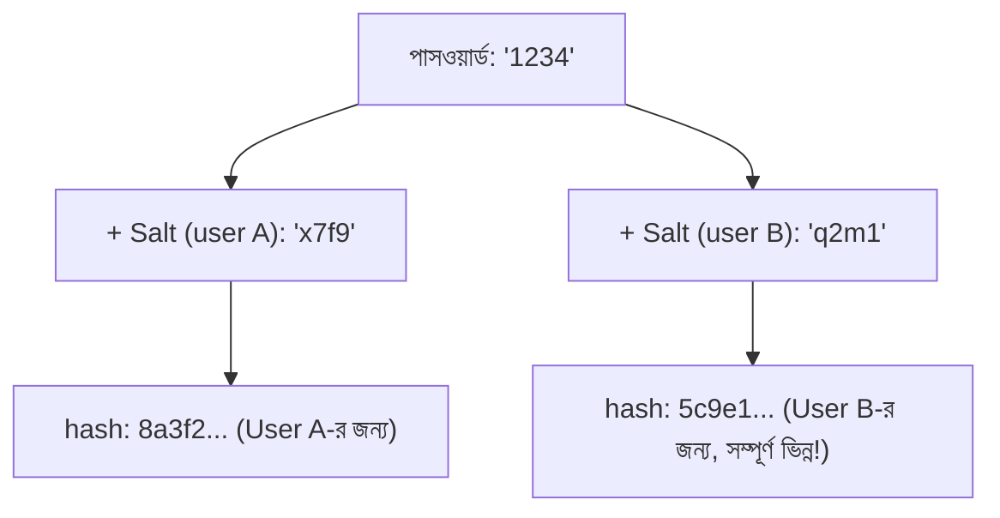

# ০৩. Username ও Password হ্যাশ করা

এবার তত্ত্ব থেকে বাস্তবে আসি। Module 3-এ আমরা `crypto`-কে শুধু নাম হিসেবে চিনেছিলাম, বলেছিলাম "Module 12-তে এটা কাজে লাগবে" — সেই মুহূর্তটা এসে গেছে। Node.js-এর built-in `crypto` মডিউল ব্যবহার করে আমরা এখন সত্যিকারের পাসওয়ার্ড হ্যাশ করবো।

সবচেয়ে সহজ পদ্ধতি হলো `crypto.createHash()` ব্যবহার করা:

```js
const crypto = require("crypto");

function simpleHash(text) {
  return crypto.createHash("sha256").update(text).digest("hex");
}

console.log(simpleHash("mypassword123"));
// আউটপুট: একটা লম্বা, নির্দিষ্ট দৈর্ঘ্যের hexadecimal স্ট্রিং
```

এটা কাজ করে, কিন্তু পাসওয়ার্ড সংরক্ষণের জন্য শুধু plain SHA-256 ব্যবহার করা যথেষ্ট নিরাপদ নয়। কেন? কারণ একটা সমস্যা আছে — **Rainbow Table Attack**। যেহেতু Hashing দেখেছি deterministic (একই ইনপুটে সবসময় একই আউটপুট), হ্যাকাররা লক্ষ লক্ষ সাধারণ পাসওয়ার্ড (যেমন "123456", "password") আগে থেকেই হ্যাশ করে একটা বিশাল টেবিল বানিয়ে রাখে। তারপর যদি কোনোভাবে তোমার ডেটাবেসের hash-করা পাসওয়ার্ড ফাঁস হয়ে যায়, তারা সেই টেবিলে মিলিয়ে দেখে বুঝে ফেলে আসল পাসওয়ার্ডটা কী ছিলো।

এই আক্রমণ ঠেকানোর কৌশল হলো **Salting** — প্রতিটা পাসওয়ার্ড হ্যাশ করার আগে তার সাথে একটা এলোমেলো, অতিরিক্ত টুকরো (salt) জুড়ে দেয়া, যাতে একই পাসওয়ার্ডও আলাদা আলাদা ব্যবহারকারীর জন্য সম্পূর্ণ ভিন্ন hash তৈরি করে। এতে আগে থেকে বানানো rainbow table আর কাজে লাগে না।



Node-এর `crypto` মডিউলে Salting-সহ হ্যাশিং-এর জন্য `scrypt` ফাংশন ব্যবহার করা যায়, যেটা বিশেষভাবে পাসওয়ার্ড হ্যাশিং-এর জন্য ডিজাইন করা (এটা ইচ্ছাকৃতভাবে ধীর, যাতে হ্যাকার দ্রুত অনেকগুলো সম্ভাবনা try করতে না পারে):

```js
const crypto = require("crypto");

function hashPassword(password) {
  const salt = crypto.randomBytes(16).toString("hex"); // প্রতিবার নতুন এলোমেলো salt
  const hash = crypto.scryptSync(password, salt, 64).toString("hex");
  return `${salt}:${hash}`; // salt আর hash একসাথে জমা রাখছি, পরে যাচাইয়ের জন্য দরকার হবে
}

function verifyPassword(password, storedValue) {
  const [salt, originalHash] = storedValue.split(":");
  const hash = crypto.scryptSync(password, salt, 64).toString("hex");
  return hash === originalHash; // দুইটা hash মিললেই পাসওয়ার্ড সঠিক
}

// ব্যবহার
const stored = hashPassword("mypassword123");
console.log("ডেটাবেসে জমা থাকবে:", stored);

console.log(verifyPassword("mypassword123", stored)); // true
console.log(verifyPassword("wrongpassword", stored)); // false
```

লক্ষ্য করো `verifyPassword`-এ আমরা কখনো আসল পাসওয়ার্ড "ফেরত" পাচ্ছি না — আমরা শুধু নতুন করে ইনপুট দেয়া পাসওয়ার্ডটাকে একই salt দিয়ে আবার হ্যাশ করছি, তারপর দুইটা hash তুলনা করছি। এটাই Hashing-এর "যাচাই করা যায়, কিন্তু ফেরত পাওয়া যায় না" নীতিটা বাস্তবে প্রয়োগ করার সঠিক পদ্ধতি।

বাস্তব প্রজেক্টে অবশ্য মানুষ সাধারণত নিজে থেকে salt ম্যানেজ না করে `bcrypt` নামের জনপ্রিয় প্যাকেজ ব্যবহার করে, যেটা salt তৈরি ও সংরক্ষণ, এমনকি ধীরগতির "cost factor" নিয়ন্ত্রণ — সবকিছু একটামাত্র সহজ ফাংশনে মুড়ে দেয়। কিন্তু ভেতরে ভেতরে নীতিটা একই — hashing আর salting।

এখন আমরা জানি কীভাবে পাসওয়ার্ড নিরাপদে হ্যাশ করে রাখতে হয়। এই একই Hashing ধারণা ব্যবহার করেই JWT-র Signature তৈরি হয় — পরের লেসনে আমরা দেখবো কীভাবে এই জ্ঞান দিয়ে JWT সম্পূর্ণ Session-ভিত্তিক Authentication-এর একটা উন্নত বিকল্প হয়ে ওঠে।
