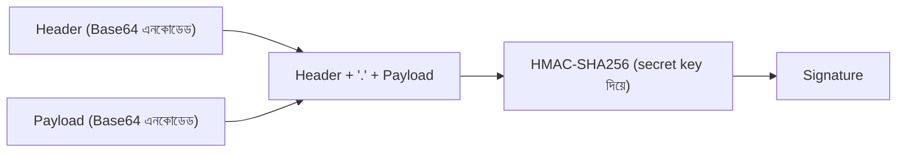
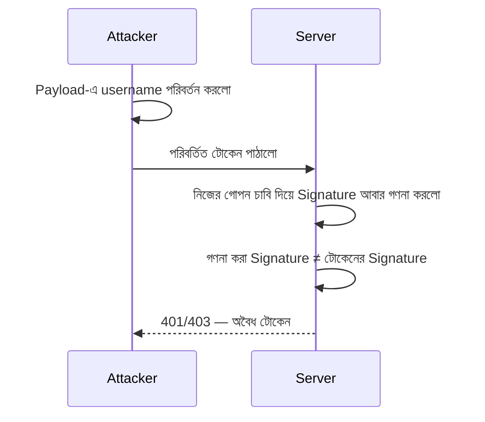

# ০৪. JWT — ক্লায়েন্ট Authenticate করার উন্নত পদ্ধতি

এখন আমাদের হাতে সব টুকরো আছে — Cookie/Session-এর সমস্যা (Module 11), JWT-র গঠন, আর Hashing-এর কাজের পদ্ধতি। এই লেসনে সব একসাথে জুড়ে বুঝবো, ঠিক কীভাবে JWT একটা সম্পূর্ণ Authentication ব্যবস্থা হিসেবে কাজ করে, আর কেন এটাকে "উন্নত" বলা হচ্ছে।

লেসন ১-এ আমরা দেখেছিলাম JWT-র তিনটা অংশ — Header, Payload, Signature। এখন Signature অংশটা আসলে কীভাবে তৈরি হয়, সেটা বুঝি। সার্ভার Header আর Payload-কে একসাথে জুড়ে, তার নিজের একটা গোপন চাবি (secret key) দিয়ে HMAC-SHA256-এর মতো একটা hashing অ্যালগরিদম চালায় (ঠিক আগের লেসনে যেমন আমরা পাসওয়ার্ড হ্যাশ করেছিলাম)। এই hash-টাই হলো Signature।

এখন জাদুটা এখানে — এই hash function-এর একটা বৈশিষ্ট্য আমরা আগেই শিখেছি: সামান্য পরিবর্তনেও সম্পূর্ণ ভিন্ন আউটপুট আসে (avalanche effect)। তাই যদি কেউ টোকেনের Payload-এ সামান্য পরিবর্তন করে (যেমন `"username": "arman"` বদলে `"username": "admin"` বসিয়ে দেয়), আর টোকেনটা আবার সার্ভারে পাঠায়, সার্ভার নিজে আবার সেই একই Header + Payload দিয়ে hash গণনা করবে (নিজের গোপন চাবি দিয়ে), আর দেখবে নতুন গণনা করা hash আর টোকেনে থাকা Signature মিলছে না। ব্যস, সার্ভার তখনই বুঝে যায় টোকেনটা জালিয়াতি করা হয়েছে, আর সেটা প্রত্যাখ্যান করে।

এখানেই JWT-র আসল শক্তি বোঝা যায় — সার্ভারকে ডেটাবেসে গিয়ে কিছু খুঁজতে হচ্ছে না, শুধু গাণিতিকভাবে Signature পুনরায় গণনা করেই বুঝে ফেলছে টোকেনটা আসল কিনা, বদলানো হয়েছে কিনা। Module 11-এর Session পদ্ধতিতে সার্ভারকে প্রতিটা request-এ `sessionStore`-এ (বা Redis-এ) গিয়ে খুঁজতে হতো — এখানে সেই "কেন্দ্রীয় স্মৃতি"-র দরকারই নেই।

এই বৈশিষ্ট্যটাই সরাসরি Module 11-এর সমস্যাগুলো সমাধান করে দেয়:

| Session-এর সমস্যা | JWT কীভাবে সমাধান করে |
|---|---|
| একাধিক সার্ভারে Session শেয়ার করা কঠিন | যেকোনো সার্ভার একাই Signature যাচাই করতে পারে, কেন্দ্রীয় স্টোরেজ লাগে না |
| ক্রস-ডোমেইন জটিলতা | টোকেন সাধারণত `Authorization` header দিয়ে পাঠানো হয়, Cookie নয়, তাই ডোমেইন-নির্ভরতা কম |
| মোবাইল/অন্যান্য ক্লায়েন্টে অসুবিধা | টোকেন যেকোনো ক্লায়েন্ট (ওয়েব, মোবাইল, IoT) সহজেই সংরক্ষণ ও পাঠাতে পারে |
| CSRF ঝুঁকি | ব্রাউজার নিজে থেকে টোকেন যোগ করে না (Cookie-র মতো), তাই সরাসরি CSRF কম প্রযোজ্য |

এখানে একটা গুরুত্বপূর্ণ জিনিস মনে রাখা দরকার — JWT পুরোপুরি ঝুঁকিমুক্ত না। যেমন, JWT একবার ইস্যু করা হলে, সেটা নিজে থেকে বাতিল করা কঠিন (মেয়াদ শেষ না হওয়া পর্যন্ত এটা বৈধ থাকে) — Session হলে সার্ভার থেকে সরাসরি মুছে ফেলা যেতো। এই কারণে JWT-তে সাধারণত ছোট মেয়াদ (`expiresIn`) ব্যবহার করা হয়, আর প্রয়োজনে "refresh token" নামের আরেকটা প্যাটার্ন যোগ করা হয় — কিন্তু সেটা এই কোর্সের পরিসরের বাইরে, এখন শুধু ধারণাটা জেনে রাখাই যথেষ্ট।

তত্ত্ব অনেক হলো — এবার আসল কোড লেখার পালা। পরের লেসনে আমরা `jsonwebtoken` প্যাকেজ ব্যবহার করে বাস্তবে JWT তৈরি এবং যাচাই করবো, একটা সম্পূর্ণ Express রুটে।
