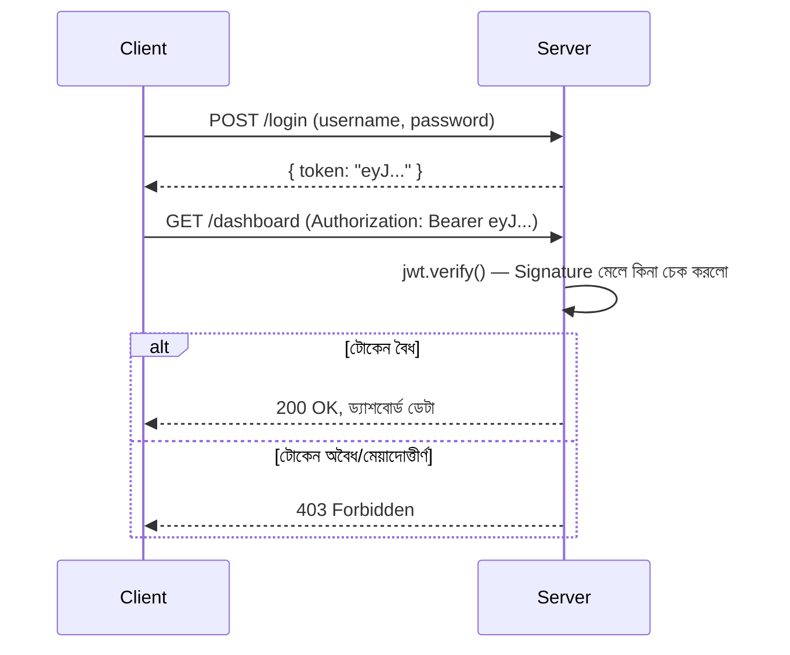

# ০৫. JWT হ্যান্ডস-অন — জেনারেট ও ভেরিফাই করা

তত্ত্ব এখন যথেষ্ট মজবুত — এবার হাতে-কলমে একটা সম্পূর্ণ JWT-ভিত্তিক Authentication সিস্টেম বানাই। আমরা `jsonwebtoken` নামের জনপ্রিয় প্যাকেজ ব্যবহার করবো, যেটা লেসন ৪-এ শেখা Header-Payload-Signature গণনার পুরো কাজটা এক লাইনের ফাংশন কলে করে দেয়।

```bash
npm install express jsonwebtoken
```

প্রথমে একটা বেসিক সেটআপ করি:

```js
const express = require("express");
const jwt = require("jsonwebtoken");
const app = express();

app.use(express.json());

const SECRET_KEY = "amar-khub-goopon-chabi"; // বাস্তবে .env ফাইলে রাখা উচিত

// ভুয়া ইউজার তালিকা (Module 12-এর লেসন ৩-এর মতো, এখানে সরলতার জন্য plain রাখলাম)
const users = [{ username: "arman", password: "1234" }];
```

লগইন রুটে আমরা username/password যাচাই করবো, আর সফল হলে একটা JWT তৈরি করে ফেরত দেবো:

```js
app.post("/login", (req, res) => {
  const { username, password } = req.body;
  const user = users.find(
    (u) => u.username === username && u.password === password
  );

  if (!user) {
    return res.status(401).json({ message: "ভুল username অথবা password" });
  }

  // JWT তৈরি — payload-এ শুধু প্রয়োজনীয়, অ-সংবেদনশীল তথ্য রাখছি
  const token = jwt.sign({ username: user.username }, SECRET_KEY, {
    expiresIn: "1h", // ১ ঘণ্টা পর টোকেন নিজে থেকেই অকার্যকর হয়ে যাবে
  });

  res.json({ message: "লগইন সফল!", token });
});
```

লক্ষ্য করো, এখানে কোনো Cookie সেট হচ্ছে না, কোনো `sessionStore` তৈরি হচ্ছে না — শুধু একটা টোকেন স্ট্রিং ফেরত যাচ্ছে JSON response-এর মধ্যে (Module 8-এর JSON response-এর ধারণাটাই এখানে কাজে লাগছে)। ক্লায়েন্ট (ব্রাউজার বা মোবাইল অ্যাপ) নিজের দায়িত্বে এই টোকেন জমা রাখবে (সাধারণত `localStorage` বা অ্যাপের মেমরিতে)।

এখন প্রোটেক্টেড রুটের জন্য একটা middleware বানাই, যেটা `Authorization` header থেকে টোকেন নিয়ে যাচাই করবে:

```js
function authenticateToken(req, res, next) {
  const authHeader = req.headers["authorization"]; // ফরম্যাট: "Bearer <token>"
  const token = authHeader && authHeader.split(" ")[1];

  if (!token) {
    return res.status(401).json({ message: "টোকেন পাওয়া যায়নি" });
  }

  jwt.verify(token, SECRET_KEY, (err, decoded) => {
    if (err) {
      return res.status(403).json({ message: "টোকেন অবৈধ বা মেয়াদ শেষ" });
    }
    req.user = decoded; // যাচাই সফল হলে ডিকোড করা তথ্য পরের handler-এ পাঠাচ্ছি
    next();
  });
}

app.get("/dashboard", authenticateToken, (req, res) => {
  res.json({ message: `স্বাগতম, ${req.user.username}! এটা তোমার ড্যাশবোর্ড।` });
});

app.listen(3000, () => console.log("Server চলছে পোর্ট 3000-এ"));
```

`jwt.verify()` ঠিক লেসন ৪-এ আঁকা diagram-টাই বাস্তবায়ন করছে — এটা টোকেনের Header আর Payload নিয়ে নিজে থেকে Signature আবার গণনা করে, তারপর টোকেনের ভেতরে থাকা Signature-এর সাথে তুলনা করে। না মিললে, বা মেয়াদ শেষ হয়ে গেলে, `err` পাওয়া যায় আর আমরা ৪০৩ Status Code (Forbidden) ফেরত দিচ্ছি।



চাইলে Postman দিয়ে নিজে টেস্ট করে দেখতে পারো — `/login`-এ হিট করে টোকেন নাও, তারপর `/dashboard`-এ হিট করার সময় Headers ট্যাবে `Authorization: Bearer <সেই টোকেন>` বসিয়ে দেখো রেসপন্স আসে কিনা। এরপর টোকেনের একটা অক্ষর বদলে দিয়ে আবার চেষ্টা করো — দেখবে সার্ভার সাথে সাথে ধরে ফেলছে, ঠিক যেমন লেসন ৪-এ ব্যাখ্যা করা হয়েছিলো।

এখন আমাদের হাতে সম্পূর্ণ, কার্যকর একটা JWT Authentication সিস্টেম আছে — Session বা Cookie ছাড়াই। পরের লেসনে এই সবকিছু ব্যবহার করে আমরা একটা সম্পূর্ণ প্রজেক্ট বানাবো — একটা অ্যাসাইনমেন্ট, যেখানে তুমি নিজে হাতে সব জোড়া লাগাবে।
