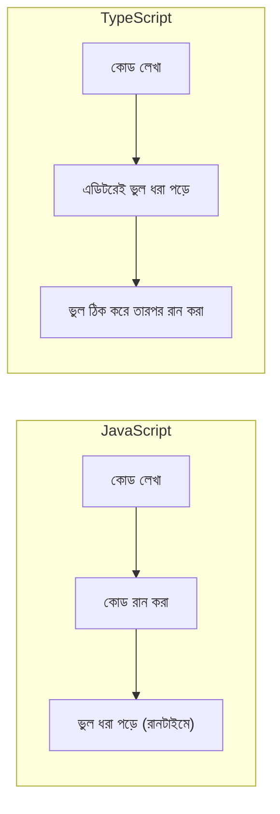

# ০১. Why Do We Need Typescript?

Module 12 পর্যন্ত আমরা যত কোড লিখেছি, সবই প্লেইন JavaScript। Express রুট, JWT verify, কুকি সেট করা — সবকিছুতেই আমরা ভেরিয়েবলে যেকোনো কিছু রাখতে পেরেছি, কোনো বাধা ছাড়াই। এটা প্রথম প্রথম স্বাধীনতার মতো মনে হয়, কিন্তু প্রজেক্ট যত বড় হয়, এই স্বাধীনতাই ধীরে ধীরে সমস্যা হয়ে দাঁড়ায়।

একটা বাস্তব দৃশ্য কল্পনা করি। ধরো তুমি একটা ফাংশন লিখেছো যেটা একজন ইউজারের বয়স নিয়ে হিসাব করে:

```js
function calculateDiscount(age) {
  if (age > 60) return 20;
  return 0;
}
```

এখন তোমার টিমমেট, না জেনে, কোথাও থেকে `calculateDiscount("ষাট")` — মানে সংখ্যার বদলে স্ট্রিং — পাঠিয়ে দিলো। JavaScript কোনো অভিযোগ করবে না, কোড চলবে, কিন্তু ফলাফল হবে ভুল বা অদ্ভুত — কারণ `"ষাট" > 60` তুলনাটাই অর্থহীন। এই ভুলটা তুমি তখনই ধরবে যখন প্রোডাকশনে গিয়ে কোনো ইউজার অভিযোগ করবে ছাড় পাচ্ছে না। এটাই JavaScript-এর সবচেয়ে বড় দুর্বলতা — ভুলগুলো **রানটাইমে** ধরা পড়ে, মানে কোড চালানোর পরেই।

TypeScript এই সমস্যাটার সমাধান করে একটা সহজ আইডিয়া দিয়ে — ভেরিয়েবল আর ফাংশনের প্যারামিটারে তুমি আগেই বলে দাও এটা কী ধরনের ডেটা হবে (সংখ্যা, স্ট্রিং, বুলিয়ান, অবজেক্ট)। একই ফাংশন TypeScript-এ লিখলে:

```ts
function calculateDiscount(age: number): number {
  if (age > 60) return 20;
  return 0;
}

calculateDiscount("ষাট"); // ❌ কম্পাইল-টাইমেই এরর: Argument of type 'string' is not assignable to parameter of type 'number'
```

লক্ষ্য করো — এই ভুলটা তুমি কোড **রান করার আগেই**, লেখার সময়েই দেখতে পাচ্ছো, এডিটরের ভেতরেই লাল দাগ পড়ে যাচ্ছে। এটাকেই বলে **static typing** বা **compile-time type checking**। JavaScript-কে বলা হয় **dynamically typed** ভাষা — টাইপ চেক হয় রানটাইমে, TypeScript-কে বলা হয় **statically typed** — টাইপ চেক হয় কোড লেখার সময়, রান করার আগেই।



এখানে বোঝা দরকার — TypeScript আসলে ব্রাউজার বা Node.js সরাসরি চালাতে পারে না। TypeScript হলো JavaScript-এর "উপরে" বসানো একটা লেয়ার — একে বলে **superset**। তুমি TypeScript-এ কোড লেখো, আর একটা টুল (`tsc` — TypeScript Compiler) সেটাকে "compile" করে সাধারণ JavaScript-এ রূপান্তর করে দেয়, যেটা তখন Node.js বা ব্রাউজার চালাতে পারে। মানে TypeScript-এর প্রতিটা ফিচার শেষমেশ প্লেইন JavaScript-এ নেমে আসে — শুধু লেখার সময় তুমি বাড়তি নিরাপত্তা আর সাহায্য পাও।

এই "সাহায্য"টাও গুরুত্বপূর্ণ একটা কারণ। যখন তুমি টাইপ বলে দাও, VS Code-এর মতো এডিটর তোমাকে **autocomplete** সাজেশন দিতে পারে — কোনো অবজেক্টে কোন প্রোপার্টি আছে, কোন ফাংশনে কী প্যারামিটার লাগে, সব আগে থেকেই দেখাতে পারে। বড় টিমে যখন অনেকজন একসাথে কাজ করে, একজনের লেখা ফাংশন আরেকজন ব্যবহার করার সময় ডকুমেন্টেশন না পড়েও বুঝতে পারে কী পাঠাতে হবে — কারণ টাইপগুলোই একধরনের লিখিত চুক্তির মতো কাজ করে।

তার মানে এই না যে TypeScript সব বাগ ঠেকিয়ে দেয় — লজিক্যাল ভুল (যেমন ভুল সূত্র দিয়ে ছাড় হিসাব করা) TypeScript ধরতে পারবে না। কিন্তু "ভুল ধরনের ডেটা পাঠানো" গোত্রের ভুলগুলো, যেগুলো বড় প্রজেক্টে সবচেয়ে বেশি সময় নষ্ট করে, সেগুলো TypeScript লেখার সময়েই আটকে দেয়।

এখন প্রশ্ন হলো — এই TypeScript আসলে কম্পিউটারে চালাবো কীভাবে, আর Node.js-এর সাথে এটা সেটআপ করবো কীভাবে? সেটাই পরের লেসনের বিষয়।
