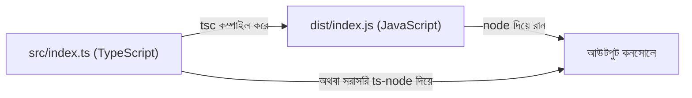

# ০২. Running Typescript Enabled Node.js

আগের লেসনে আমরা জেনেছি TypeScript নিজে থেকে চলে না — এটাকে আগে JavaScript-এ রূপান্তর (compile) করতে হয়, তারপর Node.js সেটা চালায়। এই লেসনে আমরা হাতে-কলমে দেখবো এই সেটআপটা কীভাবে করতে হয়, ঠিক যেভাবে Module 2-তে আমরা প্রথম `http` সার্ভার বানানোর সময় প্রজেক্ট ফোল্ডার সাজিয়েছিলাম।

প্রথমেই একটা নতুন ফোল্ডারে গিয়ে, আগের মতোই `npm init -y` দিয়ে একটা `package.json` বানাই। এরপর TypeScript ইনস্টল করি — এটা একটা npm প্যাকেজ, ঠিক যেভাবে আমরা Module 4-এ `express` ইনস্টল করেছিলাম External Package হিসেবে:

```bash
npm install --save-dev typescript ts-node @types/node
```

এখানে তিনটা প্যাকেজ কেন লাগলো, একটু বুঝে নেই। `typescript` হলো মূল কম্পাইলার (`tsc`), যেটা `.ts` ফাইলকে `.js`-এ রূপান্তর করে। কিন্তু প্রতিবার কোড পাল্টানোর পর হাতে কম্পাইল করে তারপর `node` দিয়ে চালানো — এই দুই ধাপ বারবার করা বিরক্তিকর। এখানেই `ts-node` কাজে লাগে — এটা কম্পাইল আর রান, দুইটা কাজ একসাথে করে দেয়, একটাই কমান্ডে। আর `@types/node` হলো Node.js-এর নিজের ফাংশনগুলোর (যেমন `require`, `process`) জন্য টাইপ তথ্য, যাতে TypeScript বুঝতে পারে এগুলো কী।

এরপর দরকার একটা `tsconfig.json` ফাইল — এটা TypeScript কম্পাইলারের জন্য একটা নির্দেশনাপত্র, ঠিক যেভাবে `package.json` npm-এর জন্য নির্দেশনা দেয়। এটা বানানো যায়:

```bash
npx tsc --init
```

এই কমান্ড একটা `tsconfig.json` তৈরি করে দেয় অনেকগুলো অপশনসহ, যার বেশিরভাগ কমেন্ট করা থাকে। শুরুর জন্য আমরা কয়েকটা গুরুত্বপূর্ণ অপশন সেট করি:

```json
{
  "compilerOptions": {
    "target": "ES2020",
    "module": "commonjs",
    "outDir": "./dist",
    "rootDir": "./src",
    "strict": true,
    "esModuleInterop": true
  }
}
```

এখানে `target` বলে দেয় কোন ভার্সনের JavaScript-এ কম্পাইল হবে, `rootDir`/`outDir` বলে দেয় সোর্স ফাইল (`src/`) কোথায় আর কম্পাইল হওয়া ফাইল (`dist/`) কোথায় যাবে, আর `strict: true` হলো সবচেয়ে গুরুত্বপূর্ণ অপশন — এটা TypeScript-এর সবচেয়ে কড়া টাইপ-চেকিং চালু করে, যেটা শুরু থেকেই অভ্যাস করা ভালো।

এখন একটা ফাইল বানাই `src/index.ts`:

```ts
function greet(name: string): string {
  return `স্বাগতম, ${name}!`;
}

console.log(greet("আরমান"));
```

এটা চালানোর দুইটা উপায় আছে। ডেভেলপমেন্টের সময় দ্রুত পরীক্ষা করতে:

```bash
npx ts-node src/index.ts
```

আর প্রোডাকশনের জন্য, আগে কম্পাইল করে তারপর সাধারণ Node.js দিয়ে চালানো:

```bash
npx tsc
node dist/index.js
```



`package.json`-এ একটা স্ক্রিপ্ট যোগ করে রাখলে কাজটা আরও সহজ হয়ে যায়:

```json
{
  "scripts": {
    "dev": "ts-node src/index.ts",
    "build": "tsc",
    "start": "node dist/index.js"
  }
}
```

এরপর থেকে শুধু `npm run dev` লিখলেই যথেষ্ট। এই সেটআপটা এখন থেকে আমাদের সব TypeScript প্রজেক্টের ভিত্তি হয়ে থাকবে — পরের লেসনে আমরা এই একই সেটআপ ব্যবহার করে একটা Express অ্যাপ্লিকেশনকে TypeScript-এ রূপান্তর করবো।
