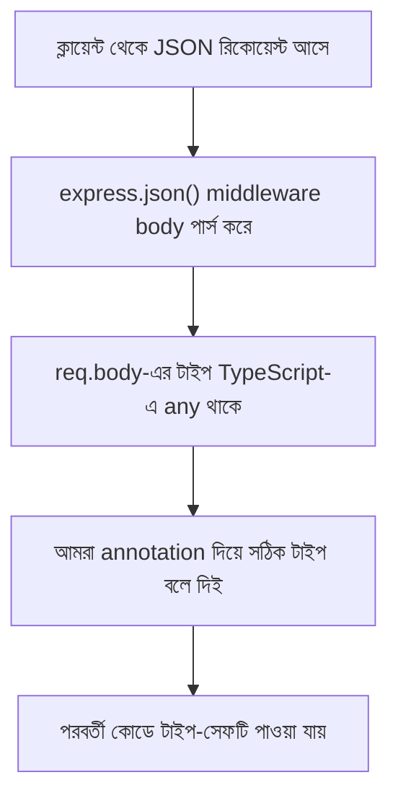

# ০৩. Typescript in Express.js Applications

আগের লেসনে আমরা একটা খালি TypeScript প্রজেক্ট সেটআপ করেছি। এখন সময় এসেছে এটাকে আমাদের পরিচিত জায়গায় নিয়ে যাওয়ার — Module 4 থেকে যে Express.js অ্যাপ্লিকেশন আমরা বারবার লিখেছি, সেটাকে TypeScript দিয়ে লিখবো।

প্রথমেই `express` ইনস্টল করি, আর সাথে এর টাইপ তথ্য:

```bash
npm install express
npm install --save-dev @types/express
```

এখানে একটা গুরুত্বপূর্ণ জিনিস লক্ষ্য করার আছে — `express` নিজে JavaScript দিয়ে লেখা, TypeScript-এ না। তাহলে TypeScript কীভাবে জানবে `req`, `res` এর ভেতরে কী কী প্রোপার্টি আছে? এই কাজটাই করে `@types/express` — এটা একটা আলাদা প্যাকেজ, যেখানে শুধু টাইপের সংজ্ঞা লেখা আছে, আসল কোড নেই। এরকম হাজার হাজার জনপ্রিয় JavaScript প্যাকেজের জন্য কমিউনিটি আলাদাভাবে `@types/xxx` প্যাকেজ বানিয়ে রেখেছে — এই পুরো সংগ্রহটাকে বলে **DefinitelyTyped**।

এখন একটা সাধারণ Express সার্ভার লিখি, কিন্তু এবার টাইপসহ:

```ts
import express, { Request, Response, NextFunction } from "express";

const app = express();
app.use(express.json());

interface User {
  id: number;
  name: string;
  age: number;
}

const users: User[] = [
  { id: 1, name: "আরমান", age: 28 },
  { id: 2, name: "নীলা", age: 24 },
];

app.get("/users", (req: Request, res: Response) => {
  res.json(users);
});

app.post("/users", (req: Request, res: Response) => {
  const { name, age }: { name: string; age: number } = req.body;
  const newUser: User = { id: users.length + 1, name, age };
  users.push(newUser);
  res.status(201).json(newUser);
});

app.listen(3000, () => console.log("সার্ভার চলছে পোর্ট 3000-এ"));
```

লক্ষ্য করো, আমরা `Request` আর `Response` টাইপ দুটো `express` থেকেই import করেছি, আর প্রতিটা রুট হ্যান্ডলারের প্যারামিটারে সেগুলো বসিয়ে দিয়েছি। এখন যদি ভুলবশত `res.json(users)`-এর বদলে `res.jsn(users)` লিখে ফেলি (বানান ভুল), TypeScript সাথে সাথে ধরিয়ে দেবে — কারণ `Response` টাইপে `jsn` নামে কোনো মেথড নেই। JavaScript-এ এই ভুলটা রানটাইম পর্যন্ত ধরা পড়তো না।

`interface User` অংশটা এখানে নতুন — আমরা বলে দিচ্ছি একটা `User` অবজেক্টের গঠন ঠিক কেমন হবে (`id` সংখ্যা, `name` স্ট্রিং, `age` সংখ্যা)। এই ধারণাটা এতটাই গুরুত্বপূর্ণ যে সামনে Module 14-এ পুরো একটা লেসন এটার জন্য বরাদ্দ থাকবে। এখন শুধু এটুকু মনে রাখলেই চলবে — `interface` দিয়ে আমরা ডেটার "আকার" বেঁধে দিচ্ছি।

`req.body`-এর ক্ষেত্রে একটা ব্যাপার মনে রাখা দরকার — Express নিজে থেকে জানে না `body`-তে ঠিক কী আসবে, তাই ডিফল্টভাবে এটার টাইপ হয় `any` (মানে "যেকোনো কিছু")। আমরা তাই সেখানে নিজে থেকে টাইপ বলে দিয়েছি `{ name: string; age: number }`। এটাকে বলে **type annotation**।



এই সেটআপে `npm run dev` (Module 13 Lesson 2-এর `ts-node` স্ক্রিপ্ট) চালালেই সার্ভার চালু হয়ে যাবে, ঠিক আগের মতোই — শুধু এখন প্রতিটা রুট, প্রতিটা ডেটা স্ট্রাকচার টাইপ-সুরক্ষিত।

এতক্ষণ আমরা TypeScript-কে টুল হিসেবে ব্যবহার করলাম — সিনট্যাক্স আর সেটআপ শিখলাম। এখন থেকে আমরা একটা গভীর প্রশ্নে ঢুকবো: এই টাইপ ধারণাটা আসলে কোথা থেকে এলো, আর কেন এটা Object-Oriented Programming-এর সাথে এত ঘনিষ্ঠভাবে জড়িত — এটাই পরের লেসনের বিষয়।
