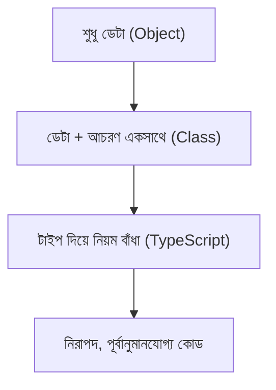

# ০৪. Introduction to Object Orientation: Why Do We Need Types?

এতদিন আমরা যা কোড লিখেছি, সেগুলো মূলত ফাংশন আর ডেটার আলাদা আলাদা টুকরো — একটা ফাংশন এখানে, একটা অবজেক্ট ওখানে, তাদের মধ্যে সম্পর্ক আমরা মনে মনে ধরে রাখতাম। প্রজেক্ট যত বড় হতে থাকে, এই "মনে মনে ধরে রাখা" ততই কঠিন হয়ে পড়ে। Object Orientation (বা সংক্ষেপে OOP) হলো একটা চিন্তাভাবনার ধরন, যেখানে আমরা কোডকে বাস্তব জগতের "বস্তু" (object) হিসেবে সাজাই — প্রতিটা বস্তুর নিজস্ব তথ্য (data) আর নিজস্ব আচরণ (behavior) থাকে, একসাথে বাঁধা।

একটা উদাহরণ দিয়ে শুরু করি। Module 13-এর Lesson 3-তে আমরা একটা `User` নিয়ে কাজ করেছিলাম, যার `id`, `name`, `age` ছিলো। বাস্তব জীবনে একজন ইউজার শুধু ডেটা না — তার কিছু আচরণও থাকে: সে লগইন করতে পারে, প্রোফাইল আপডেট করতে পারে, পাসওয়ার্ড পাল্টাতে পারে। JavaScript-এ প্লেইনভাবে লিখলে আমরা ডেটা আর সেই ডেটার উপর কাজ করা ফাংশনগুলো আলাদা রাখি:

```js
const user = { id: 1, name: "আরমান", age: 28 };

function updateAge(user, newAge) {
  user.age = newAge;
}
```

এখানে সমস্যা হলো — `user` অবজেক্ট আর `updateAge` ফাংশনের মধ্যে কোনো "আনুষ্ঠানিক" সম্পর্ক নেই। যে কেউ, যেকোনো জায়গা থেকে, `user.age = -50` লিখে সরাসরি বয়স নেগেটিভ করে দিতে পারে — কোনো বাধা নেই। বড় টিমে, বড় কোডবেসে, এই ধরনের "যেকোনো জায়গা থেকে যেকোনো কিছু পাল্টানো"-র স্বাধীনতা বাগের একটা বড় উৎস হয়ে দাঁড়ায়।

OOP এই সমস্যাটার সমাধান দেয় একটা নতুন কাঠামো দিয়ে — **Class**। একটা ক্লাস হলো একটা "নকশা" বা "ব্লুপ্রিন্ট", যেখানে আমরা বলে দিই একটা `User`-এর ঠিক কী কী ডেটা থাকবে, আর সেই ডেটার উপর কোন কোন কাজ (মেথড) করা যাবে — সব একসাথে, একই জায়গায়। এই লেসনে আমরা এখনও পুরো Class সিনট্যাক্সে ঢুকবো না (সেটা Lesson 9-এ), কিন্তু বুঝে নেবো কেন এই কাঠামোর জন্য **Types** এত জরুরি একটা ভিত্তি।

ভাবো, তুমি যদি বলো "একটা `User`-এর `age` সবসময় একটা `number` হবে, আর কখনো ঋণাত্মক হবে না" — এটা বলার জন্য তোমার একটা ভাষা দরকার যেটা "ধরন" (type) বোঝাতে পারে। প্লেইন JavaScript-এ এই ধরনের কোনো ভাষা নেই — সবকিছুই ঢিলেঢালা। TypeScript ঠিক এই জায়গাতেই OOP-এর সাথে হাত মেলায়। TypeScript-এর `interface` আর `class` আমাদের সুযোগ দেয় বলার জন্য: "এই বস্তুটার গঠন ঠিক এরকম হবে, আর এভাবেই আচরণ করবে।"



একটা ছোট উদাহরণ দিয়ে এই পার্থক্যটা অনুভব করি। টাইপ ছাড়া:

```js
function createAccount(balance) {
  return { balance };
}

const acc = createAccount("হাজার টাকা"); // কোনো বাধা নেই, ভুল ডেটা ঢুকে গেলো
```

টাইপসহ:

```ts
interface Account {
  balance: number;
}

function createAccount(balance: number): Account {
  return { balance };
}

const acc = createAccount("হাজার টাকা"); // ❌ কম্পাইল-টাইম এরর, ভুলটা লেখার সময়েই ধরা পড়লো
```

এখানে `interface Account` আসলে একটা "চুক্তি" — এটা বলে দিচ্ছে যেকোনো জিনিস যদি নিজেকে `Account` বলে দাবি করে, তার একটা `balance` থাকতে হবে, আর সেটা অবশ্যই `number`। এই "চুক্তি" ধারণাটাই OOP-এর মূল ভিত্তি — বস্তুগুলোর মধ্যে স্পষ্ট, লিখিত নিয়ম থাকা, যা কম্পাইলার নিজেই যাচাই করে দেয়।

তাহলে সারকথা হলো — Types আমাদের বলার ভাষা দেয় "একটা বস্তু ঠিক কেমন হবে", আর OOP সেই ভাষা ব্যবহার করে বাস্তব জগতের বস্তুগুলোকে কোডে মডেল করে। এখন আমরা প্রস্তুত OOP-এর আসল কাঠামোয় ঢোকার জন্য — পরের লেসনে আমরা দেখবো OOP-এর চারটা মূল স্তম্ভ কী কী, আর তারা একসাথে কীভাবে কাজ করে।
