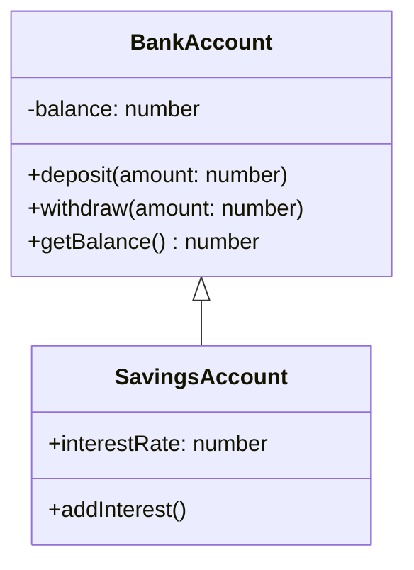

# ০৫. Introduction to OOP: চারটা স্তম্ভ

আগের লেসনে আমরা দেখেছি কেন প্লেইন ডেটা আর ফাংশনকে আলাদা রাখা বড় প্রজেক্টে সমস্যা তৈরি করে, আর কীভাবে Types আমাদের একটা কাঠামো দেয় বস্তুগুলোর নিয়ম বেঁধে দেয়ার জন্য। এখন সময় এসেছে পুরো ছবিটা দেখার — Object-Oriented Programming দাঁড়িয়ে আছে চারটা মূল স্তম্ভের উপর। এই লেসনে আমরা চারটাকেই উপর থেকে দেখবো, আর পরের কয়েকটা লেসনে একটা একটা করে গভীরে ঢুকবো।

একটা ব্যাংক অ্যাকাউন্ট সিস্টেম কল্পনা করি — এই একই উদাহরণ আমরা পুরো মডিউল জুড়ে ব্যবহার করবো, যাতে প্রতিটা স্তম্ভ কীভাবে একসাথে বসে সেটা স্পষ্ট থাকে।

প্রথম স্তম্ভ **Encapsulation** — এর মানে হলো ডেটা আর সেই ডেটার উপর কাজ করা মেথডকে একসাথে একটা ক্লাসের ভেতরে "বন্দী" (encapsulate) করে রাখা, আর বাইরে থেকে সরাসরি ডেটা পাল্টানো আটকে দেয়া। উপরের ডায়াগ্রামে `balance`-এর সামনে `-` চিহ্নটা মানে এটা **private** — বাইরে থেকে কেউ সরাসরি `account.balance = 999999` লিখে বদলাতে পারবে না, শুধু `deposit()` বা `withdraw()` মেথড দিয়ে নিয়ন্ত্রিতভাবে বদলাতে হবে। এটা অনেকটা ব্যাংকের ভল্টের মতো — টাকা সরাসরি হাত দিয়ে ধরা যায় না, নির্দিষ্ট প্রক্রিয়ার (deposit/withdraw slip) মধ্য দিয়ে যেতে হয়।

দ্বিতীয় স্তম্ভ **Abstraction** — এর মানে হলো জটিল ভেতরের কাজ লুকিয়ে রেখে, ব্যবহারকারীকে শুধু দরকারি, সরল একটা ইন্টারফেস দেখানো। যখন তুমি `account.withdraw(500)` কল করো, তোমাকে জানতে হয় না ভেতরে কীভাবে ব্যালেন্স চেক হয়, কীভাবে লেনদেনের লগ রাখা হয়, কীভাবে ব্যাংকের ডেটাবেসে আপডেট যায় — এই জটিলতা লুকানো থাকে, তুমি শুধু ফলাফল পাও। এটা অনেকটা গাড়ি চালানোর মতো — অ্যাক্সিলারেটর চাপলে গাড়ি চলে, কিন্তু ইঞ্জিনের ভেতরে ঠিক কী ঘটছে সেটা জানার দরকার হয় না।

তৃতীয় স্তম্ভ **Inheritance** — এর মানে হলো একটা ক্লাস আরেকটা ক্লাসের বৈশিষ্ট্য "উত্তরাধিকার সূত্রে" পেতে পারে। উপরের ডায়াগ্রামে `SavingsAccount`, `BankAccount`-এর সবকিছু (deposit, withdraw, balance) পেয়ে যায় বিনা পরিশ্রমে, আর নিজের বাড়তি বৈশিষ্ট্য (`interestRate`, `addInterest`) যোগ করে। এটা অনেকটা সন্তানের বাবা-মায়ের কাছ থেকে বৈশিষ্ট্য পাওয়ার মতো — পাশাপাশি নিজের কিছু আলাদা বৈশিষ্ট্যও থাকে।

চতুর্থ স্তম্ভ **Polymorphism** — গ্রিক শব্দ, যার মানে "বহু রূপ"। এর মানে হলো একই নামের একটা মেথড বিভিন্ন ক্লাসে ভিন্ন ভিন্নভাবে কাজ করতে পারে। ধরো `SavingsAccount` আর `CheckingAccount` দুটোরই একটা `calculateFee()` মেথড আছে, কিন্তু হিসাবের নিয়ম আলাদা — Polymorphism আমাদের সুযোগ দেয় একই নাম ব্যবহার করে ভিন্ন আচরণ পাওয়ার। এই স্তম্ভটা এতটাই গুরুত্বপূর্ণ যে এটার জন্য পুরো Module 14 বরাদ্দ থাকবে।

| স্তম্ভ | মূল ভাব | রোজকার উপমা |
|---|---|---|
| Encapsulation | ডেটা ও আচরণ একসাথে বেঁধে, বাইরের হস্তক্ষেপ আটকানো | ব্যাংকের ভল্ট |
| Abstraction | জটিলতা লুকিয়ে সরল ইন্টারফেস দেখানো | গাড়ির অ্যাক্সিলারেটর |
| Inheritance | এক ক্লাস আরেক ক্লাসের বৈশিষ্ট্য পাওয়া | সন্তান-বাবা-মা |
| Polymorphism | একই নাম, ভিন্ন ভিন্ন আচরণ | "চালানো" শব্দ — গাড়ি চালানো বনাম সাইকেল চালানো |

এই চারটা স্তম্ভ আলাদা আলাদা মনে হলেও, বাস্তবে এরা একসাথে কাজ করে একটা সুসংগঠিত সিস্টেম তৈরি করতে। TypeScript-এর `class`, `interface`, `private`/`public` কীওয়ার্ডগুলো ঠিক এই ধারণাগুলোকে কোডে রূপ দেয়ার হাতিয়ার। এখন আমরা প্রথম স্তম্ভ দিয়ে শুরু করবো, গভীরভাবে — পরের লেসনে আমরা Encapsulation নিয়ে বিস্তারিত কোড লিখবো।
