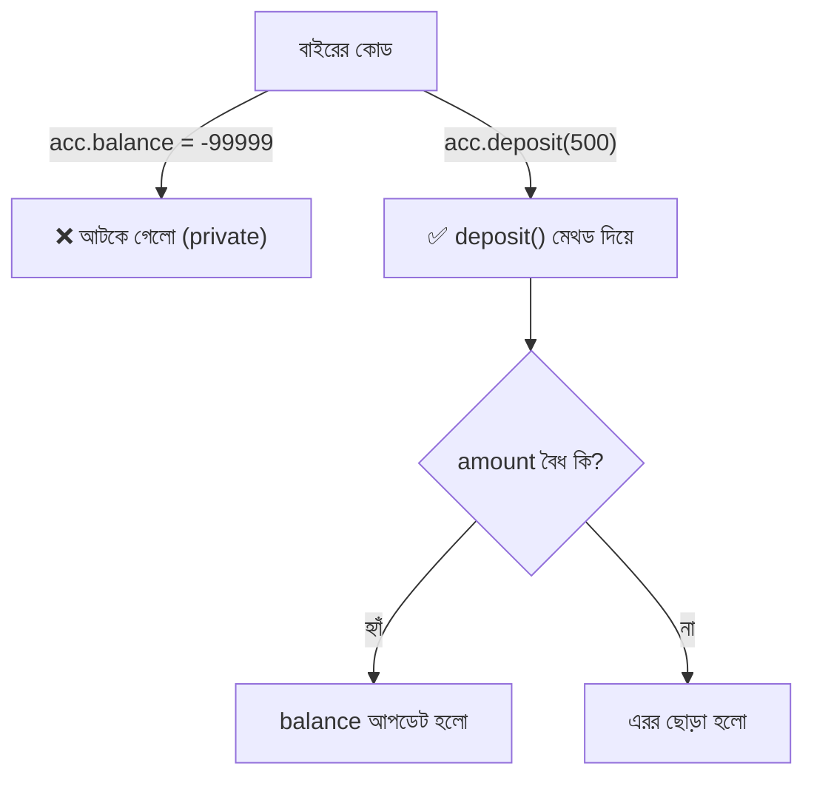

# ০৬. Encapsulation: First Pillar of OOP

আগের লেসনে আমরা ব্যাংক অ্যাকাউন্টের উদাহরণ দিয়ে বুঝেছি Encapsulation মানে ডেটা আর আচরণ একসাথে বেঁধে বাইরের হস্তক্ষেপ আটকানো। এই লেসনে আমরা সেটাকে বাস্তব TypeScript কোডে রূপ দেবো, যদিও পুরোপুরি `class` সিনট্যাক্স আমরা Lesson 9-এ শিখবো — এখন শুধু `private`/`public` অ্যাক্সেস কন্ট্রোলের ধারণাটায় ফোকাস করি।

Module 13 Lesson 4-এ আমরা দেখেছিলাম প্লেইন অবজেক্টে যেকোনো জায়গা থেকে সরাসরি ডেটা পাল্টানো যায়:

```js
const account = { balance: 1000 };
account.balance = -99999; // কোনো বাধা নেই!
```

এই সমস্যা সমাধানের জন্য TypeScript-এ আমরা ক্লাসের প্রোপার্টিকে `private` ঘোষণা করতে পারি:

```ts
class BankAccount {
  private balance: number;

  constructor(initialBalance: number) {
    this.balance = initialBalance;
  }

  public deposit(amount: number): void {
    if (amount <= 0) {
      throw new Error("জমার পরিমাণ শূন্য বা ঋণাত্মক হতে পারবে না");
    }
    this.balance += amount;
  }

  public withdraw(amount: number): void {
    if (amount > this.balance) {
      throw new Error("অপর্যাপ্ত ব্যালেন্স");
    }
    this.balance -= amount;
  }

  public getBalance(): number {
    return this.balance;
  }
}

const acc = new BankAccount(1000);
acc.deposit(500);
console.log(acc.getBalance()); // 1500

acc.balance = -99999; // ❌ কম্পাইল-টাইম এরর: Property 'balance' is private
```

এখানে `private balance: number` মানে হলো — এই প্রোপার্টিটা শুধু `BankAccount` ক্লাসের ভেতরের কোড থেকেই অ্যাক্সেস করা যাবে, ক্লাসের বাইরে থেকে কেউ সরাসরি `acc.balance` লিখতে বা পড়তে পারবে না। `public` মানে হলো এটা যেকোনো জায়গা থেকে অ্যাক্সেসযোগ্য — তাই `deposit`, `withdraw`, `getBalance` মেথডগুলোকে `public` রাখা হয়েছে, কারণ এগুলোই বাইরের জগতের সাথে ক্লাসের "যোগাযোগের পথ"।

লক্ষ্য করো — `deposit()` মেথডের ভেতরে আমরা একটা শর্ত বসিয়েছি, `amount <= 0` হলে এরর ছুঁড়ে দিচ্ছি। এটাই Encapsulation-এর আসল শক্তি — শুধু ডেটা লুকানো না, বরং ডেটা পাল্টানোর **নিয়ম** নিজের ভেতরে নিয়ন্ত্রণ করা। কেউ ইচ্ছা করলেও ব্যালেন্সকে সরাসরি অবৈধ মান দিতে পারবে না, কারণ একমাত্র রাস্তা হলো `deposit`/`withdraw`, আর সেই রাস্তায় পাহারা বসানো আছে।



TypeScript-এ `private` ছাড়াও `protected` নামে আরেকটা অ্যাক্সেস মডিফায়ার আছে, যেটা আমরা Lesson 10-এ Inheritance শেখার সময় দেখবো — এটা `private`-এর মতোই লুকায়, তবে সন্তান ক্লাসকে (child class) অ্যাক্সেস করতে দেয়। আপাতত মনে রাখা যথেষ্ট: `public` = সবার জন্য খোলা, `private` = শুধু নিজের ক্লাসের জন্য বন্ধ।

একটা গুরুত্বপূর্ণ বাস্তবতা মনে রাখা দরকার — এই `private` কীওয়ার্ডটা শুধু TypeScript কম্পাইল করার সময় চেক হয়। কম্পাইল হয়ে যখন প্লেইন JavaScript-এ রূপান্তরিত হয়, তখন এই সুরক্ষা মুছে যায় (কারণ JavaScript-এ সেকেলে `private` নেই)। তাই এটাকে বলা যায় "ডেভেলপমেন্ট-টাইম সুরক্ষা" — এটা তোমাকে আর তোমার টিমকে ভুল থেকে বাঁচায়, নিরাপত্তার শেষ কথা নয়।

এখন আমরা Encapsulation-এর মূল ধারণা কোডে দেখেছি। পরের লেসনে আমরা এই একই উদাহরণটাকে আরেকটু ঝালিয়ে নেবো, আর কিছু সাধারণ ভুল আর প্র্যাকটিস প্যাটার্ন দেখবো — যাতে Abstraction-এ যাওয়ার আগে ভিত্তিটা পাকা হয়।
