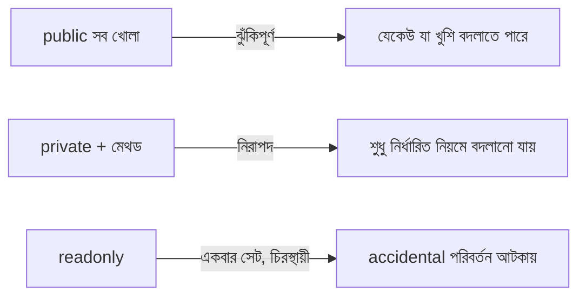

# ০৭. Encapsulation Recap

আগের লেসনে আমরা `BankAccount` ক্লাস দিয়ে Encapsulation দেখেছি — `private balance` আর তার চারপাশে পাহারা দেয়া `deposit`/`withdraw` মেথড। এই লেসনে আমরা একটু থেমে, জিনিসগুলো ঝালিয়ে নেবো, আর কিছু বাস্তব প্র্যাকটিস প্যাটার্ন দেখবো — কারণ Encapsulation বুঝতে সহজ মনে হলেও, ঠিকভাবে প্রয়োগ করতে অনেকে শুরুতে ভুল করে।

সবচেয়ে সাধারণ ভুলটা হলো — সবকিছু `public` রেখে দেয়া "সুবিধার জন্য"। ধরো কেউ লিখলো:

```ts
class BankAccount {
  public balance: number; // ভুল অভ্যাস

  constructor(balance: number) {
    this.balance = balance;
  }
}
```

এটা টাইপ চেক পাস করবে ঠিকই, কিন্তু Encapsulation-এর পুরো উদ্দেশ্যই নষ্ট হয়ে যায় — যে কেউ যেকোনো জায়গা থেকে `acc.balance = -1000000` লিখতে পারবে, কোনো নিয়ম মানা ছাড়াই। এখানে মনে রাখার নিয়ম সহজ — **যদি ডেটা এমন কিছু হয় যেটা নিয়ন্ত্রিতভাবে পাল্টানো উচিত, সেটা সবসময় `private` রাখো, আর একটা নির্দিষ্ট মেথডের মাধ্যমে অ্যাক্সেস দাও।**

একটা প্যাটার্ন যেটা প্রায়ই ব্যবহার হয়, সেটা হলো **getter** — শুধু পড়ার জন্য একটা নিয়ন্ত্রিত পথ:

```ts
class BankAccount {
  private balance: number;

  constructor(balance: number) {
    this.balance = balance;
  }

  get currentBalance(): number {
    return this.balance;
  }
}

const acc = new BankAccount(2000);
console.log(acc.currentBalance); // ফাংশন কল না, প্রোপার্টির মতো ব্যবহার — কিন্তু ভেতরে মেথডই চলছে
```

লক্ষ্য করো, `get` কীওয়ার্ড দিয়ে লেখা `currentBalance` কল করার সময় বন্ধনী `()` লাগে না — এটা দেখতে সাধারণ প্রোপার্টির মতো লাগে, কিন্তু আসলে এটা একটা মেথড, যেটা প্রতিবার কল হওয়ার সময় চাইলে লজিক চালাতে পারে (যেমন লগ রাখা, বা ফরম্যাট করা)। এটাও Encapsulation-এরই একটা অংশ — বাইরের কোড জানে না ভেতরে `get` চলছে নাকি সরাসরি প্রোপার্টি, তার কাছে ইন্টারফেসটা একই রকম দেখায়।

Module 13 Lesson 3-এ আমরা যে Express রুট লিখেছিলাম, সেখানে `User` একটা প্লেইন `interface` ছিলো, কোনো Encapsulation ছিলো না — কারণ সেটা শুধু ডেটা বহন করার জন্য (এরকম গঠনকে অনেক সময় বলে **DTO — Data Transfer Object**)। কিন্তু যদি আমরা একটা `UserAccount` ক্লাস বানাতাম যেখানে পাসওয়ার্ড থাকতো, সেটা অবশ্যই `private` হওয়া উচিত হতো:

```ts
class UserAccount {
  private password: string;
  public readonly email: string;

  constructor(email: string, password: string) {
    this.email = email;
    this.password = password;
  }

  public checkPassword(attempt: string): boolean {
    return attempt === this.password;
  }
}
```

এখানে একটা নতুন কীওয়ার্ড দেখা যাচ্ছে — `readonly`। এটা বলে দেয় `email` একবার সেট হওয়ার পর আর কখনো পাল্টানো যাবে না, এমনকি ক্লাসের ভেতর থেকেও না (constructor ছাড়া)। এটা Encapsulation-এরই একটা হালকা রূপ — ডেটা সুরক্ষিত রাখা, তবে সম্পূর্ণ লুকিয়ে না রেখে।



সংক্ষেপে, Encapsulation-এর ব্যবহারিক নিয়ম তিনটা: এক, ডেটা যেটা নিয়ন্ত্রণ দরকার সেটা `private` রাখো। দুই, মেথড দিয়ে নিয়ন্ত্রিত অ্যাক্সেস দাও (দরকার হলে `get`)। তিন, যা কখনো পাল্টাবে না সেটা `readonly` দিয়ে ঘোষণা করো। এই তিনটা অভ্যাস তোমার সব ভবিষ্যৎ ক্লাস ডিজাইনে কাজে লাগবে।

Encapsulation দিয়ে আমরা শিখলাম কীভাবে ভেতরের ডেটা সুরক্ষিত রাখতে হয়। পরের লেসনে আমরা দেখবো এর পাশের ধারণা — Abstraction — যেখানে প্রশ্নটা হবে ডেটা সুরক্ষার বদলে, জটিলতা কীভাবে লুকানো যায়।
