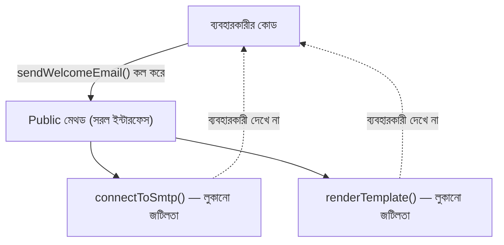

# ০৮. Abstraction - OOP

Encapsulation আর Abstraction অনেক সময় গুলিয়ে ফেলা হয়, কারণ দুটোই "কিছু একটা লুকানো"-র সাথে জড়িত। পার্থক্যটা স্পষ্ট করে নেই — Encapsulation লুকায় **ডেটা**কে অনধিকার প্রবেশ থেকে বাঁচানোর জন্য (আগের দুই লেসনে যা দেখেছি), আর Abstraction লুকায় **জটিলতা**কে, ব্যবহারকারীর জীবন সহজ করার জন্য। একই কাজ, কিন্তু উদ্দেশ্য আলাদা।

Module 11 আর 12-এ আমরা কুকি আর JWT নিয়ে কাজ করেছিলাম। মনে করো, JWT ভেরিফাই করার জন্য আমরা `jwt.verify(token, secret)` লিখতাম। এই একটা লাইনের পেছনে কতটা জটিলতা লুকিয়ে আছে ভাবো — টোকেনকে তিন ভাগে ভাঙা, base64 ডিকোড করা, ক্রিপ্টোগ্রাফিক সিগনেচার যাচাই করা, এক্সপায়ারি চেক করা। কিন্তু আমাদের এসবের একটাও জানতে হয়নি — লাইব্রেরি এই জটিলতাকে **abstract** করে দিয়েছে, আমাদের হাতে দিয়েছে একটা সহজ ফাংশন কল।

এখন নিজেরাই এরকম একটা abstraction বানাই। ধরো আমাদের একটা `NotificationService` দরকার, যেটা ইমেইল পাঠাবে — কিন্তু ভেতরে SMTP সার্ভারের সাথে সংযোগ, রিট্রাই লজিক, টেমপ্লেট রেন্ডারিং — অনেক জটিলতা থাকবে। ব্যবহারকারীর জন্য আমরা এই পুরোটা লুকিয়ে একটা সরল ইন্টারফেস দিই:

```ts
class EmailService {
  private smtpHost: string;
  private smtpPort: number;

  constructor(smtpHost: string, smtpPort: number) {
    this.smtpHost = smtpHost;
    this.smtpPort = smtpPort;
  }

  private connectToSmtp(): void {
    console.log(`SMTP সার্ভার ${this.smtpHost}:${this.smtpPort}-এ সংযোগ করা হচ্ছে...`);
  }

  private renderTemplate(templateName: string, data: object): string {
    return `[টেমপ্লেট "${templateName}" রেন্ডার হলো ডেটাসহ: ${JSON.stringify(data)}]`;
  }

  public sendWelcomeEmail(to: string, userName: string): void {
    this.connectToSmtp();
    const body = this.renderTemplate("welcome", { userName });
    console.log(`ইমেইল পাঠানো হলো ${to} ঠিকানায়:\n${body}`);
  }
}

const emailer = new EmailService("smtp.example.com", 587);
emailer.sendWelcomeEmail("arman@example.com", "আরমান");
```

লক্ষ্য করো — `EmailService` ব্যবহার করা কতটা সহজ। যে কেউ শুধু `sendWelcomeEmail(to, userName)` কল করলেই যথেষ্ট। ভেতরে `connectToSmtp()` আর `renderTemplate()` মেথড দুটোকে ইচ্ছাকৃতভাবে `private` করে রাখা হয়েছে — এগুলো implementation-এর "কীভাবে" অংশ, ব্যবহারকারীর জানার দরকার নেই। বাইরের কোড শুধু জানে "কী" করা যায় (`sendWelcomeEmail`), "কীভাবে" হয় সেটা না।



এখানে একটা গুরুত্বপূর্ণ প্রশ্ন আসে — Encapsulation-এর `private` আর Abstraction কি তাহলে একই টুল দিয়ে হয়? উত্তর হলো — হ্যাঁ, টুলটা (private/public) একই, কিন্তু চিন্তাভাবনার কোণ আলাদা। `private balance` লেখার সময় তুমি ভাবছো "কেউ যেন ভুল করে ব্যালেন্স নষ্ট না করে" (Encapsulation — সুরক্ষা)। `private connectToSmtp` লেখার সময় তুমি ভাবছো "ব্যবহারকারীর এই ডিটেইল জানার দরকার নেই, এটা তাকে বিভ্রান্ত করবে" (Abstraction — সরলীকরণ)।

TypeScript-এ Abstraction-এর আরেকটা শক্তিশালী টুল আছে — `abstract class`, যেখানে আমরা বলে দিতে পারি একটা ক্লাসের একটা মেথড অবশ্যই থাকতে হবে, কিন্তু তার বাস্তবায়ন (implementation) সন্তান ক্লাসের উপর ছেড়ে দিতে পারি:

```ts
abstract class PaymentMethod {
  abstract processPayment(amount: number): void; // শুধু ঘোষণা, বাস্তবায়ন নেই

  logTransaction(amount: number): void {
    console.log(`লেনদেন লগ হলো: ৳${amount}`);
  }
}
```

এখানে `PaymentMethod`-এর `processPayment` মেথডটা "খালি" — শুধু বলে দিচ্ছে এরকম একটা মেথড থাকতেই হবে, কিন্তু কীভাবে কাজ করবে সেটা নির্দিষ্ট করছে না। `abstract class` নিজে থেকে `new PaymentMethod()` দিয়ে অবজেক্ট বানানো যায় না — এটা শুধু একটা নকশা, যেটা সন্তান ক্লাস (child class) সম্পূর্ণ করবে। এই ধারণাটা আমরা Inheritance-এর লেসনে আরও গভীরভাবে দেখবো, আর Module 14-তে Interface-এর সাথে তুলনা করবো।

Abstraction শেখার পর এখন আমরা প্রস্তুত মূল কাঠামোতে — Class ঠিক কী, আর কীভাবে লেখা হয় — সেটা গভীরভাবে বোঝার জন্য। পরের লেসনে আমরা Class-এর বেসিক অ্যানাটমি নিয়ে বিস্তারিত আলোচনা করবো।
