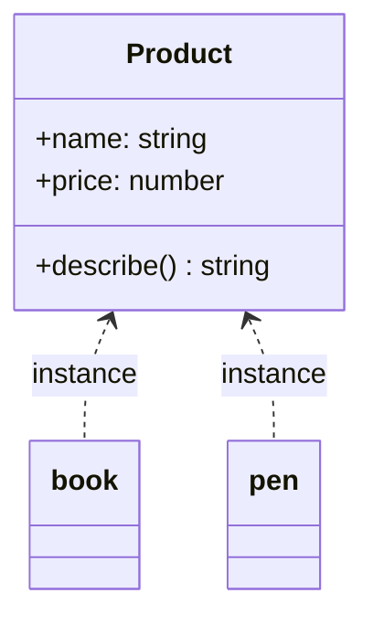

# ০৯. What Is a Class? Basics of Class

গত চারটা লেসনে আমরা বারবার `class` কীওয়ার্ড ব্যবহার করেছি, উদাহরণ দিয়ে দিয়ে Encapsulation আর Abstraction বুঝেছি। এবার সময় এসেছে থেমে, `class`-এর অ্যানাটমিটা টুকরো টুকরো করে বোঝার।

সহজ ভাষায়, একটা **class** হলো একটা নকশা বা ছাঁচ (blueprint/template), যেটা দিয়ে আমরা একই ধরনের একাধিক বস্তু (object) বানাতে পারি। ধরো তুমি একটা মিষ্টির ছাঁচ কিনলে — ছাঁচটা নিজে মিষ্টি না, কিন্তু ওই ছাঁচ দিয়ে তুমি একই আকারের অনেকগুলো মিষ্টি বানাতে পারো। ক্লাস হলো সেই ছাঁচ, আর প্রতিটা মিষ্টি হলো একটা **instance** (বা object) — ক্লাস থেকে বানানো একটা বাস্তব বস্তু।

```ts
class Product {
  name: string;
  price: number;

  constructor(name: string, price: number) {
    this.name = name;
    this.price = price;
  }

  describe(): string {
    return `${this.name} — মূল্য ৳${this.price}`;
  }
}

const book = new Product("বই", 250);
const pen = new Product("কলম", 15);

console.log(book.describe()); // বই — মূল্য ৳250
console.log(pen.describe());  // কলম — মূল্য ৳15
```

এখানে `Product` হলো ক্লাস (ছাঁচ), আর `book`, `pen` হলো দুটো আলাদা instance — একই ছাঁচ থেকে বানানো, কিন্তু আলাদা আলাদা ডেটাসহ। `new` কীওয়ার্ড দিয়ে আমরা ক্লাস থেকে একটা নতুন instance তৈরি করি — একে বলে **instantiation**।

`constructor` হলো একটা বিশেষ মেথড, যেটা `new Product(...)` লেখার মুহূর্তে স্বয়ংক্রিয়ভাবে চলে। এর কাজ হলো নতুন instance-টাকে শুরুতে দরকারি মান দিয়ে সাজিয়ে দেয়া — যাকে বলে **initialization**। Module 9-এ যখন আমরা JavaScript-এর ডেটা টাইপ (string, number, object) শিখেছিলাম, সেখানে আমরা প্লেইন অবজেক্ট লিটারেল `{ name: "বই", price: 250 }` লিখতাম। ক্লাস আসলে এই একই ধরনের ডেটা তৈরির একটা আরও সংগঠিত, পুনর্ব্যবহারযোগ্য উপায়।



TypeScript-এ ক্লাস লেখার একটা শর্টকাটও আছে, যেটা constructor-এর ভেতরে বারবার `this.x = x` লেখার ঝামেলা কমায় — একে বলে **parameter property**:

```ts
class Product {
  constructor(
    public name: string,
    public price: number
  ) {}

  describe(): string {
    return `${this.name} — মূল্য ৳${this.price}`;
  }
}
```

এই দুটো কোড একদম একই কাজ করে — শুধু constructor-এর প্যারামিটারের সামনে `public` বসিয়ে দিলেই TypeScript নিজে থেকে প্রোপার্টি বানিয়ে, `this.x = x` বসিয়ে দেয়। এটা কোড ছোট রাখতে সাহায্য করে, বিশেষ করে যখন অনেকগুলো প্রোপার্টি থাকে।

এখন প্রশ্ন আসতে পারে — Module 13 Lesson 4-এ যে `interface User` লিখেছিলাম, সেটা আর এই `class Product`-এর পার্থক্য কী? `interface` শুধু গঠন (shape) বর্ণনা করে — এটা বলে "এরকম দেখতে একটা জিনিস হবে", কিন্তু নিজে থেকে কোনো বাস্তব বস্তু তৈরি করে না, `new` দিয়ে instance বানানো যায় না। `class` গঠনও বর্ণনা করে, আবার সাথে বাস্তবায়নও (constructor, মেথড) রাখে, আর `new` দিয়ে সত্যিকারের অবজেক্ট বানানো যায়। এই পার্থক্যটা Module 14-এ Interface নিয়ে বিস্তারিত আলোচনার সময় আরও স্পষ্ট হবে।

একটা ক্লাসে **static** মেথবারও থাকতে পারে, যেগুলো কোনো নির্দিষ্ট instance-এর সাথে যুক্ত না, বরং পুরো ক্লাসের সাথে যুক্ত:

```ts
class Product {
  static category = "সাধারণ পণ্য";

  constructor(public name: string, public price: number) {}
}

console.log(Product.category); // instance ছাড়াই সরাসরি অ্যাক্সেস
```

`static` প্রোপার্টি বা মেথড ব্যবহার হয় যখন কোনো তথ্য বা কাজ সব instance-এর জন্য একই থাকে — যেমন একটা কাউন্টার, যেটা মোট কতগুলো `Product` তৈরি হয়েছে তা গোনে।

এখন আমরা ক্লাসের মূল অ্যানাটমি জানি — প্রোপার্টি, constructor, মেথড, static সদস্য। পরের লেসনে আমরা দেখবো কীভাবে একটা ক্লাস আরেকটা ক্লাসের বৈশিষ্ট্য "উত্তরাধিকার" সূত্রে পেতে পারে — Inheritance।
