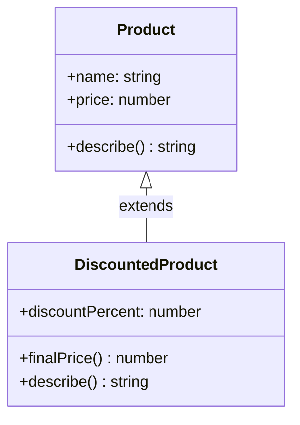

# ১০. Inheritance in OOP

আগের লেসনে আমরা `Product` ক্লাস বানিয়েছি — `name`, `price`, আর `describe()` মেথডসহ। ধরো এখন আমাদের একটা `DiscountedProduct` দরকার, যেটা `Product`-এর সবকিছুই রাখবে, কিন্তু সাথে একটা ছাড়ের হার (`discountPercent`) যোগ করবে, আর দাম হিসাব করার নিয়মও একটু আলাদা হবে। এখানেই OOP-এর চতুর্থ (তবে ক্রমানুসারে আমাদের তৃতীয়) স্তম্ভ — **Inheritance** — কাজে আসে।

Inheritance-এর মূল ভাব হলো — একটা ক্লাস (বলা হয় **child class** বা **subclass**) আরেকটা ক্লাসের (বলা হয় **parent class** বা **superclass**) সব প্রোপার্টি আর মেথড স্বয়ংক্রিয়ভাবে পেয়ে যায়, আর তার উপর নিজের নতুন কিছু যোগ করতে পারে। TypeScript-এ এটা লেখা হয় `extends` কীওয়ার্ড দিয়ে:

```ts
class Product {
  constructor(
    public name: string,
    public price: number
  ) {}

  describe(): string {
    return `${this.name} — মূল্য ৳${this.price}`;
  }
}

class DiscountedProduct extends Product {
  constructor(
    name: string,
    price: number,
    public discountPercent: number
  ) {
    super(name, price); // parent class-এর constructor কল করা বাধ্যতামূলক
  }

  finalPrice(): number {
    return this.price - (this.price * this.discountPercent) / 100;
  }

  describe(): string {
    return `${super.describe()} (${this.discountPercent}% ছাড়ে, চূড়ান্ত দাম ৳${this.finalPrice()})`;
  }
}

const regular = new Product("বই", 250);
const sale = new DiscountedProduct("কলম", 100, 20);

console.log(regular.describe()); // বই — মূল্য ৳250
console.log(sale.describe());    // কলম — মূল্য ৳100 (20% ছাড়ে, চূড়ান্ত দাম ৳80)
```

এখানে বেশ কিছু নতুন জিনিস আছে, একে একে দেখি। `class DiscountedProduct extends Product` মানে হলো `DiscountedProduct`, `Product`-এর সব প্রোপার্টি (`name`, `price`) আর মেথড (`describe`) পেয়ে যাচ্ছে বিনা পরিশ্রমে। `super(name, price)` হলো parent class-এর constructor-কে কল করার উপায় — এটা লেখা বাধ্যতামূলক, কারণ TypeScript নিশ্চিত করতে চায় parent class-এর প্রোপার্টিগুলো সঠিকভাবে সেট হয়েছে, তারপরেই child class নিজের কাজ শুরু করবে।

`describe()` মেথডটা `DiscountedProduct`-এ আবার লেখা হয়েছে — এটাকে বলে **method overriding**, মানে parent-এর মেথডকে child class নিজের মতো করে পুনর্লিখন করছে। কিন্তু লক্ষ্য করো, ভেতরে আমরা `super.describe()` কল করে parent-এর মূল বর্ণনাটাও ব্যবহার করছি, শুধু তার সাথে বাড়তি তথ্য জুড়ে দিচ্ছি — পুরোপুরি নতুন করে না লিখে, পুরনোটাকে "বাড়িয়ে" ব্যবহার করছি।



এই ডায়াগ্রামের তীরচিহ্নটা (`<|--`) Inheritance-এর প্রচলিত UML নোটেশন — ফাঁপা ত্রিভুজাকৃতির তীর parent class-এর দিকে নির্দেশ করে, বোঝায় "এটা থেকে উত্তরাধিকার পাওয়া গেছে"। Module 13 Lesson 5-এর `BankAccount`/`SavingsAccount` উদাহরণেও আমরা ঠিক এই একই সম্পর্ক দেখেছিলাম।

এখানে `protected` কীওয়ার্ডের প্রসঙ্গ আসে, যেটা Lesson 6-এ উল্লেখ করেছিলাম। ধরো `Product`-এ আমরা `price`-কে সম্পূর্ণ `private` না করে `protected` করি:

```ts
class Product {
  constructor(
    public name: string,
    protected price: number
  ) {}
}

class DiscountedProduct extends Product {
  finalPrice(discountPercent: number): number {
    return this.price - (this.price * discountPercent) / 100; // ✅ child class অ্যাক্সেস করতে পারছে
  }
}

const p = new DiscountedProduct("কলম", 100);
console.log(p.price); // ❌ এরর — ক্লাসের বাইরে থেকে protected অ্যাক্সেস করা যায় না
```

তাহলে সারসংক্ষেপ — `public` সবার জন্য খোলা, `private` শুধু নিজের ক্লাসের জন্য, আর `protected` নিজের ক্লাস এবং তার সন্তান ক্লাসগুলোর জন্য খোলা, কিন্তু বাইরের জগতের জন্য বন্ধ। এই তিন স্তরের অ্যাক্সেস কন্ট্রোল Encapsulation আর Inheritance-কে একসাথে সুশৃঙ্খলভাবে কাজ করতে দেয়।

Inheritance আমাদের কোড পুনর্ব্যবহার (code reuse) করতে দেয়, একই কাঠামোর উপর ভিন্ন ভিন্ন বিশেষায়িত ক্লাস বানাতে দেয়। কিন্তু একটা প্রশ্ন থেকেই যায় — যদি `Product`, `DiscountedProduct`, আর ভবিষ্যতে হয়তো `SubscriptionProduct` — এই সবগুলোর `describe()` মেথড থাকে, কিন্তু প্রত্যেকটার আচরণ ভিন্ন, তাহলে আমরা কীভাবে এদের সবাইকে "একই ধরনের জিনিস" হিসেবে একসাথে ব্যবহার করবো, একটা লিস্টে রেখে লুপ চালাবো? এই প্রশ্নের উত্তরই হলো Polymorphism — আর সেটা নিয়েই শুরু হবে পরের মডিউল, Module 14 — Interface And Polymorphism।
