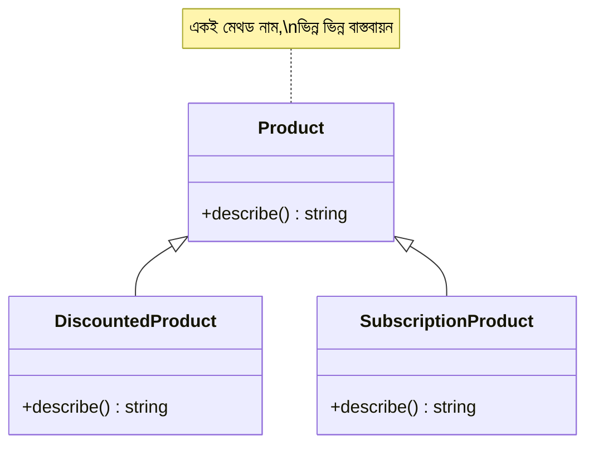

# ০১. Introduction to Polymorphism

Module 13-এর শেষ লেসনে আমরা `Product` আর `DiscountedProduct` বানিয়েছিলাম — `DiscountedProduct`, `Product`-কে `extends` করে নিজের `describe()` মেথড দিয়ে parent-এর মেথড override করেছিলো। লেসনের শেষে একটা প্রশ্ন রেখে এসেছিলাম — যদি আমাদের কাছে `Product`, `DiscountedProduct`, আর ভবিষ্যতে হয়তো `SubscriptionProduct`-এর মতো একাধিক ধরনের পণ্য থাকে, আর সবগুলোর `describe()` মেথড আছে কিন্তু আলাদা আচরণ করে, তাহলে আমরা কীভাবে এদের সবাইকে "একই গোত্রের জিনিস" হিসেবে একসাথে ট্রিট করবো? এই প্রশ্নের উত্তরই হলো **Polymorphism**।

গ্রিক শব্দ Polymorphism-এর অর্থ "বহু রূপ" (poly = বহু, morph = রূপ)। প্রোগ্রামিং-এ এর মানে হলো — একই নামের একটা মেথড কল করলে, কোন ধরনের বস্তু (object) সেটা কল করছে তার উপর ভিত্তি করে আলাদা আলাদা আচরণ হতে পারে। আগের লেসনের কোডটা আসলে polymorphism-এরই প্রথম উদাহরণ ছিলো — শুধু আমরা তখন নামটা বলিনি। এখন সেটা আরও স্পষ্টভাবে দেখি:

```ts
class Product {
  constructor(public name: string, public price: number) {}

  describe(): string {
    return `${this.name} — মূল্য ৳${this.price}`;
  }
}

class DiscountedProduct extends Product {
  constructor(name: string, price: number, public discountPercent: number) {
    super(name, price);
  }

  describe(): string {
    return `${this.name} — ৳${this.price} থেকে ${this.discountPercent}% ছাড়ে`;
  }
}

class SubscriptionProduct extends Product {
  constructor(name: string, price: number, public billingCycle: string) {
    super(name, price);
  }

  describe(): string {
    return `${this.name} — ৳${this.price}/${this.billingCycle}`;
  }
}

const catalog: Product[] = [
  new Product("বই", 250),
  new DiscountedProduct("কলম", 100, 20),
  new SubscriptionProduct("স্ট্রিমিং সাবস্ক্রিপশন", 199, "মাস"),
];

for (const item of catalog) {
  console.log(item.describe());
}
// বই — মূল্য ৳250
// কলম — ৳100 থেকে 20% ছাড়ে
// স্ট্রিমিং সাবস্ক্রিপশন — ৳199/মাস
```

এখানে জাদুকরী ব্যাপারটা লক্ষ্য করো — `catalog` অ্যারেটার টাইপ `Product[]`, কিন্তু ভেতরে আসলে তিন রকমের ভিন্ন ভিন্ন ক্লাসের instance রাখা আছে। `for` লুপের ভেতরে আমরা একটা লাইনই লিখেছি — `item.describe()` — অথচ প্রতিটা item নিজের ক্লাস অনুযায়ী আলাদা ফলাফল দিচ্ছে। আমাদের `if item is DiscountedProduct then ... else if ...` লেখার দরকারই হয়নি। TypeScript/JavaScript রানটাইমে নিজে থেকেই বুঝে নেয় প্রতিটা `item`-এর আসল ক্লাস কী, আর সেই ক্লাসের `describe()` মেথডটাই চালায়। এই আচরণকে বলে **runtime polymorphism** বা **dynamic dispatch**।



Polymorphism-এর আসল সুবিধা কোথায়, সেটা বোঝা যায় যখন আমরা নতুন একটা ধরন যোগ করি। ধরো ভবিষ্যতে আমরা `BundleProduct` নামে আরেকটা ক্লাস যোগ করলাম, `Product`-কে extends করে, নিজের `describe()` লিখে। আমাদের `for` লুপের কোড **এক অক্ষরও পাল্টাতে হবে না** — কারণ লুপটা কখনোই জানতো না ঠিক কোন কোন ক্লাস আছে, সে শুধু জানতো "এরা সবাই `Product`, আর সবার `describe()` আছে।" এটাই Polymorphism-এর মূল শক্তি — কোডকে ভবিষ্যতের পরিবর্তনের জন্য প্রস্তুত রাখা, নতুন ধরন যোগ হলেও পুরনো কোড অক্ষত থাকা।

এই ধারণাটা Module 4-এর Express রুট হ্যান্ডলারের সাথেও তুলনা করা যায় — Express-এর `app.get()`, `app.post()` প্রতিটাই "একই প্যাটার্নের" (`req, res` নেয়া) ফাংশন আশা করে, কিন্তু প্রতিটা রুটের ভেতরের লজিক সম্পূর্ণ ভিন্ন হতে পারে। এটাও এক ধরনের polymorphic চিন্তাভাবনা — একটা কমন "আকৃতি" মেনে চললে, ভেতরের বাস্তবায়ন যা খুশি হতে পারে।

এখন আমরা Polymorphism-এর মূল ধারণা বুঝেছি — একই ইন্টারফেসের পেছনে ভিন্ন ভিন্ন আচরণ। পরের লেসনে আমরা আরও একটা concrete উদাহরণ দিয়ে এটাকে অনুশীলন করবো, আর দেখবো কীভাবে TypeScript-এর টাইপ সিস্টেম এটাকে আরও নিরাপদ করে তোলে।
