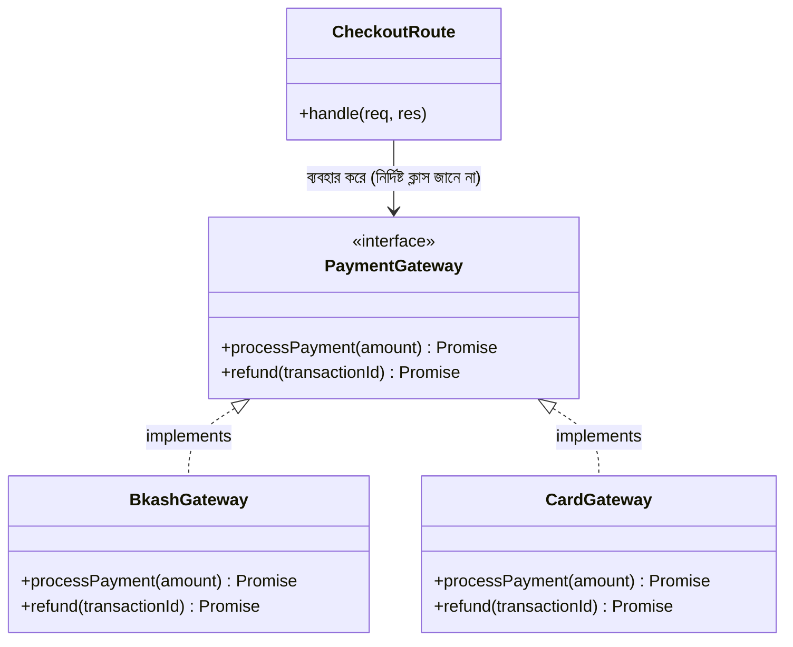

# ০৩. Real Life Use Case of Interface and Polymorphism

আগের দুই লেসনে আমরা `abstract class` ব্যবহার করে polymorphism দেখিয়েছি। কিন্তু বাস্তব ব্যাকএন্ড ডেভেলপমেন্টে, বিশেষ করে যখন ক্লাসগুলোর মধ্যে কোনো ভাগাভাগি করা কোড (shared implementation) থাকে না, শুধু একটা "চুক্তি" (contract) দরকার হয় — তখন `abstract class`-এর চেয়ে **`interface`** বেশি উপযুক্ত। এই লেসনে আমরা একটা বাস্তব সমস্যা দিয়ে দেখবো — একটা ই-কমার্স সিস্টেমে একাধিক পেমেন্ট গেটওয়ে (bKash, Card, PayPal) সাপোর্ট করা।

Module 13 Lesson 9-এ আমরা `interface` আর `class`-এর পার্থক্য দেখেছিলাম — `interface` শুধু গঠন বর্ণনা করে, কোনো বাস্তবায়ন রাখে না। এখন আমরা একটা `interface` দিয়ে বলে দিই, প্রতিটা পেমেন্ট গেটওয়ে ক্লাসের ঠিক কী কী মেথড থাকতেই হবে:

```ts
interface PaymentGateway {
  processPayment(amount: number): Promise<{ success: boolean; transactionId: string }>;
  refund(transactionId: string): Promise<boolean>;
}
```

এই `interface`টা একটা প্রতিশ্রুতি — "যে কেউ নিজেকে `PaymentGateway` দাবি করবে, তাকে অবশ্যই `processPayment` আর `refund` মেথড দিতে হবে, ঠিক এই সিগনেচার অনুযায়ী।" এখন তিনটা আলাদা গেটওয়ে বাস্তবায়ন করি, `implements` কীওয়ার্ড দিয়ে:

```ts
class BkashGateway implements PaymentGateway {
  async processPayment(amount: number) {
    console.log(`bKash দিয়ে ৳${amount} প্রসেস করা হচ্ছে...`);
    return { success: true, transactionId: `BKS-${Date.now()}` };
  }

  async refund(transactionId: string) {
    console.log(`bKash রিফান্ড হচ্ছে: ${transactionId}`);
    return true;
  }
}

class CardGateway implements PaymentGateway {
  async processPayment(amount: number) {
    console.log(`কার্ড দিয়ে ৳${amount} চার্জ করা হচ্ছে...`);
    return { success: true, transactionId: `CARD-${Date.now()}` };
  }

  async refund(transactionId: string) {
    console.log(`কার্ড রিফান্ড হচ্ছে: ${transactionId}`);
    return true;
  }
}
```

এবার Module 4-এর Express রাউটের ধাঁচে একটা চেকআউট রুট বানাই, যেখানে গেটওয়ে ইউজারের পছন্দ অনুযায়ী নির্ধারিত হয়:

```ts
import express, { Request, Response } from "express";

const app = express();
app.use(express.json());

function getGateway(method: string): PaymentGateway {
  if (method === "bkash") return new BkashGateway();
  if (method === "card") return new CardGateway();
  throw new Error("অজানা পেমেন্ট পদ্ধতি");
}

app.post("/checkout", async (req: Request, res: Response) => {
  const { amount, method }: { amount: number; method: string } = req.body;

  const gateway: PaymentGateway = getGateway(method);
  const result = await gateway.processPayment(amount);

  res.json(result);
});
```

এখানেই polymorphism আর interface একসাথে কাজ করার আসল সৌন্দর্যটা দেখা যায়। `/checkout` রুটের ভেতরের কোড `gateway.processPayment(amount)` লেখার সময় জানেই না — এমনকি জানার দরকারও নেই — এটা `BkashGateway` না `CardGateway`। যতক্ষণ কোনো ক্লাস `PaymentGateway` interface মেনে চলে, ততক্ষণ সেটা এই রুটে ব্যবহারযোগ্য। ভবিষ্যতে যদি `PayPalGateway` বা `NagadGateway` যোগ করতে হয়, `getGateway` ফাংশনে একটা লাইন যোগ করলেই যথেষ্ট — `/checkout` রুটের এক লাইনও পাল্টাতে হবে না।



এই ডায়াগ্রামের ফুটকা রেখার তীর (`<|..`) বোঝায় "implements" সম্পর্ক — `extends`-এর থেকে আলাদা, কারণ এখানে কোনো কোড উত্তরাধিকার সূত্রে পাওয়া যায় না, শুধু গঠনের চুক্তি মেনে চলা হয়। এই প্যাটার্নটার একটা প্রচলিত নাম আছে সফটওয়্যার ডিজাইনে — **Strategy Pattern** — যেখানে একটা কাজ করার একাধিক "কৌশল" (strategy) থাকে, আর রানটাইমে ঠিক কোন কৌশল ব্যবহার হবে তা নির্ধারিত হয়, কিন্তু বাকি সিস্টেম সেই পার্থক্য নিয়ে মাথা ঘামায় না।

এই একই প্যাটার্ন নোটিফিকেশন সিস্টেমেও (SMS, Email, Push Notification) হুবহু কাজ করবে — একটা `Notifier` interface, যার `send(message: string)` মেথড থাকবে, আর `SmsNotifier`, `EmailNotifier` আলাদা আলাদা বাস্তবায়ন। যেকোনো জায়গায় যেখানে "একাধিক ধরনের বাস্তবায়ন থাকতে পারে, কিন্তু ব্যবহারকারী কোড সবগুলোকে একইভাবে ট্রিট করতে চায়" — সেখানেই Interface আর Polymorphism একসাথে এই সমাধান দেয়।

এই তিন মডিউল লেসনের মধ্য দিয়ে আমরা TypeScript-এর টাইপ সিস্টেম আর OOP-এর চারটা স্তম্ভ — Encapsulation, Abstraction, Inheritance, আর Polymorphism — একসাথে ব্যবহার করে বাস্তব, সম্প্রসারণযোগ্য ব্যাকএন্ড কোড লেখা শিখলাম। এখন পর্যন্ত আমাদের সব ডেটা (users, products, transactions) মেমোরিতে অস্থায়ীভাবে রাখা হয়েছে — সার্ভার রিস্টার্ট করলেই সব হারিয়ে যায়। পরের মডিউলে আমরা এই সমস্যার সমাধান করবো — Database পরিচিতি দিয়ে, যেখানে আমরা শিখবো কীভাবে ডেটা স্থায়ীভাবে সংরক্ষণ করতে হয়।
