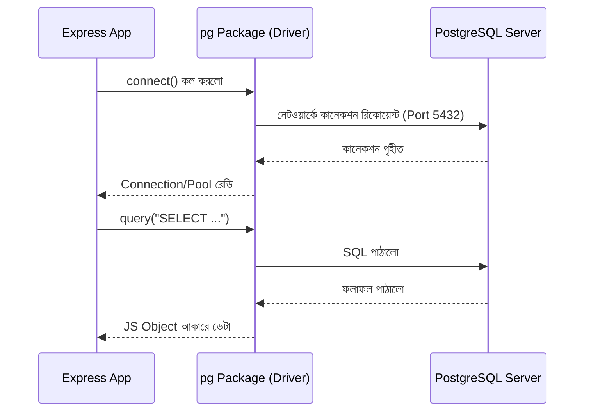
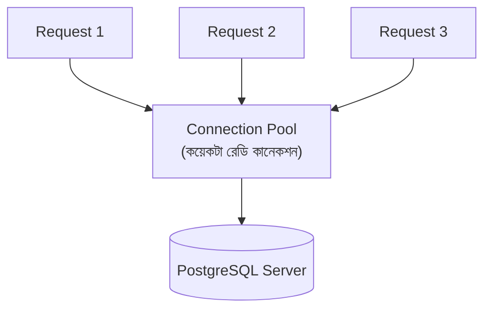

# ০৩. How to Connect Database in a Fullstack Application?

PostgreSQL এখন কম্পিউটারে চলছে, পোর্ট 5432-তে কান পেতে বসে আছে। কিন্তু এটা এখনও আমাদের Express অ্যাপের (Module 4-এ শেখা) সাথে সম্পূর্ণ বিচ্ছিন্ন — দুইটা আলাদা প্রোগ্রাম, একে অপরের অস্তিত্ব সম্পর্কে কিছুই জানে না। এই লেসনে আমরা এই দুইটাকে একসাথে "কথা বলাবো"।

মনে করো ব্যাপারটাকে এভাবে — Express সার্ভার একটা client, আর PostgreSQL server আরেকটা server। ঠিক যেমন ব্রাউজার HTTP দিয়ে ওয়েব সার্ভারের সাথে কথা বলে (Module 2), তেমনি আমাদের Node.js প্রোগ্রামকে PostgreSQL-এর নিজস্ব প্রোটোকল দিয়ে কথা বলতে হবে। এই কাজটা নিজে হাতে লিখতে গেলে ভীষণ জটিল হতো, তাই আমরা ব্যবহার করবো একটা **npm package** (Module 3-এ শেখা core module বনাম external package-এর পার্থক্য মনে আছে?) — এর নাম `pg`।



প্রথমে প্যাকেজটা ইনস্টল করি একটা এক্সপ্রেস প্রজেক্টে (Module 4-এ যেভাবে `npm install express` করেছিলে ঠিক সেভাবেই):

```bash
npm install pg
```

এবার একটা গুরুত্বপূর্ণ প্রশ্ন — কানেকশনের তথ্য (হোস্ট, পোর্ট, ইউজারনেম, পাসওয়ার্ড, ডেটাবেজের নাম) কোথায় রাখবো? এগুলো সরাসরি কোডে লিখে ফেলা (hardcode করা) একটা বাজে অভ্যাস — বিশেষ করে পাসওয়ার্ড! যদি এই কোড GitHub-এ পাবলিক হয়ে যায়, তাহলে যে কেউ তোমার ডেটাবেজে ঢুকে যেতে পারবে। এর সমাধান হলো **environment variables** — কোডের বাইরে, একটা আলাদা `.env` ফাইলে এই সিক্রেট তথ্যগুলো রাখা।

`dotenv` প্যাকেজ ইনস্টল করি:

```bash
npm install dotenv
```

প্রজেক্টের রুটে একটা `.env` ফাইল বানাই (এবং `.gitignore`-এ যোগ করি, যাতে ভুলেও GitHub-এ না যায়):

```
DB_HOST=localhost
DB_PORT=5432
DB_USER=postgres
DB_PASSWORD=তোমার_ইনস্টলের_সময় দেয়া_পাসওয়ার্ড
DB_NAME=todo_app
```

এবার একটা `db.js` ফাইল বানাই, যেখানে আমরা কানেকশন সেটআপ করবো:

```js
// db.js
require('dotenv').config();
const { Pool } = require('pg');

const pool = new Pool({
  host: process.env.DB_HOST,
  port: process.env.DB_PORT,
  user: process.env.DB_USER,
  password: process.env.DB_PASSWORD,
  database: process.env.DB_NAME,
});

module.exports = pool;
```

লক্ষ্য করো, আমরা একটা সরাসরি `Client` না বানিয়ে একটা `Pool` বানিয়েছি। এটার কারণ বোঝা জরুরি। ধরো তোমার Express অ্যাপে একসাথে ১০০ জন ইউজার রিকোয়েস্ট পাঠাচ্ছে। প্রতিটা রিকোয়েস্টের জন্য যদি নতুন করে ডেটাবেজের সাথে কানেকশন খোলা আর বন্ধ করা হয়, সেটা খুবই ধীরগতির — কারণ কানেকশন তৈরি করা নিজেই একটা ব্যয়বহুল কাজ (নেটওয়ার্ক হ্যান্ডশেক, অথেন্টিকেশন, ইত্যাদি)।

এর বদলে **connection pooling** ব্যবহার করি — অনেকটা একটা ট্যাক্সি স্ট্যান্ডের মতো কল্পনা করো। কয়েকটা ট্যাক্সি (কানেকশন) আগে থেকেই রেডি হয়ে দাঁড়িয়ে থাকে। কেউ যাত্রার (query) দরকার হলে একটা খালি ট্যাক্সি ধরে, কাজ শেষে ট্যাক্সিটা আবার স্ট্যান্ডে ফিরিয়ে দেয় — পরের যাত্রীর জন্য রেডি থাকে। নতুন করে ট্যাক্সি বানাতে হয় না বারবার।



এবার এই `pool`-কে আসলে ব্যবহার করে একটা রুট বানাই, যেখানে আমরা ডেটাবেজের ভার্সন চেক করবো — শুধু প্রমাণ করার জন্য যে কানেকশনটা আসলেই কাজ করছে:

```js
// app.js
const express = require('express');
const pool = require('./db');

const app = express();
app.use(express.json()); // Module 8-এ শেখা JSON body parse করার জন্য

app.get('/db-health', async (req, res) => {
  try {
    const result = await pool.query('SELECT version()');
    res.json({ connected: true, version: result.rows[0].version });
  } catch (err) {
    res.status(500).json({ connected: false, error: err.message });
  }
});

app.listen(3000, () => console.log('Server running on port 3000'));
```

লক্ষ্য করো, `pool.query(...)` একটা **Promise** ফেরত দেয় — Module 5-এ শেখা async/await-এর জ্ঞান এখানে সরাসরি কাজে লাগছে। কানেকশন, query পাঠানো, উত্তর ফিরে আসা — সবকিছুই সময় নেয় (I/O অপারেশন), তাই এটা asynchronous।

Postman বা Thunder Client দিয়ে (Module 4-এ শেখা টুল) `GET http://localhost:3000/db-health` কল করে দেখো। যদি JSON রেসপন্সে `connected: true` আর PostgreSQL-এর ভার্সন দেখো, তাহলে আমাদের Express অ্যাপ আর PostgreSQL ইঞ্জিন এখন একসাথে কাজ করছে।

এখন ফাউন্ডেশন তৈরি — সার্ভার ডেটাবেজের সাথে কথা বলতে পারে। পরের লেসনে আমরা এই কানেকশনকে আসল কাজে লাগাবো — সেই পুরোনো "No Database" TODO Manager-কে বাস্তব ডেটাবেজে রূপান্তর করা শুরু করবো।
