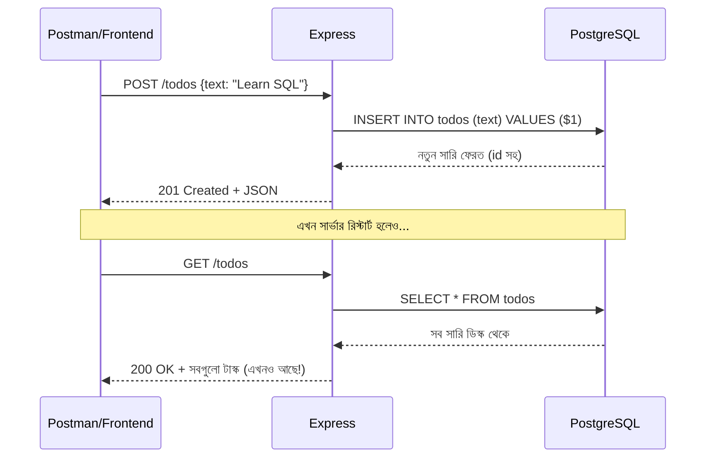

# ০৪. Fullstack Application Part 2

আগের লেসনে আমরা কানেকশন বানিয়েছি আর প্রমাণ করেছি এটা কাজ করে। এখন সময় এসেছে সেই প্রতিশ্রুতি পূরণ করার — Module 12-এর "No Database" TODO Manager-কে একটা আসল, স্থায়ী ডেটাবেজ-চালিত অ্যাপ্লিকেশনে রূপান্তর করা।

মনে করিয়ে দেই, আগের ভার্সনে আমাদের কোড এরকম ছিলো:

```js
// পুরোনো ভার্সন — মেমোরিতে ডেটা
let todos = [];

app.post('/todos', (req, res) => {
  const todo = { id: Date.now(), text: req.body.text, done: false };
  todos.push(todo);
  res.status(201).json(todo);
});

app.get('/todos', (req, res) => {
  res.json(todos);
});
```

এই কোডের সমস্যা আমরা লেসন ১-এ বুঝেছি — সার্ভার রিস্টার্ট হলেই `todos` array খালি হয়ে যায়। আজকে আমরা `todos` array-টাকেই সরিয়ে দিচ্ছি, তার জায়গায় বসাচ্ছি ডেটাবেজ query।

প্রথমে একটা টেবিল বানাতে হবে ডেটাবেজে (SQL-এর বিস্তারিত পরের লেসনে শিখবো, আপাতত শুধু চালাই)। psql বা pgAdmin খুলে চালাও:

```sql
CREATE TABLE todos (
  id SERIAL PRIMARY KEY,
  text VARCHAR(255) NOT NULL,
  done BOOLEAN DEFAULT false
);
```

এই কমান্ডটা PostgreSQL-কে বলছে — "একটা `todos` নামের টেবিল বানাও, যেখানে প্রতিটা সারিতে থাকবে একটা `id` (স্বয়ংক্রিয়ভাবে বেড়ে যাওয়া নম্বর), একটা `text` (লেখা), আর একটা `done` (হয়েছে কিনা, ডিফল্ট false)।" এটা অনেকটা তোমার আগের JS object `{ id, text, done }`-এর টেবিল-ভার্সন, শুধু এবার এটা ডিস্কে স্থায়ীভাবে থাকবে, RAM-এ নয়।

এবার Express রুটগুলো নতুন করে লিখি, `pool.query` ব্যবহার করে:

```js
const express = require('express');
const pool = require('./db');

const app = express();
app.use(express.json());

// নতুন টাস্ক তৈরি
app.post('/todos', async (req, res) => {
  try {
    const { text } = req.body;
    const result = await pool.query(
      'INSERT INTO todos (text) VALUES ($1) RETURNING *',
      [text]
    );
    res.status(201).json(result.rows[0]);
  } catch (err) {
    res.status(500).json({ error: err.message });
  }
});

// সব টাস্ক দেখা
app.get('/todos', async (req, res) => {
  const result = await pool.query('SELECT * FROM todos ORDER BY id');
  res.json(result.rows);
});

// একটা টাস্ক আপডেট করা (done = true করা)
app.put('/todos/:id', async (req, res) => {
  const { id } = req.params; // Module 4-এ শেখা path parameter
  const result = await pool.query(
    'UPDATE todos SET done = true WHERE id = $1 RETURNING *',
    [id]
  );
  if (result.rows.length === 0) {
    return res.status(404).json({ error: 'Todo not found' });
  }
  res.json(result.rows[0]);
});

// একটা টাস্ক ডিলিট করা
app.delete('/todos/:id', async (req, res) => {
  const { id } = req.params;
  await pool.query('DELETE FROM todos WHERE id = $1', [id]);
  res.status(204).send();
});

app.listen(3000, () => console.log('TODO API running on port 3000'));
```

কয়েকটা জিনিস খেয়াল করার মতো এখানে। প্রথমত, `$1` — এটা একটা **placeholder** (Prepared Statement Parameter)। আমরা কখনোই সরাসরি ইউজারের ইনপুট স্ট্রিং হিসেবে জোড়া লাগিয়ে (concatenate করে) SQL বানাই না, যেমন `"INSERT INTO todos VALUES (" + text + ")"`। এটা করলে **SQL Injection** নামের একটা ভয়ংকর নিরাপত্তা ফাঁক তৈরি হয়, যেখানে একজন দুষ্ট ইউজার `text`-এর জায়গায় ক্ষতিকর SQL কোড ঢুকিয়ে পুরো ডেটাবেজ মুছে দিতে পারে। `$1`, `$2` প্লেসহোল্ডার আর প্যারামিটার array (`[text]`) ব্যবহার করলে `pg` প্যাকেজ নিজেই নিরাপদভাবে ভ্যালুগুলো বসিয়ে দেয়, বিপদ ছাড়াই।

দ্বিতীয়ত, `RETURNING *` — এটা PostgreSQL-এর একটা সুবিধাজনক ফিচার, যেটা INSERT বা UPDATE করার পর সাথে সাথে নতুন সারিটা ফেরত দেয়, যাতে আমাদের আলাদা করে আবার SELECT করতে না হয়।



এখন টেস্ট করার পালা — Postman দিয়ে কয়েকটা টাস্ক POST করো, তারপর সার্ভারটা বন্ধ করে আবার চালাও, তারপর GET করে দেখো। আগের মতো খালি array না, বরং তোমার সব টাস্ক ঠিক আগের মতোই আছে — কারণ ডেটা এখন RAM-এ নয়, ডিস্কে বসে আছে PostgreSQL-এর মধ্যে।

এই মুহূর্তে যদি JWT অথেন্টিকেশন (Module 12) আবার যোগ করতে চাও, তাহলে middleware (Module 7-এ শেখা) দিয়ে প্রতিটা রুটের আগে টোকেন যাচাই করে নিতে পারো, ঠিক আগের মতোই — শুধু পার্থক্য হলো এখন `todos` একটা array না, ডেটাবেজের একটা টেবিল, আর প্রতিটা টাস্কের সাথে `user_id` কলাম যোগ করে বুঝতে পারবে কোন টাস্ক কার (এই সম্পর্কের ধারণা নিয়ে বিস্তারিত আসবে Module 18-এ)।

আমাদের "No Database" অ্যাপটা এখন সত্যিকার অর্থেই একটা database-backed fullstack application। কিন্তু এতক্ষণ আমরা SQL কমান্ড (`CREATE TABLE`, `INSERT`, `SELECT`, `UPDATE`, `DELETE`) ব্যবহার করলাম না বুঝেই, শুধু কপি করে চালিয়েছি। পরের লেসনে থামি, আর বুঝি — SQL আসলে কী, এটা কীভাবে একটা ভাষা হিসেবে কাজ করে।
