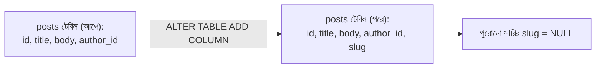
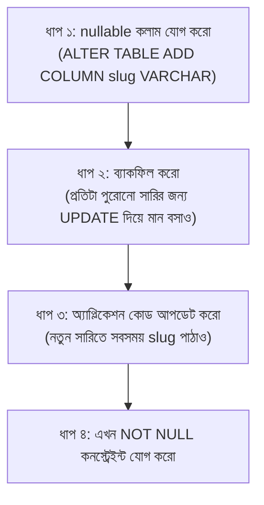

# ০৩. How to Alter a Live Table

গত লেসনের শেষে যে দৃশ্যকল্পটা রেখেছিলাম সেটা দিয়েই শুরু করি — তোমার `posts` টেবিলে ইতিমধ্যে হাজারো সারি ডেটা আছে (মানুষ প্রতিদিন ব্লগ লিখছে), আর হঠাৎ প্রোডাক্ট টিম বললো "প্রতিটা পোস্টে একটা SEO-friendly `slug` কলাম দরকার।" এখন কী করবে? টেবিলটা `DROP` করে আবার `CREATE` করবে? সেটা করলে হাজারো সারির সব ডেটা মুছে যাবে — সম্পূর্ণ বিপর্যয়।

এই সমস্যার সমাধান হলো **`ALTER TABLE`** — এমন একটা কমান্ড যা বিদ্যমান ডেটা অক্ষত রেখে টেবিলের কাঠামো বদলাতে দেয়। এটাকে তুলনা করা যায় একটা বাড়িতে নতুন ঘর যোগ করার সাথে — পুরো বাড়ি ভেঙে আবার বানানো লাগে না, বাড়ির বাকি অংশ ঠিক থেকেই একটা নতুন কক্ষ জুড়ে দেয়া যায়।

**নতুন কলাম যোগ করা:**

```sql
ALTER TABLE posts ADD COLUMN slug VARCHAR(220);
```

এই কমান্ড চালানোর সাথে সাথে, `posts` টেবিলের প্রতিটা বিদ্যমান সারিতে `slug` কলাম যোগ হয়ে যাবে, এবং পুরোনো সারিগুলোতে এর মান হবে `NULL` (কারণ আমরা `DEFAULT` দেইনি, আর পুরোনো সারিতে এই তথ্য জানাই ছিলো না)। এটাই স্বাভাবিক এবং প্রত্যাশিত।



**একটা কলাম মুছে ফেলা:**

```sql
ALTER TABLE posts DROP COLUMN published;
```

এটা সাবধানে ব্যবহার করতে হয় — এই কমান্ড চালালে `published` কলামের সব ডেটা **স্থায়ীভাবে** মুছে যায়, কোনো "undo" নেই (ঠিক যেমন Module 37-এ শেখা `git reset --hard`-এর মতো বিপজ্জনক)। প্রোডাকশন ডেটাবেজে এই কমান্ড চালানোর আগে সবসময় ব্যাকআপ নেয়া উচিত।

**কলামের টাইপ বা নাম পরিবর্তন করা:**

```sql
-- টাইপ পরিবর্তন
ALTER TABLE posts ALTER COLUMN slug TYPE VARCHAR(300);

-- নাম পরিবর্তন
ALTER TABLE posts RENAME COLUMN slug TO url_slug;

-- নতুন কনস্ট্রেইন্ট যোগ করা
ALTER TABLE posts ALTER COLUMN url_slug SET NOT NULL;
```

শেষ কমান্ডটা নিয়ে একটু সতর্ক থাকা দরকার — যদি টেবিলে ইতিমধ্যে এমন সারি থাকে যেখানে `url_slug` এখনও `NULL`, তাহলে `SET NOT NULL` কমান্ডটা ব্যর্থ হবে, কারণ ডেটাবেজ বিদ্যমান নিয়ম ভাঙতে দেবে না। এখানেই আসে **safe migration thinking** — বাস্তব প্রোডাকশন সিস্টেমে স্কিমা বদলানোর সময় একটা নির্দিষ্ট ধাপে ধাপে চিন্তা করতে হয়:



এই ধাপে ধাপে পদ্ধতি কেন দরকার? কারণ একটা লাইভ সিস্টেমে (যেখানে হাজারো ইউজার সেকেন্ডে সেকেন্ডে রিকোয়েস্ট পাঠাচ্ছে) হঠাৎ একটা কড়া কনস্ট্রেইন্ট যোগ করলে চলমান অ্যাপ্লিকেশন কোড ভেঙে যেতে পারে — যদি সেই কোড এখনো `slug` না পাঠিয়ে পুরোনো পদ্ধতিতে `INSERT` করে। তাই আগে নতুন কলামটা "নরমভাবে" (nullable) যোগ করে, অ্যাপ্লিকেশন কোড আপডেট করে নিশ্চিত হওয়া হয় যে সব জায়গা থেকেই এখন নতুন কলাম পাঠানো হচ্ছে, তারপরই কড়া নিয়ম (`NOT NULL`) চাপানো হয়।

ব্যাকফিল করার SQL-টা দেখি — ধরো আমরা টাইটেল থেকে একটা সাধারণ slug বানাতে চাই পুরোনো সারিগুলোর জন্য:

```sql
UPDATE posts
SET url_slug = LOWER(REPLACE(title, ' ', '-'))
WHERE url_slug IS NULL;
```

এই একটা `UPDATE` স্টেটমেন্ট সব পুরোনো সারিতে একসাথে কাজ করে — এটাই SQL-এর declarative শক্তি যেটা আগের লেসনে দেখেছিলাম, তুমি বলছো *কী* করতে হবে, PostgreSQL নিজে বের করে নেয় *কীভাবে* প্রতিটা সারিতে এটা প্রয়োগ করতে হবে।

Express অ্যাপের দিক থেকেও (Module 15-এ শেখা `pg` কানেকশন মনে আছে?) `ALTER TABLE` চালানো একদম সাধারণ query-র মতোই:

```js
await pool.query('ALTER TABLE posts ADD COLUMN slug VARCHAR(220)');
```

বাস্তব প্রজেক্টে অবশ্য এই ধরনের স্কিমা পরিবর্তন সরাসরি হাতে চালানোর বদলে **migration file** নামের ভার্সন-কন্ট্রোল-করা স্ক্রিপ্টে লেখা হয় (যেমন Module 24-এ TypeORM migration নিয়ে দেখবে), যাতে টিমের সবাই একই ক্রমে একই পরিবর্তন প্রয়োগ করতে পারে, আর Git-এ (Module 37) এর ইতিহাস ট্র্যাক করা যায়।

এখন আমরা জানি কীভাবে একটা লাইভ টেবিলের কাঠামো নিরাপদে বদলাতে হয় — নতুন কলাম যোগ করা, মুছে ফেলা, টাইপ পাল্টানো, আর সবচেয়ে গুরুত্বপূর্ণ, কেন ধাপে ধাপে করতে হয়। পরের লেসনে আমরা একটু ভিন্ন দিকে যাবো — টেবিলে বাস্তবসম্মত টেস্ট ডেটা দ্রুত তৈরি করার জন্য SQL-এর ভেতরে লুপ চালানো শিখবো।
